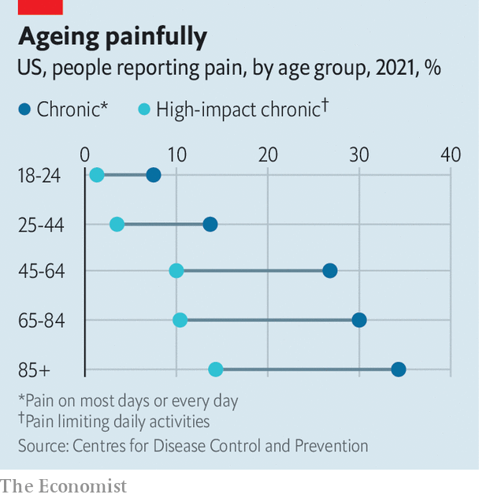
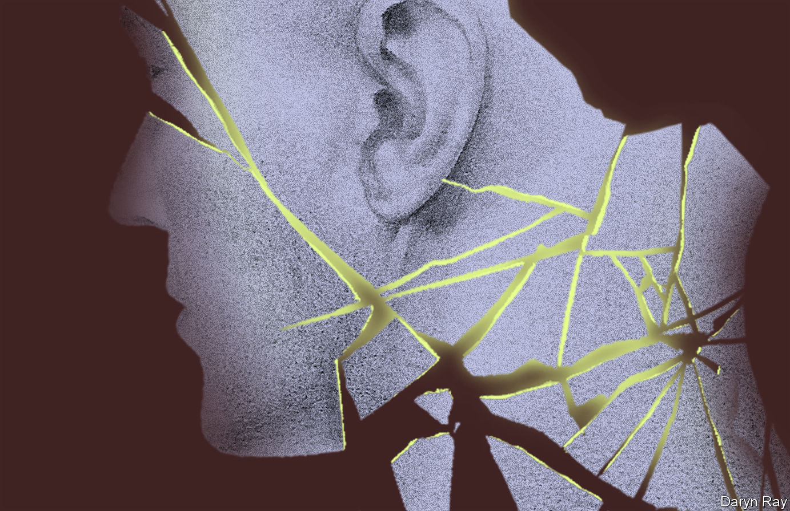
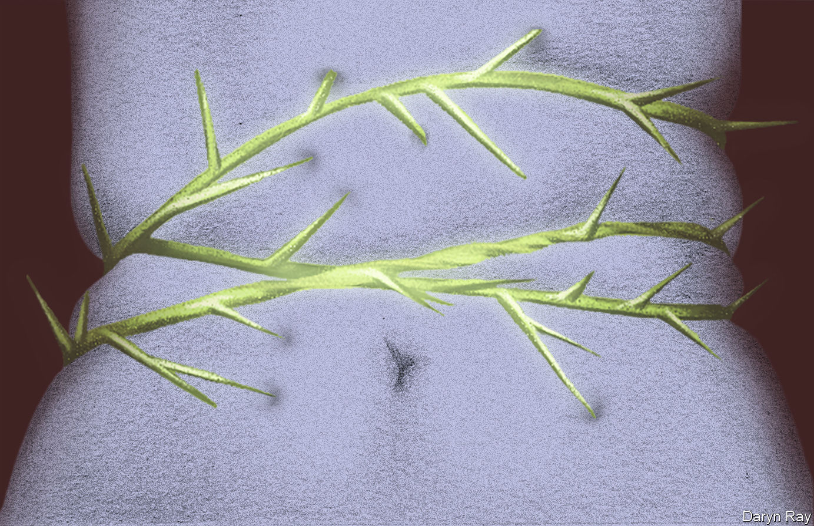

###### A new world of hurt

# Some forms of chronic pain are particularly mysterious 

##### But new approaches show promise 

 

> Aug 30th 2023 

When she was only 14, Catherine Charlwood noticed a swelling in her right forearm. It was accompanied by a heavy muscular ache that made daily activities difficult. As a talented clarinettist at a British school where regular practice was on the timetable, the pain was deeply worrying. She was told it was repetitive strain injury, and would disappear within six weeks. When those weeks had gone and the pain remained, she was diagnosed with tendonitis. She did her best to make do, minimising her music practice and learning to write with her left hand. Eventually, when playing the clarinet was no longer feasible, she had to leave the school.

When the pain continued past the six months which is typical of tendonitis, doctors recommended surgery. “Each time they opened me up, what they were looking for wasn’t there,” she says. The second of those procedures, intended to relieve pressure on her radial nerve, actively made things worse. Since then, she occasionally experiences what feels like electricity crackling down the scar left by the procedure. “The volume can turn up, and it can turn up a lot, but it doesn’t turn down,” she says. Further diagnoses have come and gone, but the true origins of her pain remain mysterious.

Disabling consequences

Chronic pain, however it is experienced by people, is an enormous problem (see chart). As opposed to acute pain, which is a short-lived response to a dangerous or noxious event, chronic pain is widely defined as lasting for three months or longer. It has no discernible evolutionary purpose and often no identifiable trigger. It is best thought of as a disease, one that affects around 30% of the world’s population and carries with it a significant economic cost, in medical treatment, lost labour productivity and caregiving. Around one in ten of those affected are estimated to have disabling pain, making it the leading cause of disability worldwide.

 


In addition to the physical symptoms, chronic pain brings with it wide-ranging psychological problems, including depression and withdrawal from society. “You grieve your past life,” says Sara Villa Hernandez, a pain researcher at King’s College London, who herself experiences chronic pain. The experience differs from the sudden pain caused by a stubbed toe, as hurtful as that may be, in the same way that depression differs from being sad, explains Jan Vollert of Imperial College London, who also studies chronic pain. 

The ranks of people who experience chronic pain are growing all the time. Many diseases that would once have been fatal can now be treated, sometimes leaving patients who are alive but in pain. One in three cancer survivors, for example, live with chronic pain. Fully 80% of care-home residents do likewise. The covid-19 pandemic has also had an enormous impact: an estimated 65m people are thought to be living with long covid worldwide, of whom a quarter experience pain.

To help doctors treat chronic pain, scientists first need to understand where it comes from. To say that is a long way off is to understate the complexity of the field. “Chronic pain as a research endeavour is a bit of a car crash,” says Christopher Eccleston, head of the Pain Research Centre at the University of Bath, in Britain.

Most of the pain experienced by people occurs when specialised nerve cells on the body’s periphery react to traumatic events such as pressure or heat. Proteins on the surface of those cells deform to produce channels that enable the flow of charged ions out of those cells, through their neighbouring cells, up the spinal cord and into the brain, where they are interpreted as pain. This signalling from damaged tissue along healthy nerves is known as nociceptive pain, and can occur in chronic form in such conditions as ulcers or osteoarthritis. Neuropathic pain, by contrast, occurs when the tissue is healthy but the nerves themselves are damaged—as in the case of spinal-cord injuries or shingles.

But not all chronic pain fits under these two labels. In 2017 the International Association for the Study of Pain, the leading body of pain researchers, defined a new form of chronic pain—nociplastic pain. Potentially experienced by up to a billion people, this new condition squeezes neatly into the gap left between the others. Both tissue and nerves appear healthy, in other words, but the pain persists. It is this world that Ms Charlwood inhabits. “I’ve been living for over 20 years with essentially faulty wiring,” she says.

Nociplastic pain is thought to arise when the body’s own pain-processing network gets rewired to overreact to incoming stimuli. Such sensitisation can arise when sustained pain signals permanently change a nerve’s ion channels, making even mild sensations indistinguishable from painful ones. Alternatively, it can occur when the body’s natural painkillers, neurotransmitters such as endorphins that dampen the flow of pain signals, are less readily manufactured. This often signals some damage to the Descending Pain Modulating System (DPMS), a network of brain regions that can provide pain relief if appropriately stimulated. Among its best-known functions is the placebo effect, where a patient can feel better after simply being given the impression of being treated. Another set of mechanisms, known as pain inhibits pain, is what allows the discomfort of nails digging into palms to alleviate the pain of a dental drill being used on teeth.

It is not just the nervous system that can be at fault. Andreas Goebel, a pain researcher at the University of Liverpool, had long hypothesised that antibodies, which patrol the bloodstream to identify and draw attention to pathogens, could also mistakenly attack a patient’s nerves. In experimental results published in 2021, he demonstrated that a type of antibody known as immunoglobulin G could, if taken from individuals with fibromyalgia, a condition characterised by severe pain across the body (as well as a host of related symptoms such as tiredness and cognitive problems), induce similar sensitivities when they were injected into mice. This suggests that variations in the immune system may contribute to the onset of nociplastic pain. He intends to conduct similar studies on long covid, as that is a condition also associated with nociplastic pain.

Suffering in silence

Physical mechanisms, however, will only ever be one part of the problem. How a person feels is also critical to the sensation. Studies have shown that adverse effects in childhood can make an adult more likely to develop nociplastic pain, as can a history of conditions such as depression and anxiety. The spinal cord is like a palimpsest, says Rajesh Munglani, vice-president of the British Pain Society. “It retains memory.” Social factors can also exacerbate the problem, with the negative emotional consequences of pain (including an inability to work, social alienation and depression) leading to activation of the very brain regions that can amplify its severity.

 


All this complexity means that nociplastic pain cannot be resolved by a single pill. Indeed, when it comes to medicine, most commonly prescribed forms of pain relief—opioids such as morphine, non-steroidal anti-inflammatories (NSAIDs) such as aspirin, or antidepressants such as duloxetine—are either ineffective for nociplastic pain, or come with unpalatable side-effects (addiction in the case of opioids, or stomach ulcers for NSAIDs). 

But some interventions can make a big difference. Studies have shown that being listened to and, crucially, being believed by medical professionals can make chronic pain easier to bear. In the case of nociplastic pain, a sensation that cannot easily be traced to any physical source, such empathy can be hard to find. 

After Ms Charlwood’s initial surgeries failed to clear up the pain, she was put on a waiting list for ultrasound-guided steroid injections, a set of procedures aimed at identifying and disabling any misfiring nerves. These were not straightforward, with nurses having to manipulate the bones in her neck to allow the doctor to puncture the right spot. “That was all a bit medieval,” she recalls. 

Exhausted by the pain and frustrated by the lack of a diagnosis, Ms Charlwood decided to engineer a meeting with the University of Bath’s Dr Eccleston, whose work on chronic pain she had admired from a distance. Her nascent doctoral work on comparative literary studies offered her a way in. In 2012, she submitted an abstract on intergenerational pain in the poetry of Robert Frost to a conference where Dr Eccleston was presenting. Having secured an invitation to speak, Ms Charlwood burst into tears when they met. He was one of the first people who really got it, she says.

Patients with nociplastic pain are slowly gaining recognition. They are increasingly being consulted by researchers ahead of experimental trials, and are sometimes selected as reviewers for papers to be published in pain journals. 

Specialist doctors are also referring people diagnosed with nociplastic pain to pain-management courses, rather than encouraging them into the exhausting pursuit of a potentially nonexistent cure. Such courses often centre on giving patients a sense of community, as well as the tools they need to regain control of their lives. This can take numerous forms, from classes on pain science through to cognitive behavioural therapy, physiotherapy or exercise. Virtual reality is also being tried, as this allows patients to experiment with real-world activities in the safety of their own homes. Although such methods can be expensive and time-consuming, many patients say they wish they had come to them sooner. 

Ms Charlwood, with the memory of unnecessary and harmful surgeries still fresh in her mind, agrees. People end up turning to pain management too far down the line, she says. By the time they get there, they are often in worse shape than when they started looking for treatment. 

Some relief

Although unrealistic expectations can make matters worse, ways to relieve nociplastic pain may yet be found. Most interest now lies in harnessing the brain’s flexibility for good. “Neuroplasticity can actually go both ways,” says Dr Munglani. Psychedelics such as psilocybin, for example, are thought to act on certain neurons in ways that disrupt their existing connections, making it easier to reform faulty circuits or to establish new connections between different parts of the brain. Such new patterns of brain activity have been tentatively linked with an easing of depression, and could potentially help with nociplastic pain. Later this summer, Peter Hendricks at the University of Alabama will begin a clinical trial testing psilocybin on patients with fibromyalgia in order to monitor changes to their level of pain and quality of life. Tryp Therapeutics, a Canada-based biotech company, is also planning to trial the effects of a synthetic form of psilocybin on patients with fibromyalgia and irritable bowel syndrome. 

 


Another reason few remedies exist is that potentially helpful treatments may have been tested on the wrong patients. In most clinical trials of analgesics of all kinds, says Dr Munglani, fewer than a third of patients feel any benefit. Diagnostic improvements could help identify that cohort in advance. 

At present, most pain of all kinds is assessed on a 0-10 scale, with zero representing no pain and ten the worst pain imaginable. In addition to misdiagnosing patients with overactive imaginations, such a scale flattens much of the nuance associated with pain. Carl von Baeyer, a pain scientist with the University of Saskatchewan, likens it to describing music by volume alone.

A more sophisticated form of assessment is quantitative sensory testing (QST). Developed in Germany in the 2000s, it aims to identify patients whose different forms of chronic pain may be caused by similar underlying mechanisms. Imperial’s Dr Vollert compares it to how similar infections may be either bacterial or viral in origin, necessitating entirely different treatment plans.

The methodology is simple. Individuals have a small metal plate held against their skin as the temperature of the plate is varied. The patients are then tested on their ability to detect the changes in temperature as well as the threshold at which they experience discomfort. The process is subsequently repeated with hairlike filaments and blunt needles in order to establish the patients’ sensitivity to pressure. The results allow researchers to group patients in a number of cohorts that transcend their diagnoses: those who are relatively normal but more sensitive to temperature changes (peripheral sensitisation), those less sensitive to both kinds of painful stimuli (extensive peripheral nerve fibre damage), and those with a loss of thermal detection (small fibre neuropathy). Many patients fall into more than one category, says Dr Vollert, who reckons that more subtle categories may yet emerge.

Such categorisations may seem self-indulgent, but they have shown promise in guiding people towards the right medications. Even, potentially, ones that already exist. In 2014, Dr Vollert and colleagues performed trials that showed that an anticonvulsant called oxcarbazepine, which had failed in previous trials across a broad swathe of patients with neuropathic pain (resulting from nerve damage), achieved results superior to a placebo in patients deemed by QST to have peripheral sensitisation. This success has resulted in interest from pharmaceutical firms keen to use QST to better target future medications. 

Rolling this approach out from neuropathic to nociplastic pain comes with challenges. For one thing, says Dr Vollert, QST is best performed on a painful part of the body that can then be compared with a normal region. As nociplastic pain is frequently either felt across the body or else in inaccessible organs below the skin, this makes comparisons more difficult. 

It couldn’t hurt

There are, however, some early signs that nociplastic patients could eventually feel the benefits. A 2022 study by researchers at Harvard Medical School showed that patients with fibromyalgia were most likely to feel the analgesic benefits of electrical nerve stimulation if they had increased sensitivity, as measured by QST. “The trajectory the field is on looks really promising,” says Dr Vollert.

Tests that can reveal a patient’s pain profile are enticing, especially when they offer the promise of early diagnosis. But researchers worry about the unintended consequences of setting a medical reference for what pain should look like. Many patients with chronic pain already get turned away on the grounds that they do not look as if they are in pain. Relying solely on a biomarker runs the risk of repeating the error. For Dr Eccleston, biomarkers, though useful, must not supplant the individual’s reported experience. “There is no objective measure of pain,” he says. ■


