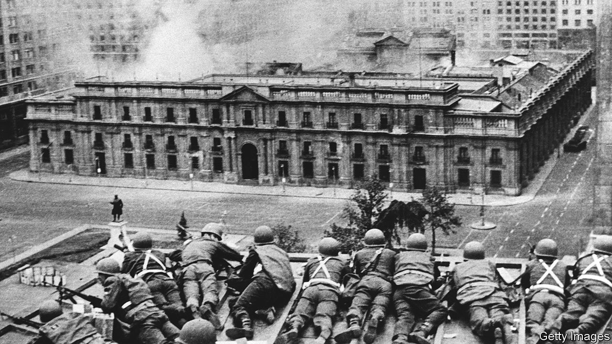
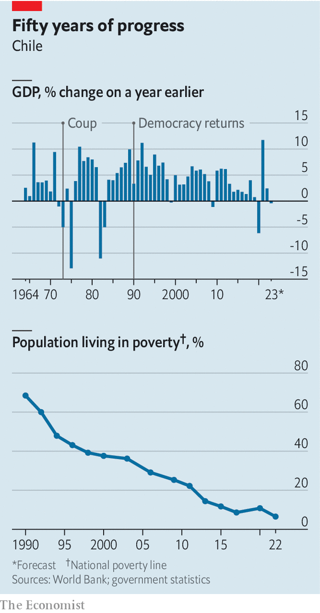
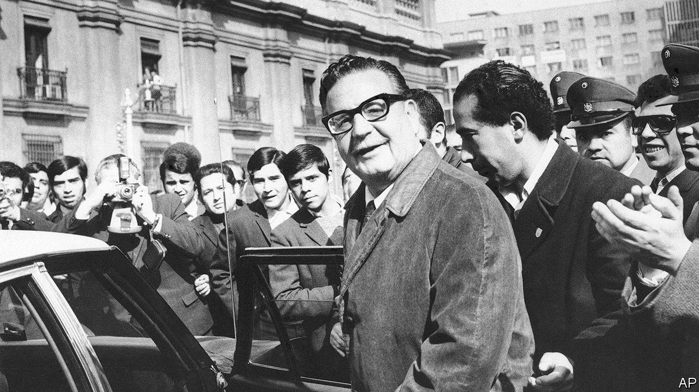

###### Half a century later

# Chile is still haunted by the coup in September 1973 

##### Gabriel Boric, the young left-wing president, is a fan of Salvador Allende 

 

> Aug 31st 2023 

The images, in grainy black and white, are etched into history. Clouds of smoke billow from La Moneda, the presidential palace in the heart of Santiago, as Hawker Hunter jets of the Chilean air force fire rockets at it on the morning of September 11th 1973. Tanks patrol the surrounding streets as soldiers dragoon hundreds of civilian prisoners, hands on their heads. Salvador Allende, the elected Socialist president, in tweed jacket and tin helmet, brandishes a pistol in La Moneda. By 2pm, he would die by his own hand. And the world would soon learn the name of General Augusto Pinochet, the leader of the violent coup against Allende, who would rule Chile as a dictator for the next 17 years.

In Latin America and around the world these events quickly acquired totemic significance. As Chileans prepare to mark the 50th anniversary of the coup, they still reverberate. In Gabriel Boric, the young left-wing president, Chile now has a national leader who is an unabashed fan of Allende. On the day of his inauguration, he paid homage to the statue of the fallen leader behind the Moneda and invoked him in a speech to his followers. 

But the government’s plans for a 50th-anniversary commemoration have been stymied by the controversies that Allende still arouses. Patricio Fernández, a journalist whom the president appointed to co-ordinate a “symbolic national ceremony of rejection” of the coup, resigned in July after he was criticised by the Communist Party for saying that “history can continue to debate why [the coup] happened”. 

The country seems split. An attempt by Mr Boric’s government to rewrite Chile’s constitution, which in part derives from Pinochet, was rejected by a whopping 62% of voters last year. And a poll by Mori found that only 42% of those asked now think the coup destroyed democracy and 36% that it freed Chile from Marxism, compared with 68% and 19%, respectively, in 2006.

The disagreements reflect nagging questions. One, which has bedevilled the left in Chile and elsewhere for half a century, is whether Allende’s overthrow was simply a crushing military defeat or whether it was above all a political failure. The second, related, question is whether the coup could have been avoided. To answer them, one must start by looking back at the thousand or so days of Allende’s government that preceded its overthrow.

Elected in 1970, Allende had proclaimed “the Chilean road to socialism”, an attempt to carry out a revolution by peaceful parliamentary means. But his Popular Unity (Unidad Popular or UP) coalition lacked a congressional majority. It polarised Chile and plunged it into chaos. Many Chileans, and a majority of politicians, welcomed the coup, imagining that the army would restore order and call a fresh election. 

Two things turned Allende into a martyr for democracy as well as a global icon for the left. One was the brutality of the coup and its aftermath. Pinochet’s junta murdered 2,130 people and tortured at least 30,000, many cruelly, according to investigations under later democratic governments. The second was Allende’s defiant final speech to the nation, broadcast from La Moneda at 9.10am. It lasted less than seven minutes, his voice calm and measured even amid shouting in the background. “I will not resign,” he declared. “I will repay the loyalty of the people with my life... Always remember that much sooner than later the great avenues along which free men pass to build a better society will once again be open.”

Salvador Allende was a complex and ambiguous figure. A medical doctor, he was a self-declared “Marxist Socialist president” but also a bon vivant, a man with many lovers. He rejoiced in the friendship of Fidel Castro, inviting the Cuban revolutionary leader to Chile and allowing him to tour the country for 20 days. Allende’s idea of socialism was the dismantling of the existing socioeconomic order and its replacement with state control. It was revolution and class struggle, not Scandinavian social democracy. But he was also an experienced Chilean parliamentarian, a former president of the Senate, a man of courtesy and charm who prided himself on his political , his talent for negotiating and getting his way. He insisted that he would make his revolution within the law.

A cold-war confrontation

Chile stood out in Latin America because it had enjoyed stable civilian government since 1932. But its economy was dependent on American-owned copper companies; farming was dominated by large, inefficient estates. Allende’s predecessor, Eduardo Frei, a Christian Democrat, had made a determined effort to change that, with land reform and the partial nationalisation of copper. Allende’s election in 1970, at the fourth attempt, did not represent a big underlying shift to the left. He won just 36% of the 3m votes, only 39,000 more than a conservative rival. Chile’s constitution at that time did not allow a run-off election. Congress confirmed him as president.

As well as several small groups, the UP coalition was made up of two large parties, the Communists and Allende’s own Socialists, a majority of whom at their congress in 1967 had declared the party Marxist-Leninist and endorsed revolutionary violence. To the left of UP, but not in the coalition, was the Movement of the Revolutionary Left (MIR), a Cuban-inspired urban guerrilla outfit. 

In office Allende implemented the UP programme: he completed the nationalisation of copper with opposition support, but resorted to legal chicanery to decree state takeovers of more than 150 large firms. “Were changes on this scale possible? At first, yes, but it spun out of control,” says Sergio Bitar, the mining minister at the end of Allende’s government. Party militants simply seized scores of businesses, farms and even houses. Macroeconomic policy was recklessly populist, with big wage increases and an expansion of public jobs financed by printing money. State firms were badly run and leached cash.

Richard Nixon’s administration in the United States was alarmed by what it saw as a “second Cuba” in Latin America. He told the CIA to make Chile’s economy “scream”. The United States blocked loans to Chile. The CIA financed the opposition, which organised strikes by truck-drivers and shop-owners. By 1973 Chile was at breaking point. Allende’s measures and utopian vision forged a strong link with many Chileans: the UP won 43% of the vote in a legislative election in March 1973. But many others were alarmed. Mismanagement prompted inflation (which peaked at an annual rate of 600%), shortages and rationing. Allende brought military commanders into government, but did nothing to halt political polarisation and growing violence from extremist groups on the left and right. “For half of Chile, at least, it was a very scary time,” notes David Gallagher, a Chilean banker and diplomat.

Allende was hostage to the UP, and it was split. For tactical reasons, and because this was Moscow’s line, the Communists were cautious. The Socialist leadership, which was influenced by the MIR, wanted to accelerate. Allende vacillated. The best course was an agreement with the centrist Christian Democrats (DC). In a posthumous memoir published this year Patricio Aylwin, the DC party chief and later the first president of Chile’s restored democracy, recounts three meetings with Allende. “You have to choose,” Aylwin urged him. “You can’t be on good terms with us and with the MIR”. Allende reassured him that while he was president “there will be no dictatorship of the proletariat”, which many in the UP were working towards. Aylwin’s riposte was, “How am I going to believe you if you have so many times said one thing and the government has done the opposite?” 

The opposition majority in Congress approved a motion declaring Allende to have violated the constitution by failing to promulgate a constitutional amendment to regulate nationalisations, which would have required the state to hand back factories and farms. On September 10th Mr Bitar attended a private lunch with Allende at which the president said that he had decided to call a plebiscite on the future of his government. It was too late. Senior military leaders were set on a coup, which Pinochet joined at the last minute. 

In the end Allende preferred to risk the coup rather than split the UP by striking a deal with the Christian Democrats. “I still think, as I did then, that democracy could have been saved,” Aylwin writes. “But for that a large dose of rationality was needed and it didn’t exist.”

Might the armed forces have given the politicians more time? They were prey to their own myths. They believed that the far-left, with Cuban help, was stockpiling large quantities of arms and training fighters. There was some of that but not much—and not as much as some in the media, including , feared. (Our coverage in 1973 gave too much credence to the claims of the right that the country was close to a civil war, and appears to have exaggerated the scale of far-left armed groups. However, our initial approach to Allende’s government featured scepticism rather than outright rejection. We thought the coup was a “regrettable inevitability”, a view which some have criticised, although it was shared by many Chileans.)

“For all practical purposes, fighting lasted four hours,” Pinochet later declared. There was no civil war. “The violence that Pinochet unleashed was not a desperate expedient to save an imperilled country; it was a brutal power grab by what became a despotic regime,” as Heraldo Muñoz, a socialist who would later be foreign minister, accurately put it in a memoir.

Nobody expected the horror of what was to come. “In Chile’s political world of 1973 everyone knew everyone else. It came as a total shock,” says Andrés Velasco, a former finance minister. Pinochet swiftly sidelined his fellow junta members and established a personal dictatorship. He was determined to liquidate Marxism in Chile, and the democracy he believed had enabled it to flourish. He was ruthless, turning his secret police into an instrument of state terror. Several rival generals died in mysterious circumstances. The secret police murdered Orlando Letelier, Allende’s defence minister, with a brazen terrorist attack in Washington, DC. Libraries were purged not just of Marxist authors but also of works by liberals such as J.K. Galbraith. 

Pinochet’s economic policy was another shock. Most Latin American armies believed in state-led industrialisation. But Pinochet was persuaded to hire the “Chicago boys”, a group of young technocrats trained at that city’s university under an exchange programme run by Chile’s Catholic University. They were free-marketeers, disciples of Milton Friedman. They tore down tariff barriers and controls and privatised everything except the copper industry (the revenues of which went partly to the army). They made mistakes: a fixed and overvalued exchange rate and rampant insider lending by financial conglomerates crashed the economy in 1982. It recovered under more pragmatic management.

Pinochet placed Chile “on track to sustained economic growth”, legitimising entrepreneurship, the profit motive, market mechanisms and exports, Mr Muñoz recognises. But he criticises Pinochet’s creation of a “market society”, in which basic services were governed by profit, which has become a source of recent discontent in Chile. And Pinochet, like many dictators, would prove to be personally corrupt. He made history once again in 1998, when a Spanish judge issued an arrest warrant for the retired general while he was in London for medical treatment. The British government eventually sent him back to Chile, where he was charged and placed under house arrest for the disappearance and torture of political prisoners. This case was a milestone for the idea of universal jurisdiction for crimes against humanity. 

The coup’s aftermath

In exile, mourning its dead, the left reflected on the UP years. The Communist Party blamed its own caution and failure to arm the UP for what it saw as a military defeat. It began to pursue violent revolution. It set up a guerrilla group which came close to killing Pinochet in 1986 (which prompted another round of repression). Many Socialists engaged in a different kind of self-criticism. They identified crucial mistakes in the UP’s strategy. The first was pursuing such a radical programme without a political or popular majority. A second was having scorned and lost the middle classes. That stemmed from a rigid Marxist outlook which failed to recognise that Chilean democracy had achieved social reform and a more egalitarian society. 

Another mistake was the UP’s failure to grasp the realities of the cold war, notes Mr Bitar, who spent more than a year as a political prisoner in one of Pinochet’s concentration camps. Faced with the implacable opposition of the United States, the Allende government assumed that the Soviet Union would bail it out. The Soviets did finance Allende’s election campaign and the Chilean Communist Party. But they balked at Allende’s demand for massive aid. They were already spending more than they could afford to keep Castro’s Cuba afloat. Maoist China, preoccupied with Vietnam, turned Allende down as well. Despite the armed forces’ constitutionalist tradition, which meant that they were reluctant to intervene, once they did so they were guided by the cold-war “national security doctrine” under which they saw the left as an enemy to be exterminated.

 


Out of these reflections came an alliance between the Socialists and the Christian Democrats which had proved impossible in 1973. Known as the Concertación, it led Chile’s return to democracy after Pinochet in 1988 held, and lost, a plebiscite on staying or leaving. The Concertación governed, with much success, for the next two decades. Its leaders kept Pinochet’s market economy, adding fiscal rigour and more social provision. That was particularly the case under Ricardo Lagos, the first socialist president since Allende. He reformed Pinochet’s constitution of 1980, removing undemocratic clauses. Chile struck free-trade agreements with much of the world. Between 1990 and 2012 the economy grew at an average annual rate of over 5%. The poverty rate fell from 68% in 1990 to 7% in 2022 (see chart).

But the Concertación fell victim to its own success in generating expectations of rapid progress. Student protests in 2011 targeted the high cost of university education, especially in low-quality private universities. In response Michelle Bachelet, a Socialist president whose father, an air-force general, died at Pinochet’s hands, broadened the coalition in 2014 to bring in the Communist Party. She had sympathy for the  (self-flagellators) of the left, who argued that the Concertación had been too tolerant of “neoliberalism”. That, too, was the view of the Frente Amplio (Broad Front), comprising new left-wing parties, one formed by Mr Boric, which allied with the Communists.

With economic growth slowing, and a centre-right government in power, discontent boiled over in 2019 in a “social explosion” which included both huge peaceful demonstrations and vandalistic violence. To calm the streets, a conservative government agreed to set up a convention to write a new constitution. On the back of the protests, Mr Boric won the election of 2021. Many in the Frente Amplio saw themselves as heirs to Allende rather than the Concertación. They had a big hand in drafting a constitution which in some respects recalled the UP’s constitutional plans.

 


Their problem, as Daniel Mansuy, an academic, writes in a new book, is that Allende has become a myth rather than a political project. The constitutional draft was crushingly rejected last year. The Frente Amplio conjured up its mirror image in José Antonio Kast and his Republican Party, a hard-right outfit. Mr Kast is unapologetic about the dictatorship. The Republicans did well in an election in May for a new constitutional council; the new draft will be voted on in December. There is less agreement in Chile today on the meaning of 1973 than there was a decade ago. 

Lessons learnt and forgotten

Yet Chile has left 1973 a long way behind. The response of politicians to the polarisation and violence of 2019 was to seek a broad agreement on a peaceful solution. Unlike the UP, the new left defends liberal democracy, notes Noam Titelman, a researcher close to the Frente Amplio. When faced with difficulties, Mr Boric has edged to the centre, bringing ex-Concertación people into his government. Rather than a desire for a rebirth of the dictatorship, Mr Kast’s support derives from concerns about security, crime and immigration, says Isabel Aninat, a constitutional lawyer.

It would be better for Chile if Allende and Pinochet become purely historical figures, rather than sources of political inspiration, allowing the country to look forward. Clearly that is still hard. Allende’s government was a colossal political failure. But what “we can try to agree on,” as Mr Fernández, the journalist who was originally involved in the 50th-anniversary celebrations, put it, “is that what happened after the coup was unacceptable”. ■

