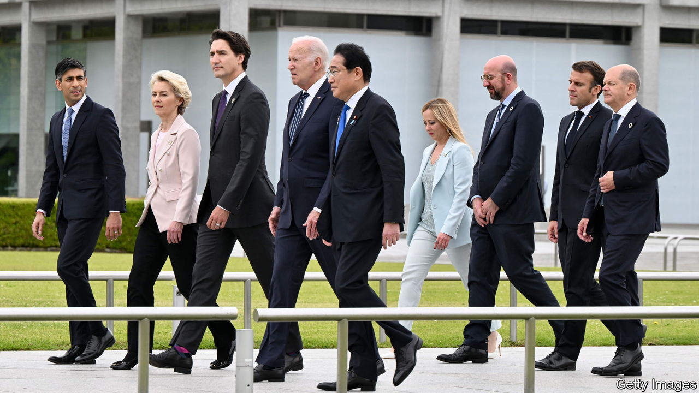

###### The Economist explains

# What is “friendshoring”? 

##### Western policymakers want to move supply chains to friendly countries 

 

> Aug 30th 2023 

AT THEIR ANNUAL gathering in Jackson Hole last week the world’s central bankers talked, among other things, about the threat of deglobalisation. Christine Lagarde, president of the European Central Bank (ECB), noted that the governments of Western countries are increasingly adopting industrial policies that promote “friendshoring” of strategic industries. This, and related terms like “nearshoring”, “” and “decoupling” (mainly from China), are in vogue among economic policymakers. What is friendshoring? 

It happens when a government pushes businesses to restructure supply chains, shifting production away from geopolitical rivals to friendly powers. The  on American investment in Chinese technology this month is one example. Friendshoring is similar to nearshoring, which moves production closer to home. Both policies aim to strengthen trade security. They have a cost: when politics rather than profit determines where goods are made, production is likely to be less efficient. But advocates argue that the price is worth paying to reduce countries’ dependence on hostile powers. That argument gained force after Russia cut off its gas supplies to try to compel the EU to withdraw its support for Ukraine, which it invaded in 2022. It has been bolstered by increasing tensions between America and China. 

Janet Yellen, America’s treasury secretary, implicitly argued for reducing Western reliance on China in a speech last year when she called for more secure supplies of critical materials, particularly those used in semiconductors and electric-vehicle batteries. She recently travelled to India and Vietnam to strengthen ties with businesses there. At first glance, friendshoring appears to be making progress. Trade ties between China and America are weakening: in 2018 two-thirds of American imports from a group of “low-cost” Asian countries came from China; last year just over half did. This year Mexico supplanted China as America’s top trading partner.

But the reality is  than these figures suggest. Although America is importing less from China, its friendly suppliers continue to rely on Chinese inputs. Mexico’s imports of car parts from China have doubled in the past five years. And in some strategic industries, notably green power, America continues to rely on China: it provides more than a third of the large-capacity batteries that America imports, up by five percentage points since Ms Yellen’s speech. The EU : the bloc relies heavily on China as a supplier of 14 out of the 27 raw materials it deems to be of critical importance. 

Thus far, attempts to friendshore supply chains have created no more than a degree of separation in America’s trade relationship with China, leaving deep economic ties largely intact. The Biden administration insists it wants to keep separation limited. During a trip to China from August 28th-30th, Gina Raimondo, America’s commerce secretary, told Li Qiang, China’s prime minister, that America does not wish to decouple from China. That may be because recent research has shown just how high the costs of friendshoring could be. A study by the IMF in May found that friendshoring would damage real GDP in America and Europe by 0.1-1%, and inflict worse harm, of up to 4.7%, on countries caught between the West and its adversaries. Another by the ECB found that global gross national expenditure would fall by 5.3% in its worst-case scenario. America may be able to buy supply-chain security, but it would come at a heavy price. ■

