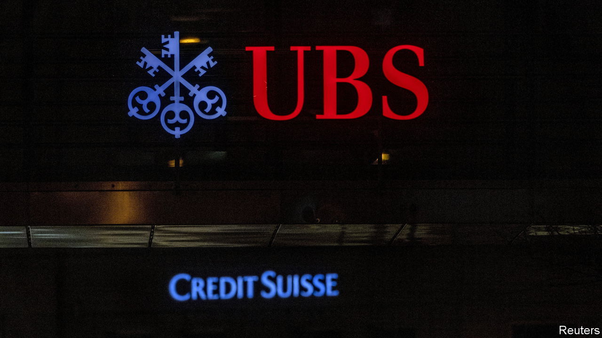

###### The world this week

# Business 

#####  

 

> Aug 31st 2023 

 reported a whopping second-quarter net profit of $29bn, almost all of it a gain from its takeover of , which it bought at a knock-down price in an emergency rescue backed by the Swiss government. UBS also laid out plans to fully absorb Credit Suisse’s domestic operations, a controversial move that will lead to thousands of job losses. 

 was 0.8% smaller in the second quarter than in the previous three months, though the contraction was not as bad as had been feared. The country exported fewer goods and household consumption shrank again, as the central bank’s sharp rises in interest rates took hold. 

 


 central bank raised its key interest rate from 17.5% to 25%, a much bigger increase than markets had expected. The bank has shifted towards a more orthodox monetary policy under the new governor, Hafize Gaye Erkan, in order to combat inflation, which is on the rise again (the annual rate soared to 47.8% in July). The bank says it will continue to tighten monetary policy “as much as needed” until the inflation outlook improves. The Turkish lira rose against the dollar but later gave up some of its gains.

The Biden administration unveiled the first  for which Medicare officials will, in effect, set the price they pay drug companies. The list includes treatments for diabetes, arthritis and the prevention of strokes. They were chosen because they account for a big share of Medicare spending and do not face competition in the market. Pharmaceutical firms have filed a court case against the scheme, arguing that it is unconstitutional.

 share price plunged amid reports that it is preparing to file for bankruptcy protection to restructure its debts, including any liabilities it incurs over claims it contributed to the opioid epidemic. Rite Aid is one of America’s biggest pharmacy chains.

This is not a wind up

The market for  looks set for a shake-up. The Swiss manufacturer of luxury timepieces said it was acquiring Bucherer, which operates stores in high-end locations around the world that sell Rolexes as well as its own merchandise, leading to speculation that Rolex is planning to sell more of its watches directly to consumers. The share price of Watches of Switzerland, a rival retailer to Bucherer, slumped. 

One of the biggest-ever lawsuits against a company reached a settlement when 3M agreed to pay $6bn to 250,000 former servicemen over . The earplugs, made by a firm that 3M bought in 2008, were distributed to troops during the conflicts in Afghanistan and Iraq, but the servicemen claim that the noise mufflers failed to prevent a loss of hearing. The agreement is not an admission of liability by 3M. A further 50,000 claims were dismissed by a judge. 

Countries in the European Union are buying significantly more , according to Global Witness, an international NGO. During the first seven months of this year the EU bought 22m cubic metres of Russian LNG, up by 40% compared with the same period in 2021. Spain and Belgium were the world’s second- and third-biggest importers, just behind China. Global Witness said that buying Russian gas has “the same impact as buying Russian oil. Both fund the war in Ukraine.”

 net profit surged by 205% in the first half of the year, compared with the same six months in 2022. The Chinese maker of electric vehicles is making a big push outside its domestic market, where it accounts for 37% of EV sales, into Europe. China is expected to overtake Japan as the world’s biggest exporter of cars this year. 

 filed for an IPO on the Nasdaq stock exchange. The public listing of the online grocery-delivery firm is being seen as another fillip for the IPO market for tech firms ahead of the flotation of Arm, a chip designer. 

To the delight of anyone who has been stuck on a plane, the American government fined  $4.1m for keeping dozens of flights on the ground for lengthy periods and not allowing people to get off. In one case passengers were held for six hours. It is the largest penalty imposed on an airline for violating the “tarmac-delay rule”. 

A meaty case

A federal judge in Miami allowed a class-action lawsuit to proceed against  from customers who claim that its Whopper is smaller than the one depicted on store menus. The judge ruled that a jury should decide “what reasonable people think” in the matter (if the case is not settled). Lawyers say the mis-advertised smaller burgers have left their clients “financially damaged” and are seeking millions in compensation. The fast-food chain says the plaintiffs’ claims are “false”.

