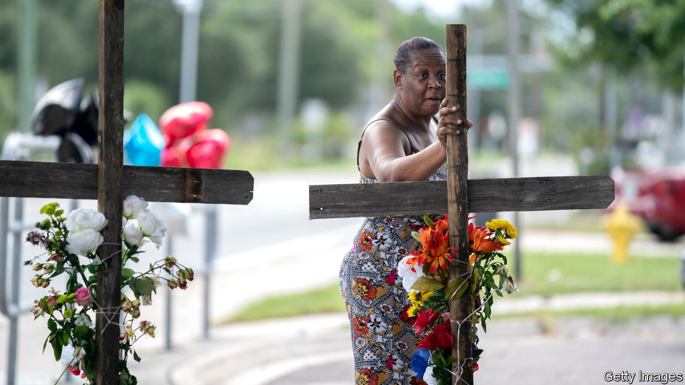

###### The world this week

# Politics 

#####  

 

> Aug 31st 2023 

Soldiers in  seized power days after a presidential election returned the incumbent, Ali Bongo, to office in a ballot that was widely deemed fraudulent as usual. Mr Bongo’s father had ruled from 1967 until his death in 2009, when his son inherited the post. It is the eighth coup in west and central Africa since 2020, following one in Niger in July. Others include Burkina Faso, Chad, Guinea and Mali. France is watching nervously, since it has a military base in Libreville, Gabon’s capital, and has seen coup-led regimes expel its forces from Burkina Faso and Mali. 

Security across much of  continued to deteriorate, as 13,000 UN peacekeepers and police continued to be drawn down; the ruling junta has ordered them all out by the end of the year. Following the death of Yevgeny Prigozhin, head of the Wagner mercenary group, which has been active in Mali, Russia pledged to keep giving “comprehensive assistance” to the country. The historic Malian city of Timbuktu, facing a blockade by jihadists, was short of food.

electoral commission declared the incumbent president, Emmerson Mnangagwa, who overthrew Robert Mugabe in a coup in 2017, to have won re-election. The commission said Mr Mnangagwa defeated Nelson Chamisa, the main challenger, by 53% to 44%. Independent observers, supported by the Southern African Development Community, a regional club which had previously whitewashed elections in Zimbabwe, castigated the conduct of the poll. 

 internationally recognised government based in Tripoli , after protests erupted in several cities when it was revealed that she had held clandestine talks in Italy with her Israeli counterpart, presumably to discuss opening diplomatic relations. 

At least 73 people died when a fire broke out in a building that was being used by squatters in central , South Africa’s commercial capital. It is thought that most of the dead were migrants. 

 stepped up its  on Russia, hitting six regions in just one night. Russia conducted its most intense bombardment of Kyiv for several months, firing missiles and drones to terrorise the city’s residents. Meanwhile the Ukrainian army said it had recaptured the village of Robotyne in the south-east of the country. Russia said it had beaten back the assault. 

A private ceremony was held to bury in St Petersburg. The Kremlin continued to deny that it had arranged for the leader of the Wagner Group to be killed in a plane crash. Vladimir Putin did not attend the funeral. 

The  education minister, Gabriel Attal, announced that Muslim girls will not be allowed to wear the abaya, a loose-fitting full-length robe, in schools. Headscarves are already banned in French schools. Mr Attal argues that secularism means “freedom to emancipate oneself at school”, but the move has been condemned on the left, with one MP saying the government had become the “clothes police”. 

A display of enmity among the institutions came to the fore when the European Commission slapped down remarks made by Charles Michel, the president of the European Council, about enlargement. Mr Michel’s comment that the EU must be ready to extend its membership by 2030 were swiftly rebuffed by the commission, which said it wasn’t focused on a date. A summit in October will discuss the candidate countries, which include Ukraine and Moldova. 

An early spring

The start of  federal trial for conspiring to overturn the result of the presidential election three years ago has been set for March 4th. Mr Trump’s lawyers had asked that it be pushed back to 2026, but the judge ruled that a speedy trial was in society’s interest. March 4th is the day before Super Tuesday, when over a dozen states will hold party primaries. 

 


A 21-year-old white man shot dead three black people at a store in , Florida, before taking his own life. The gunman’s motivation for murder was racial hatred. He had been briefly detained in 2017 for a mental-health issue. 

Bernardo Arévalo became  president-elect after the results from a recent election were officially certified. The reformer is one step closer to taking power in January, but more challenges from a group of corrupt elites trying to block him from office are in the works. Semilla, his party, has been suspended, and Mr Arévalo and his vice-president face credible threats to their lives.

Terry Gou shook up the race to be  next president by declaring his candidacy as an independent. The founder of Foxconn, which assembles the iPhone and other devices, failed this year for the second time to secure the candidacy of the Kuomintang (KMT) party, which favours closer relations with China. The front-runner for January’s poll remains Lai Ching-te, the vice-president from the ruling Democratic Progressive Party, and the only candidate who takes a tough line on China.

Meanwhile Taiwan warned of the potential for a “sharp increase” in  with China, as 12 Chinese aircraft crossed into its air-defence zone.

A court in  suspended Imran Khan’s conviction on corruption charges pending his appeal in the case. But the former prime minister will remain in jail as he is on remand in another case. Mr Khan says the 100 or so charges brought against him since he was ousted from power last year are politically motivated.

 set October 14th as the date for a referendum on whether the constitution should be altered to create an advisory body for Aboriginals and Torres Strait Islanders. Opinion polls point to rising support for a no vote.

Grant Shapps was appointed as Britain’s new . He replaces the widely respected Ben Wallace, who at one point was considered for the job of NATO secretary-general.

Green light, red light

 ultra-low emission zone was expanded to all the city’s boroughs. Now all drivers of cars that do not meet certain emissions standards will be charged. The expansion is unpopular in outer London, which is poorer than inner London, and comes amid cost-of-living concerns. Despite calls from his Labour Party to reconsider, the mayor, Sadiq Khan, remained resolute in pressing ahead with the scheme. But the backlash has caused Mr Khan to shelve plans for zero-emission zones in the city. 

