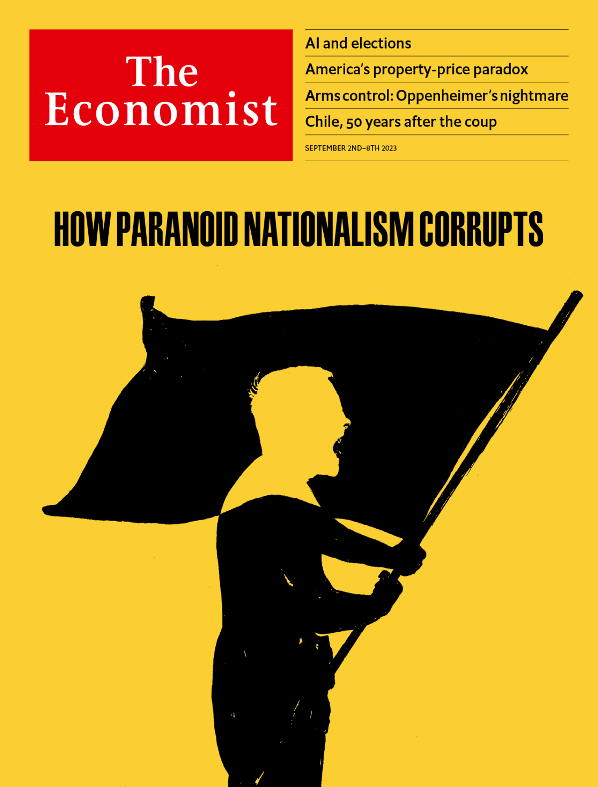

###### The Economist

# This week’s covers 

##### How we saw the world 

> Aug 31st 2023 

Some weeks, including this one, we publish more than one cover. In most of the world we consider how artificial intelligence will affect the elections of 2024. 


Politics is supposed to be about persuasion but it has always been stalked by propaganda. In the past, disinformation has always been created by humans. Now, advances in generative artificial intelligence—with models that can spit out sophisticated essays and create realistic images from text prompts—make synthetic propaganda possible. The fear is that disinformation campaigns may be supercharged in 2024, just as countries with a collective population of some 4bn—including America, Britain, India, Indonesia, Mexico and Taiwan—prepare to vote. How worried should their citizens be? 

 


 

 


In Europe, the Middle East and Africa we consider how paranoid nationalism corrupts. 


Around the world cynical leaders are using a mix of exaggeration and lies to win and abuse power. Vladimir Putin claims that Ukraine is a NATO puppet, whose Nazi cliques threaten Russia; India’s ruling party warns that Muslims are waging a “love jihad” to seduce Hindu maidens. Preachers of paranoid nationalism harm the targets of their rhetoric, obviously, but their real intention is to hoodwink their own followers. By inflaming nationalist fervour, self-serving leaders can more easily win power and, once in office, they can distract public attention from their abuses by calling out the supposed enemies who would otherwise keep them in check. 

 


 


