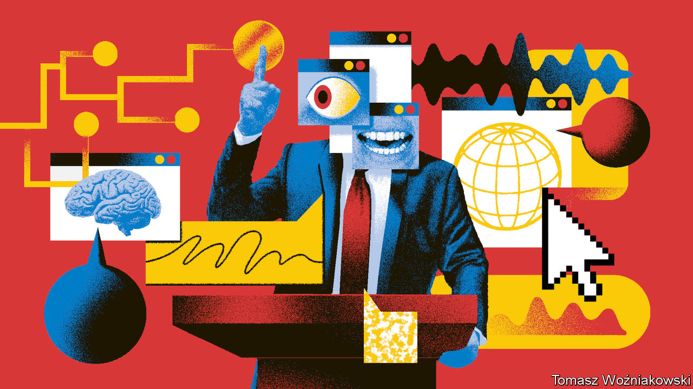
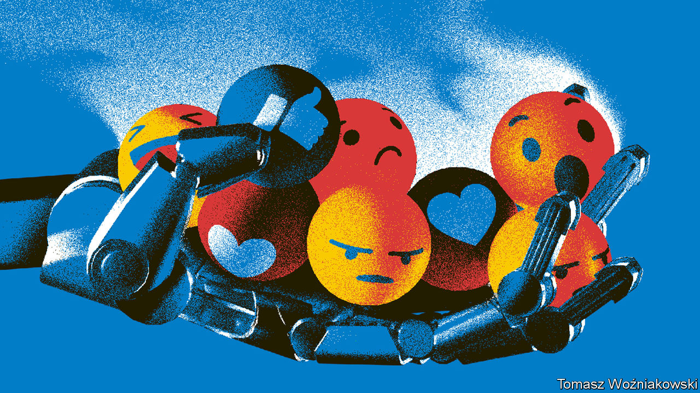

###### Mr Bot goes to Washington

# AI will change American elections, but not in the obvious way 

##### How polarisation inoculates Americans against misinformation 

 

> Aug 31st 2023 

THE day before Chicago’s mayoral election in February, a recording began circulating online. It was first posted on Twitter (now X) by a newly created account called Chicago Lakefront News. It featured what sounded like Paul Vallas, the law-and-order candidate, bemoaning all the fuss about police brutality and harking back to a halcyon time when cops could kill suspects by the dozen “and no one would bat an eye”. It was political dynamite and was quickly shared by thousands. But the voice in the recording was not Mr Vallas’s, nor any human’s: it was a “deepfake”, generated by artificial-intelligence (AI) software, which had been trained to mimic the sound of Mr Vallas’s voice.

This is the sort of incident that is keeping candidates, political analysts and anyone worried about the health of democracy up at night. Countries with a collective population of some 4bn—including America, Britain, India, Indonesia, Mexico and Taiwan—all vote for leaders in 2024. Given AI’s existing capabilities and rapid evolution, it seems inevitable that at least some of these contests will be manipulated by subterfuges like the one that targeted Mr Vallas. Tech luminaries are sounding the alarm. Eric Schmidt, a former CEO of Google (and a former member of The Economist Group’s board), has warned that “the 2024 elections are going to be a mess because social media is not protecting us from false generative AI”. Sam Altman, the CEO of OpenAI, the startup behind ChatGPT, recently posted that he was “nervous about the impact AI is going to have on future elections (at least until everyone gets used to it)”. 

Politicians are also concerned (naturally). At a hearing in late July, senators grilled AI experts about the likelihood of elections being manipulated. “I, for one, do not want the working people in this country and the children of this country to be used as guinea pigs for generative ai,” says Josh Hawley, a Republican senator from Missouri, who has written a set of AI principles that includes a licensing regime for advanced models. Amy Klobuchar, a Democratic senator from Minnesota, has expressed worry that disclosure of ai use in election ads would hardly be enough of a safeguard. 

Mr Vallas, after all, is not the only candidate to have been impersonated by AI. A political group that supports Ron DeSantis, the governor of Florida, who is challenging Donald Trump for the Republican presidential nomination, has used AI to mimic Mr Trump’s voice. The Republican National Committee, the main campaign arm of the Republican Party, issued an AI-generated ad earlier this year after Joe Biden announced that he was running for re-election. It depicted what America might look like if he won, complete with illegal immigrants swarming the border with Mexico, office buildings abandoned in Wall Street and riot police failing to keep order in San Francisco. Although any reasonably attentive viewer would understand that the images were fictional, it gives an inkling of the potential for AI to mislead.

Yet campaign staffers with technical roles are surprisingly blasé about the prospect of an election overshadowed by AI. Jacky Chang, the chief technology officer for Mr Biden’s campaign in 2020, points out that most voters tend to view all messages about politics as spam, whether they encounter them through television advertising, robocalls, websites or social media. She therefore doubts that AI will have a big impact on next year’s election, even assuming it is capable of producing much slicker and more targeted appeals.

Academics tend to agree. Their research suggests that Americans are so accustomed to being bombarded with claims and counterclaims about politics that they are more or less impervious to persuasion, whether by fake news or the truthful sort. That does not mean there is nothing to worry about: by intensifying the barrage of untrustworthy information, AI will presumably make voters more mistrustful, cynical and intransigent. That may be the intention of some of those deploying AI to manipulate elections. As Jake Auchincloss, a Democratic congressman, puts it, “Our adversaries abroad, and the worst actors here at home, are at the cutting edge of using disinformation—less to make citizens not trust a particular person or institution, but to make them not trust anything.”

Mr Vallas’s experience bears out the view that AI is unlikely to secure victory for particular candidates. He complained immediately to Twitter about the deepfake of his voice. Twitter removed the offending recording and closed the account that had posted it. Mr Vallas placed first in the election the next day, although he did eventually lose a run-off two months later. Some 40 national elections have taken place around the world since the launch a year ago of Stable Diffusion, free AI software that can create realistic-looking images from textual prompts. Over 25 have been held since the launch of ChatGPT in November. “We still have not one convincing case of a deepfake making any difference whatsoever in politics,” says Brendan Nyhan of Dartmouth College. 

 


The most commonly aired scenario for how AI might undermine an election is by saturating social media with misleading information to sway enough voters. But this misunderstands how Americans, at any rate, form their views. Social media is the primary source of news for only one in five of them, according to data from the Pew Research Centre, a think-tank. TV and newspapers, whether online or in print, both play a far bigger role, supplying news to about 30% of people each (see chart).

Those who do rely on social media are exposed to plenty of fake news: somewhere between 1% and 5% of all news viewed is false or highly misleading, according to an analysis of 11 papers by researchers from Harvard University’s Kennedy School. Facebook estimates that the Russian government’s effort to manipulate the presidential election in 2016 involved around 120 pages and 80,000 posts that were, through sharing, seen by roughly 126m Americans, half of the electorate.

The Russians aren’t coming

But most users do not set any store by such material. A study by Matthew Gentzkow and Hunt Allcott of Stanford University of the Russian disinformation campaign estimated that it shifted the candidates’ vote shares “by an amount on the order of hundredths of a percentage point”. Another study published in  in 2023 that analysed detailed data from individuals’ Twitter feeds along with repeated surveys found that exposure to tweets by Russian bots had little-to-no effect on political attitudes or polarisation.

That should not be surprising: most users seem impermeable to genuine news on social media, too. Meta, the company that owns Facebook, allowed researchers to experiment with the information served up to a group of American users in the run-up to the presidential election of 2020. Some were shown fewer items that fitted their pre-existing beliefs, and more that challenged them. Others were presented with news in chronological order, rather than in the order Facebook’s algorithm thought would interest them most. These changes did not appear to alter the subjects’ political outlook at all.

Academics consistently find that fake news is viewed mainly by hyper-partisans, rather than floating voters. In other words, it serves mainly to affirm views that are already strongly held. “The problem is more with demand than supply,” says Ms Chang.

Even highly trained and well-paid professionals struggle to shift voters’ opinions. The estimated marginal effect of most political advertising in America is near zero (a phenomenon political scientists call the “minimal-effects hypothesis”). To put it another way, if clever technology were enough to swing an election one way or another, then the $14bn-odd spent on the election campaign of 2020 would have decided races in favour of the candidates with more money on their side. “Persuasion is very difficult,” says Mr Nyhan. His work tries to counter misinformation about misinformation: it’s not nearly as effective as people think. Just as people no longer trust any old text that they encounter online, he says, they are also learning to be sceptical of other media, including recordings and film.

Indeed, social media may not be shaping American political life as much as is commonly assumed. It cannot explain heightened polarisation and diminished trust in institutions, since both trends are much older than X, Facebook and Instagram. A study published in 2017 by Mr Gentzkow, Levi Boxell and Jesse Shapiro found that political polarisation had increased most rapidly among the elderly, despite the fact that they used social media less than younger voters. That makes the rise of partisan television stations, such as Fox News, seem a likelier culprit. The fact that many other Western countries, including Germany and Sweden, have become less polarised over the past 30 years, despite the spread of social media, also suggests other factors are at play.

Some political staffers do see a way for AI-generated falsehoods to influence a campaign, but it is a more roundabout process than you might imagine. Bot networks trained to appear human could co-ordinate to trick the algorithms used by big social-media platforms in order to give prominence to certain news topics and bury discussion of others. Such skewing of the news might be further amplified if partisan media outfits then seized on the topics being aired on social media. Rick Wilson, a longtime Republican campaign strategist who co-founded the Lincoln Project, an anti-Trump outfit, gives a scenario of a deepfake or other false content that purports to implicate Mr Biden in a cover-up of crimes by his son, Hunter. It might be posted in a far-right Facebook group or some other corner of the internet, disseminated by sharing and then picked up by a prominent figure in the right-wing media. “The purpose here is not to fool high-information voters or the mainstream media. The purpose is to trick low-information Republican voters into believing and sharing the stuff on their socials so that it gets wider and wider distribution.”

In fact, this sort of manipulation works best if the posts or tweets in question are not fake, but nonetheless favourable to one party or another. That is how the most effective Chinese influence operations in Taiwan work, says Chihhao Yu, the co-director of Taiwan Information Environment Research Centre, a watchdog. For obvious reasons, Taiwan is perhaps the world’s most vigilant country about this sort of manipulation, with a government ministry dedicated to digital affairs and an active “civic-hacking” community that aims to identify and counter Chinese misinformation. Mr Yu says there is not yet much sign of sophisticated AI-generated fake news ahead of the country’s presidential election in January 2024. But China does appear to be attempting to propagate pre-existing anti-American stories and posts without making them up entirely.

This sort of activity does not necessarily involve AI. In India, political parties constantly drop misleading information about the opposite party into many thousands of WhatsApp groups, which is then quickly shared among personal networks. As a campaign operative for Congress, an opposition party, explains, “You don’t need bots to be producing misinformation…real people are producing it.”

But AI may make such activity cheaper. A recent study by Micah Musser of Georgetown University calculates that an AI model capable of producing usable text just three-quarters of the time could save $3m over the course of a 10m-post campaign, cutting content-generation costs by two-thirds. What is more, advances in large-language models and machine translation mean that AI may soon eliminate some of the telltale signs of bots, such as poor grammar or punctuation. And whereas influence campaigns typically use the same text over and over again—another red flag for monitors—AI allows the creation of unlimited numbers of distinct messages.

The most celebrated creators of the models underpinning most AI operations, such as OpenAI and Anthropic, say that they will have teams monitoring the queries sent by users and applications to detect possible influence operations. Yet even here, open-source models from Stable Diffusion for image-generation to Meta’s LLaMA for text-generation, face no such hindrances.

That makes the tech firms that distribute content ever more important. Stephen Stedman of Stanford University says the platforms are better prepared than they were in 2016, but less so than in 2020. He notes that Facebook deployed “an enormous amount of resources…around 800 people” to guard against manipulation ahead of India’s elections in 2019. From 2017 to mid-2021 it blocked more than 150 influence operations around the world. Facebook bans the sharing of deepfakes; Google prohibits the use of manipulated media in political advertisements.

But a backlash against the platforms for being too strict in recent elections, such as when several acted to pre-emptively slow the spread of the Hunter Biden laptop story, has since caused them to become more cautious about flagging or removing posts. A pair of lawsuits against government officials and a cadre of academics who flagged misinformation to social-media platforms in 2020 and 2021 will make similar efforts less likely in 2024. Meta and X have also cut members of their safety teams to reduce costs. Since its takeover by Elon Musk, X has made little progress in removing bots. And TikTok, which is still a relatively new platform in the political arena, makes it possible for new users without much reputation to go viral. 

Researchers are also busy devising technology to determine which recordings or films are real, including watermarking synthetically generated text and images. Elizabeth Seger of the Centre for the Governance of AI, a British think-tank, talks of a “digital signature” that can be used to verify the original source of an image. A consortium called C2PA is trying to create a standard that would prove that media are authentically generated. Although not all AI or social-media firms will join such initiatives, there is already plenty of talk in Congress about compelling them to do so. 

Prompt: vote 

In private, tech executives are optimistic that all this is holding the feared onslaught of manipulation at bay. “We are not seeing the influx that we expected to see,” says an official at Meta. “We are dealing with a very manageable amount right now.” An executive at Alphabet echoes this cautious confidence, noting that the wave of misinformation that was expected ahead of America’s mid-term elections last year turned out to be more of a ripple. 

Advances in AI may even help to curb abuse of AI, by helping to detect influence operations. “The major use case of GPT in security that I’ve seen is actually defensive,” says an employee at America’s Cybersecurity and Infrastructure Security Agency (CISA), which is responsible for guarding election machinery from hacking. He points to new AI tools that pre-emptively identify vulnerabilities in piles of code.

 


For many campaign operatives, too, AI is as much a boon as a threat. Matt Hodges, the head of engineering for Mr Biden’s previous campaign explains that AI’s most immediate effect is to help comms staffers and field directors supercharge their “day-to-day tasks”. Betsy Hoover, an online director for Barack Obama’s 2012 campaign and co-founder of Higher Ground Labs, a political-technology investment firm, points to the startup Quiller which helps campaigns write better fundraising emails, having perfected its software using mountains of data about which approaches have worked in the past. 

Another possible use is in refining campaign ads. A Democratic operative talks of creating software that would score draft scripts and suggest revisions. “You’re going to see a lot of down-ballot candidates use it to create content for websites,” says Scott Tranter, who has built data operations for Republican campaigns.

Some campaigns are even making use of deepfakes. A sympathetic political group has created a chatbot designed to resemble Francis Suarez, the mayor of Miami and Republican presidential candidate. Members of the public can put questions to this cyber-Suarez. The clumsily rendered avatar replies with talking points intended to make Mr Saurez look good. (Alas, even the vast analytical power of the AI behind the chatbot has not worked out a way to make Mr Suarez sound clear and cogent, rather than evasive, when talking about the attack on the Capitol by a pro-Trump mob on January 6th 2021.)

The shifty, underwhelming cyber-Suarez may be a good stand-in not just for his candidacy, but for the likely role of AI in the coming election cycle. In politics, as opposed to almost any other industry, cheerleaders for AI are hoping that its impact will be largely mundane. On current evidence, their hopes are likely to be gratified. On August 29th Mr Suarez announced he was dropping out of the race. ■


