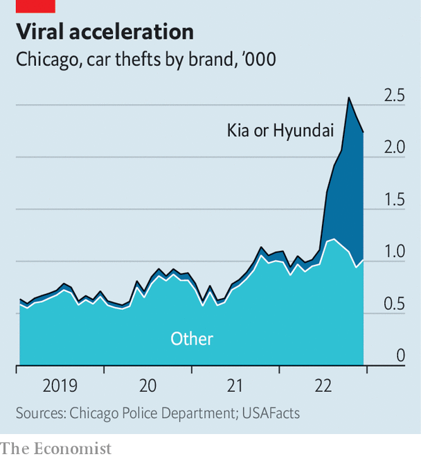

###### The Kia issue

# Cities are suing car manufacturers over auto theft. They have a case 

##### When cars are easy to steal, it makes other crimes easier too 

 

> Aug 31st 2023 

Tiktok, a Chinese-owned social-media platform where users post short videos, is a fount of useful information. Type “Kia” into its search bar and the helpful autosuggest adds “boys tutorial”. Click through and the most-liked result is a video explaining how to steal a Hyundai car. A gloved hand pulls the plastic off the steering-wheel housing and then jams a screwdriver into the ignition switch and wrenches it aside. Over rap music a computerised voice says: “this is why you should not buy Kia or Hyundai.” The hand attaches a USB cable onto an exposed socket, and twists, and the car starts up. The video has over 415,000 likes. It is one example of a viral internet trend led by “Kia Boys”, adolescents who steal cars to joyride them and post the videos on social media.

 


On August 24th the City of Chicago announced it had filed a lawsuit against the American subsidiaries of Kia and Hyundai, two South Korean car manufacturers. The lawsuit alleges that the firms did not include simple immobiliser technology in some of their cheaper vehicles, making them extraordinarily easy to steal. In 2022, over 8,800 Kias and Hyundai cars were stolen in Chicago, making up two-fifths of the 21,000 vehicle thefts recorded. So far this year, they account for more than half—and the total compared with this point last year has doubled (see chart). The result of the failure to install immobilisers, said Brandon Johnson, Chicago’s left-wing mayor, is a “nationwide crime spree”.

Mr Johnson’s critics accused him of trying to abrogate responsibility for crime. Raymond Lopez, a conservative-leaning alderman, told Fox News the move was from a “socialist playbook”. Yet Chicago’s lawsuit is one of seven to have been filed by cities against the manufacturers so far this year, as car theft has soared across America. Baltimore, New York and Seattle are among the other cities to also be suing. Last year, over 1m vehicles were stolen, the highest figure since 2008, according to the National Insurance Crime Bureau, a trade association. Kias and Hyundais were among the most-stolen cars. A class-action lawsuit by owners was settled by the firms for $200m earlier this year.

It is unclear what chance the cities have in the courts. They all argue that, by selling cars which are so easy to steal, the two firms wasted police time and enabled other crimes. Kia says its vehicles were compliant with the law, and the lawsuits are “without merit”. Unlike those in Europe or Canada, regulators in America do not require vehicles to be fitted with immobilisers, which usually work by demanding a code from a radio key fob to start a car. The firms have also offered software updates which make it less easy to steal the affected cars. All new Kias and Hyundais sold now have immobilisers fitted.

Yet in 2015, 96% of new cars sold by other manufacturers did come with immobilisers, which cost at most a few hundred dollars. For Kia and Hyundai vehicles, the figure was just 26%. Todd Henderson, a legal scholar at the University of Chicago, says that on the face of it, the cities suing might have a case. It would rest, he says, on the argument that when a simple and cheap technology is available that can radically reduce the chance of a product causing enormous damage, “the non-inclusion makes the product defective.” A car that is so easily stolen might be analogous to an iron that does not automatically switch off, and so burns down a house.

Graham Farrell, a criminologist at the University of Leeds in Britain, says that car theft is a “keystone crime”. He argues that the dramatic decline in car theft in the 1990s—in America, annual thefts peaked at 1.7m in 1991—was in large part due to cars being fitted with immobilisers. Stolen cars directly enable other crimes. It is hard to do a drive-by shooting without wheels. But especially easy-to-steal cars may have even more deleterious effects by, in effect, creating new criminals. A study Mr Farrell published in 2020 argues that car theft is a gateway drug into criminality: young boys who begin by stealing cars go on to have more extensive criminal careers.

If so, that ought to worry American cops and politicians. The enormous spike in violence that began in late 2020 seems to be ebbing. So far this year, murder rates in a majority of American cities have fallen sharply compared with last year. But car theft continues to rise. The risk is that the “Kia Boys” may just be getting started. ■


