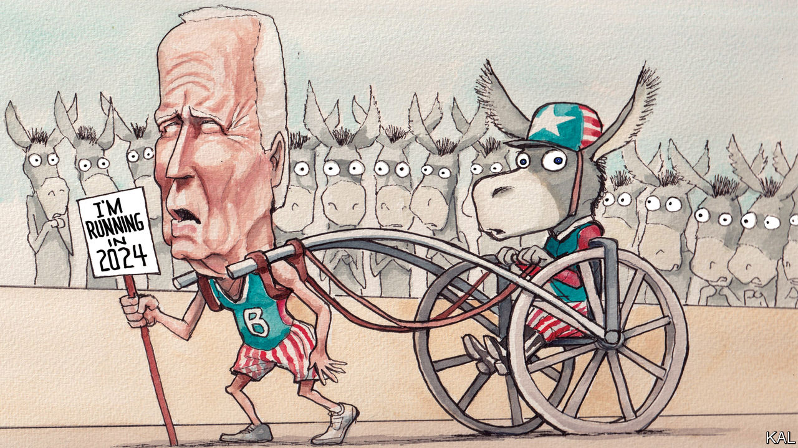

###### Lexington

# Joe Biden’s re-election bid is in trouble 

##### The Democrats’ bet looks increasingly risky 

 

> Aug 31st 2023 

The front-runner for the Republican presidential nomination is under indictment for 91 felonies in four criminal cases, and he probably is, as one of his primary opponents remarked during the recent Republican debate, the most disliked politician in America. Democrats have reason to be smug at the prospect of Donald Trump as the Republican nominee—unless they take a hard look at the vulnerabilities of their own standard-bearer. 

Fewer than one in four Americans (24%) want President Joe Biden to run again, according to a poll published on August 17th by the Associated Press. Even 55% of Democrats do not think he should run. Although his approval rating has ticked up, he remains one of the most unpopular presidents in modern history. 

Mr Biden’s problems are obscured by the drama around Donald Trump’s arrests and the Republican nominating contest. But that is also becoming a problem for the current president: he needs to capture the country’s attention if he hopes to recapture its imagination. Only Jimmy Carter and Donald Trump himself—both one-term presidents, at least so far—had net-negative ratings worse than Mr Biden’s at this point in their presidencies, according to an analysis of aggregated polls by the political publication FiveThirtyEight. In late August, its summary of public polls showed that 42% of Americans approved of the job Mr Biden was doing, whereas 53% disapproved.

His standing is even worse on the matter Americans care about most, his handling of the economy. The same Associated Press poll found that just 36% approve of his economic stewardship. It is hard to know which half of “Bidenomics” inspires them less.

 On issues such as crime, corruption in government and immigration, surveys suggest Mr Biden’s Republican opponent will have plenty of unhappiness to work with. Even in solidly blue New York, an influx of asylum-seekers—some bused from Republican border states—is souring Democrats on the president. Fewer than half of New Yorkers would vote for Mr Biden in a contest with Mr Trump, according to a recent Siena College poll. Mr Biden still led Mr Trump, 47% to 34% (with lots of abstentions). But that is a lousy margin for a Democrat in New York, far less than the 25-point minimum lead Mr Biden held in 2020. 

To the president’s partisans, all this is unfair. They rightly note the economy is vibrant. Unemployment, at 3.5%, is near a 50-year low, inflation has come down and real wages have been rising, at least for the poor. Homicide rates are falling in American cities. Although Republicans predicted chaos at the southern border after Mr Biden ended covid-era restrictions in May, a new border regime imposed by Mr Biden appears to be keeping such crossings below levels recorded before then. Mr Biden has adeptly led the international response to Russia’s invasion of Ukraine and amassed a formidable record of bipartisan legislation. 

But the president seems stuck with impressions formed in his first two years in office. His approval rating has never recovered since it crashed during America’s chaotic withdrawal from Afghanistan two years ago. That same summer of 2021 he dismissed inflation as “temporary”. For months into 2022, he pursued progressives’ fondest and costliest policy goals before settling for the still-ambitious Infrastructure Reduction Act. “It made him look like he was pursuing liberal goals and was ineffective at doing it,” says Whit Ayres, a longtime Republican pollster. “And it made moderates feel like they’d been sold a bill of goods.” Mr Biden’s position has continued to deteriorate with the working-class voters, of whatever race, whom he will need in such battleground states as Arizona, Nevada and Pennsylvania.

The collapse of Hunter Biden’s plea agreement with prosecutors this summer means that publicity about his sordid traffic in the family name will continue to cloud Mr Biden’s own image of decency, and of his efforts to restore integrity to government. Student-loan repayments, suspended for more than three years because of the pandemic, are due to resume on October 1st. A national carworkers’ strike is looming. 

Democrats will rally to Mr Biden, and he has time to woo others. Yet every day that goes by his party’s biggest gamble, on his continued good health and acuity, also grows riskier. In 2020 voters embraced the idea that his age and experience made him a steady hand. Now they seem primed to see the slightest gaffe or stumble as confirmation that he is becoming unsteady. According to an AP poll at the end of August, 77% of Americans think Mr Biden is too old to serve effectively. His vice-president, Kamala Harris, has an even lower approval rating than he does.

Joe versus the volcano

Mr Biden has been trying to improve voters’ views of “Bidenomics” and of him. So far, a big push that began in June has had little obvious benefit. In late August his campaign began a four-month, $25m advertising blitz of seven battleground states. The first advertisement touts America’s pandemic recovery and a resurgence of manufacturing. “America is back!” Mr Biden declares, as though to pre-empt any claim it might need to be made great again.

Beyond trying to persuade Americans they have it pretty good, Mr Biden will count on the fight over abortion rights and, most of all, on Mr Trump’s greater unpopularity to motivate dispirited Democrats and win over the dwindling cadre of swing voters in the dwindling number of swing states. 

“Don’t compare me to the Almighty,” Mr Biden likes to say. “Compare me to the alternative.” Well, Mr Biden will probably lose if Republicans prove sane enough to supply an alternative such as Nikki Haley, a former governor of South Carolina, and the candidate who called out Mr Trump’s unpopularity. But he could well lose anyway. Democrat or not, anyone committed to the success of the American experiment should be hoping for a Republican nominee not named Trump. ■


