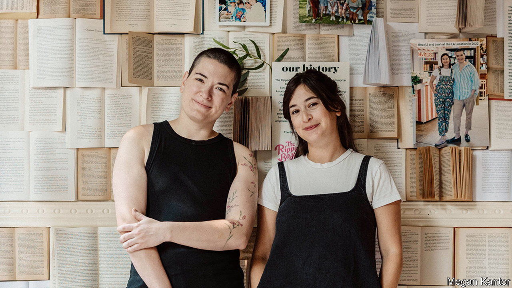

###### Bodice ripping

# Romance (as a category) is far from dead 

##### The publishing industry and readers swoon over romance novels 

 

> Aug 31st 2023 

“WOW, THIS is not what I was expecting at all,” says Allison, a nurse, remembering the first romance novel she ever read. Having shared the general literary snobbery that clings to romance novels, she is now evangelical about the genre. “It is wonderful to take somebody who is kind of sceptical and then tell them about it.” 

Allison was browsing in The Ripped Bodice, a romance-novel shop that recently opened in Brooklyn. The day the shop opened, the queue to get in was more than an hour long. The shop, which is whimsical in its decor, is serious in its devotion to romance novels.

The popularity of The Ripped Bodice (the second location devoted to romance that sisters Leah and Bea Koch have opened) is part of a larger shift. During the pandemic, when many were stuck at home and looking for escapist reading, fictional romance blossomed. In the year to May romance print sales were up by 52%, according to Circana, a market-research firm. List-price sales grew by 74%. Annual growth in sales went from 6% in 2020 to more than 50% last year.

Readers have changed too. Newer fans are mostly young adults and many are teenagers. Authors and characters alike are more racially diverse and sexually non-conforming. “Red, White and Royal Blue” depicts a romance between the son of the American president and a British prince (Amazon recently released a film based on the novel). More such plot twists are on the way. “I am a queer woman. I want to read books that have happy endings for characters like me, and that’s not what I’ve been getting so far,” says Adriana Herrera , a romance author.

The genre has come a long way from the ravishing of virgins of the 1970s. But the plots still rest on two reassuring pillars: a central love story and a happy ending. That does not mean married with a baby. “It could mean we’re adopting a dog together,” says Ms Koch. 

“The industry has a lot of respect for what has been happening with romance,” says Kristen McLean of Circana. Yet authors crave something deeper. “We shouldn’t have to defend” romance novels, says Sarah MacLean, author of “Knockout”. “Love is a powerful feeling. I wish that we could all see our way past thinking that those emotions are somehow less valuable than emotions that are built out of pain and sorrow.”

Librarians have noticed the shift too. Stephanie Anderson, of BookOps, which buys books for public libraries in New York and Brooklyn, notes that “the biggest challenge with romance at this point is finding the money and space to keep up with all the popular titles.”■


