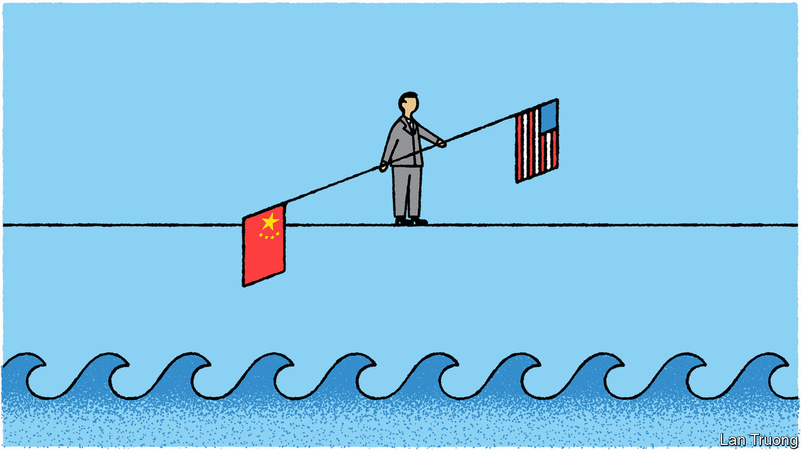

###### Banyan

# Joe Biden’s visit to Hanoi is a signal to China 

##### America and Vietnam have a shared interest in reining in aggression at sea 

 

> Sep 7th 2023 

SKIPPING AN ASEAN talkfest in Jakarta and hot on the heels of the G20 meeting in Delhi, Joe Biden is set to make a state visit to Vietnam on September 10th. He is the fifth sitting American president to travel to the land of the former enemy. Yet his trip is surely the most significant since Bill Clinton’s in 2000, after he re-established diplomatic ties and drew a line under a bloody and bitter past.

Since then relations between the champion of the free world and the world’s second-biggest Leninist dictatorship, which governs nearly 100m people, have only improved. That has been visible in America’s ascent in Vietnam’s carefully constructed hierarchy of relations with foreign countries. For a decade, the two countries’ relationship has been defined as a “comprehensive partnership”. When Mr Biden meets the general secretary of the Communist Party of Vietnam, Nguyen Phu Trong, America looks set to get a rare upgrade, to a “comprehensive strategic partnership”. Quite some rehabilitation, on both sides. 

Campaigners at home will accuse Mr Biden of cosying up to a regime with an appalling human-rights record. But he is bent on countering Chinese sway in the Indo-Pacific region. The trip is part of a strategy in which overlapping security initiatives create a spreading latticework on China’s periphery. Vietnam’s biggest security worry is Chinese encroachment in the South China Sea and harassment of fishing boats and oil-and-gas exploration vessels in Vietnamese waters. America lifted a ban on arms sales to Vietnam in 2016 and has since sold it two coastguard cutters. More defence initiatives may come out of this trip. After also strengthening its military relationship with the Philippines, America may be planning to challenge China more robustly in the South China Sea.

For America, economic security, again with China in mind, will also be a goal in Hanoi. American planners have made “de-risking” a key foreign policy. They mean reshaping trade and supply chains to bring China-based production home or to friendly countries, as well as cutting China off from American investment and know-how in high-tech areas, including quantum computing, AI and advanced chips. Vietnam, a growing production base with a bright, young workforce, is a prime candidate for “friendshoring”. More American investment would also add heft to threadbare official promises of more economic engagement in the region.

As for Vietnam, much hangs on the upgrade. The country has become a linchpin in global supply chains. America is its biggest export market. As Le Hong Hiep of the ISEAS-Yusof Ishak Institute in Singapore points out, America is seen as a source of high-quality investment. Intel, a major chipmaker, has poured over $1.5bn into Vietnam. America also has plenty of green tech to offer. That matters in a country with ambitious climate goals that wants to get away from labour- or resource-intensive industries. More defence engagement with America not only helps in the South China Sea, but also provides alternatives to Vietnam’s reliance on Russian weapons. Already of questionable quality, they have been in short supply since Russia invaded Ukraine. Vietnam wants help building its own arms industry.

China, not surprisingly, is unhappy. It condemns Mr Biden’s thickening of ties with Vietnam as more evidence of America’s “cold-war mentality”. It will also be miffed that, with the diplomatic upgrade, America will join a select club of only China, Vietnam’s inescapable northern neighbour, and Russia, its backer during the war against America.

Yet Mr Trong and colleagues have gauged that China will do little more than harrumph. Vietnam has millennia-old experience of having to handle its sometimes hostile neighbour. Fraternal ties between the two Communist parties help regulate relations. Vietnam’s leaders have gone to lengths to reassure China over the Biden visit. They know how valuable Vietnam is to China: ASEAN is China’s biggest export market, and Vietnam its biggest market among ASEAN members. If, says Mr Hiep, China shows its displeasure through more harassment in the South China Sea, why, that would be nothing new. 

Some in America think Vietnam can be reeled into its camp. That is wishful thinking. The regime’s calculation has never been to side with America. More likely, it is to balance adroitly between it and China. Better now to attempt a middle path than to leave it until relations between the two great powers lurch even more dangerously downwards.■


