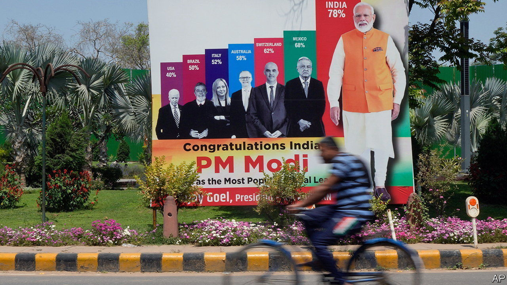

###### Peak summit

# The G20 has been a resounding success for India 

##### Less so for global co-operation 

 

> Sep 7th 2023 

FIRST IT WAS Vladimir Putin, the Russian president, who said he would stay at home. A few days later Xi Jinping, China’s leader, decided he would also skip the trip. For a moment on September 5th it seemed as though Joe Biden, too, would have to give it a miss, before he confirmed that he would, in fact, attend the G20 leaders’ summit in Delhi on September 9th and 10th. Narendra Modi, India’s prime minister and the host of the jamboree, will have breathed a sigh of relief. 

Mr Modi has staked his reputation on pulling off a successful G20. Since November last year, when India took over the rotating presidency of the group, Indian cities have been bedecked in G20 logos on wall paintings and billboards. Events have been held in dozens of Indian cities in every state of the union. The prime minister’s smiling face has beamed down from these ads. What does he have to show for it?

High-level G20 meetings over the past year have repeatedly failed to reach consensus. Summits of ministers on anything from finance to climate change ended without the customary joint statement. Instead they settled for an “outcome document” that notes areas of agreement as well as discord—usually wording around Russia’s invasion of Ukraine. There is no reason to think that the summit of heads of state and government over the weekend will achieve what no ministerial grouping has done so far. That would make it the first G20 leaders’ summit to fail to issue a joint statement. 

From the perspective of binding the world together, then, India’s G20 may be a failure. Yet, as Harsh V. Pant of King’s College in London points out, “if the fault lines in the global political environment are such that they do not themselves allow for a consensus document then there is very little India can do about it.” Indeed, seen from the perspective of Indian foreign-policy priorities, of India’s position in the world, and of Mr Modi’s Bharatiya Janata Party (BJP), the presidency has been a resounding success. 

Ever since independence in 1947, India’s foreign policy has prioritised relations with the poor world, chiefly through its leadership of the Non-Aligned Movement. Under Mr Modi, India has renewed this focus through a promise to represent and lead what has come to be called the “global south”. At the start of its presidency, India convened a “Voice of Global South Summit” of 125 countries to inform its G20 priorities. As its presidency comes to a close, it has championed the inclusion of the African Union in the G20, which would do much to boost India’s claim to be a leader of the poor world.

Second, the presidency has helped boost India’s image in the world in a year when it outgrew China to become the world’s most populous nation and its GDP is among the fastest growing of any major economy. By holding events across India, the government has showcased the breadth and diversity of the country. In a recent interview Mr Modi boasted that over the course of the year 100,000 delegates from 125 countries experienced the magic of India, and 15m Indians took part in the events in some form.

Lastly, the presidency has served as a vehicle for the personality cult of Mr Modi domestically, ahead of a general election next year. Like citizens of other big democracies, Indians have little interest in foreign affairs. The G20 has brought the world home, with  television debates giving it plenty of airtime. These tend to focus on Mr Modi himself as sage leader, not just of India but of the world, and attribute to him India’s rising importance. In a survey earlier this year by Pew Research Centre, an American pollster, 68% of Indians said they felt their country was growing in influence on the global stage. Among those who do not support the BJP, the figure was a still impressive 60%. In 2008 China used the Beijing Olympic games as a “coming-out party” to show itself off to the world. For India and for Mr Modi himself, the G20 has served much the same purpose. ■

