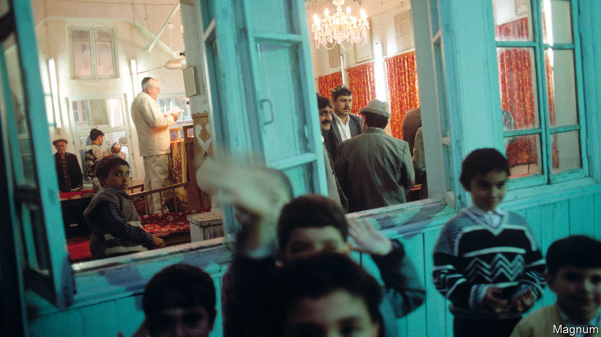

###### Lost tribe of the steppes

# Uzbekistan’s Bukharan Jews are disappearing 

##### Since the 1990s, thousands have left for Israel 

 

> Sep 7th 2023 

Towards sunset on a recent Friday, prayer-chant echoed around the turquoise tiles of Bukhara, the ancient Uzbek city Muslims consider the holiest in Central Asia. Yet it came not from a mosque or madrassa, but from a synagogue.

Jews have been living in Bukhara, an oasis on the old Silk Road, for more than 2,000 years. They have a distinctive culture and language (Bukhori, a dialect of Persian). But their numbers are dwindling so fast the community may soon disappear. Half a century ago, when the Soviet Union ruled Uzbekistan, some 20,000 Bukharan Jews lived in Bukhara and another 20,000 were scattered around Central Asia. Now there may be no more than a hundred remaining in the city, and another few hundred across Uzbekistan. 

“We are very few,” laments Abram Iskhakov, the 73-year-old self-taught cantor of the 400-year-old synagogue. He has led prayers there since its last rabbi died, five years ago, and was not replaced.

The remains of Central Asia’s oldest known synagogue, in Turkmenistan, are 2,200 years old. Local lore suggests Jews came to Bukhara after they were freed from captivity in Babylon in 538BC. More arrived in the 14th century when the emperor Tamerlane, ruling from Samarkand, invited Jewish artisans into his domain. The community thrived as merchants and craftsmen, with a similar culture to their Uzbek and Tajik neighbours. “My father taught us that Jews and Muslims are brothers, that the father of both is Abraham,” says Mr Iskhakov. But there were reminders of Jews’ second-class status in a Muslim realm. Jewish front doors were kept low to ensure “a Jew must bow down to enter his house”, says Shlomo Babayev, rabbi at one of two Bukharan Jewish synagogues in Tashkent, Uzbekistan’s capital.

The communists who took power after the Russian revolution treated all religions with disdain. Most synagogues were closed. Only old people were allowed to pray in the remaining ones, recalls Rabbi Babayev, who was born in 1955 into a Bukharan Jewish community in Samarkand. His grandfather was arrested, and died in prison, for secretly instructing children in Judaism. In the early 1970s the communists permitted emigration to Israel. An exodus began, which accelerated after the collapse of the Soviet Union in 1991. In the 1990s Rabbi Babayev blessed a dozen families every week as they embarked on the Aliyah, or journey to Israel.

In 1997 he went, too. The Bukharan Jewish diaspora probably has over 200,000 members, split between Israel and America. Rabbi Babayev has returned only temporarily, to serve as rabbi to Uzbekistan’s remaining Bukharan Jews. A few others who have returned from Israel, such as Marusya Malkiyeva, a septuagenarian living near Bukhara’s second synagogue, are back for good. “I’ve reserved my grave next to my mother’s,” she says, referring to the well-tended Jewish cemetery which is now looked after by a Muslim. “Not everyone will leave,” she insists. Then her phone rings. It is her son, calling from Israel, where he moved because he has three daughters and could find no suitable husbands for them in Bukhara. ■

