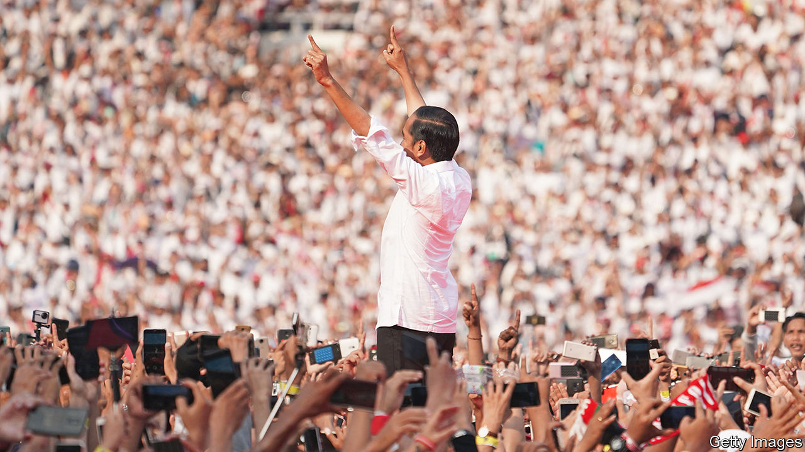
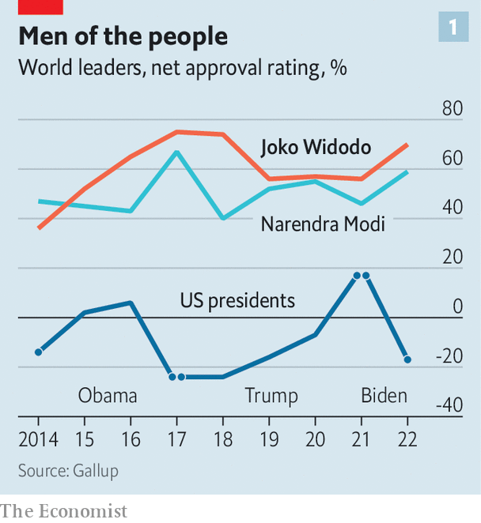
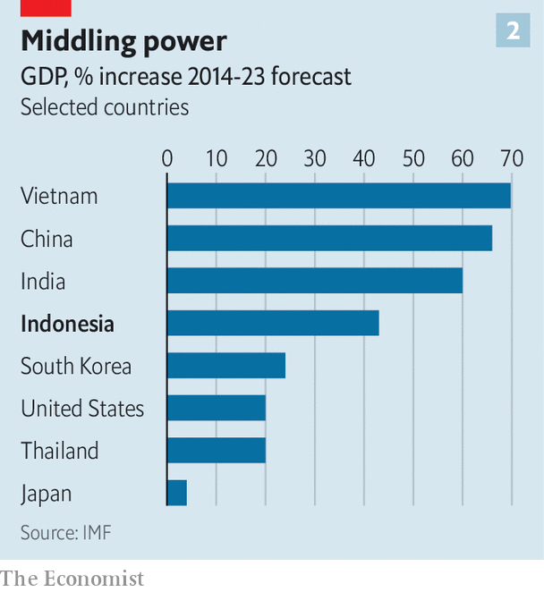
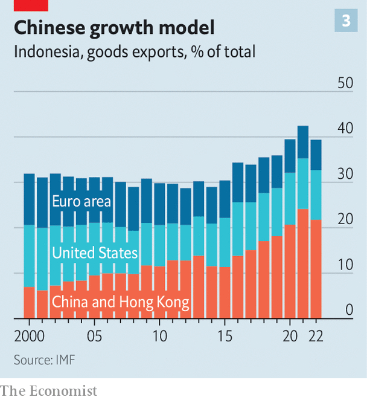

###### South-East Asian succession

# What will Indonesia look like after Jokowi leaves? 

##### The president’s legacy is not guaranteed 

 

> Sep 7th 2023 

During his final term as Indonesia’s president, Joko Widodo has played the global statesman. He hosted leaders from across the region at the Association of South-East Asian Nations (ASEAN) summit in Jakarta from September 5th to 7th. In August he bagged economic deals during a tour of Africa. He will attend the G20 leaders’ summit in Delhi on September 9th, having hosted last year’s event, and plans to visit Saudi Arabia soon, too. 

 


At home, his soft-spoken, folksy style has made Jokowi, as he is known, one of the best-liked leaders in the world. His approval rating hovers around 80% (see chart). Only Narendra Modi, India’s prime minister, comes close. But even as Jokowi basks in his popularity, speculation is building about what his legacy will be and who will succeed him after he steps down next year. 

When Jokowi became president in 2014, he was like no leader the country had ever seen: a furniture-maker who was raised in a riverside shack, he had no connection to the army or any prominent family. He is most at home inquiring about the price of onions at a market or handing out T-shirts to the crowds that throng to catch a glimpse of him wherever he goes. He has revolutionised Indonesian politics by yoking a savvy social-media operation to a relentless focus on economic growth. Yet three big uncertainties hang over his legacy: whether Indonesia’s economy will continue to grow; whether his successor will preserve his policies; and whether the country can maintain a balancing act in a divided world. 

Jokowi’s record on economic growth is decent. Indonesia has been the fifth-fastest-growing of the world’s 30 biggest economies since he won office in 2014. GDP has expanded by a cumulative 43% since then. IMF projections suggest this pace could continue. The fund reckons the country will be the second-fastest growing of the group over the next five years, making it the world’s 13th-largest economy by 2028, up from 18th back in 2014. 

Much of this has been thanks to an enormous push for infrastructure. The world’s fourth-most-populous country is made up of more than 13,000 islands, many of which lack basic amenities. Often pictured in a hard hat, Jokowi has built airports, ports, power plants, dams and has laid thousands of kilometres of roads and railways. He has used his popularity to cajole the country’s political parties, state-owned enterprises and powerful tycoons. 

His signature project, the construction from scratch of an entirely new capital city in the jungles of Borneo, exemplifies this strategy—and highlights the uncertainty of sustaining its success. Jokowi argues that this city, known as Nusantara, is essential because one-quarter of Jakarta, the current capital, could be submerged by 2050. Critics say the $34bn project, due to be completed in 2045, is unrealistic. The government says it will cover 20% of the projected costs, with the rest funded by domestic and foreign investors. Yet more than four years after the project was announced, not a single foreign backer has signed a binding contract to fund the city.

Jokowi has had more luck with getting foreigners to back other projects. Foreign direct investment soared to $45bn in 2022, up 44% from the year before. Much of this investment has come from China and flowed into the mining and processing of nickel. Indonesia has the world’s biggest reserves of the metal, which is essential for producing batteries for electric vehicles. In 2014 Indonesia banned the export of unprocessed nickel. With little choice to go elsewhere, foreign mining companies, many of them Chinese, built large processing facilities in Indonesia. This spurred growth and new jobs, albeit at the expense of the environment. Indonesia exported more than $30bn-worth of nickel products last year, 10% of total exports and ten times more than in 2013. 

The future of this strategy is uncertain. The government wants to stimulate an expansion from onshore nickel processing to manufacturing battery precursors and even electric vehicles, a far more difficult and complex task that will fall to Jokowi’s successor, should he choose to pursue it. It does not help that Jokowi’s government has shifted towards “a more interventionist and less market-oriented style”, says Tom Lembong, the trade and investment minister in the early years of Jokowi’s administration. 

 


Jokowi’s focus on infrastructure has also complicated Indonesia’s geopolitical position. It has drawn the country, which has traditionally pursued a non-aligned foreign policy, closer to China. Chinese investment was over $8bn in 2022, four times more than that by America, according to Indonesia’s Investment Co-ordinating Board. The share of the country’s exports going to China and Hong Kong has risen from 12% in 2014 to 22% in 2022. Jokowi has copied China’s reliance on infrastructure, debt financing and state-owned enterprises, says Mr Lembong. 

Economic reliance on China has limited Indonesia’s room for geopolitical manoeuvre. Despite being the world’s largest Muslim-majority country, Indonesia has remained silent about the persecution of the Uyghurs, a predominantly Muslim ethnic group native to China’s Xinjiang region, for fear of economic repercussions.

Jokowi has sought to hedge by strengthening security and economic links with America and its allies. On security, it has avoided Sino-dependence. The largest suppliers of military equipment to Indonesia are South Korea, America and France, according to the Stockholm International Peace Research Institute, a think-thank. 

Yet building economic links with America has proved harder. Indonesia badly wants a trade deal with America that includes metals to make it cheaper to sell Indonesian nickel in America and be less dependent on China. But the American government is concerned about China’s dominance in Indonesia’s nickel industry, so a deal remains elusive.

Despite these concerns, Jokowi’s focus has proved popular. “The vast majority of Indonesian elites admire China,” says Mr Lembong. “They think Western democracies are decadent, in decline, messy, slow.” By contrast, most Indonesians think of their president as a man who gets things done. As a city mayor, Jokowi became famous for his , a Javanese word for impromptu neighbourhood visits that allow him to connect with voters and learn about their problems firsthand. He continued these visits after becoming president.

A democrat—up to a point

But as he approaches his last year in office, Jokowi’s democratic credentials are eroding. He has rolled back liberal laws and weakened the anti-corruption commission, which is bad news for fixing Indonesia’s persistent cronyism. And he may be laying groundwork for his own dynasty, much like some politicians before him. In his autobiography, published in 2019, Jokowi declared that “becoming president does not mean channelling power to my children”. Yet just after he won re-election in 2019, his eldest son Gibran Rakabuming became mayor of Solo, Jokowi’s former post. His son-in-law, Bobby Nasution, is the mayor of Medan, Indonesia’s fifth-largest city. Kaesang Pangarep, his youngest son, also wants to enter politics. 

Indonesia’s constitutional court (whose chief justice is Jokowi’s brother-in-law) may lower the age of vice-presidential candidates from 40 to 35; Mr Gibran will be 36 when nominations are due. With a presidential election planned for February, Mr Gibran may be viewed as a potential running mate, one who comes with his father’s approval. Yet that will be no guarantee of continuity. The defence minister, Prabowo Subianto, an authoritarian military officer, is neck and neck in the polls with Ganjar Pranowo, the governor of Central Java and a member of Jokowi’s party. 

 


Mr Prabowo, who has lost to Jokowi twice before, looks like a return to the bad old days. He has been accused of allowing human-rights abuses in Timor-Leste in the 1980s, which he strongly denies. He emphasises his nationalism, advocating food autarky, and has criticised Indonesia’s practice of direct elections. Mr Ganjar has just appointed the head of Indonesia’s Chamber of Commerce, a well-respected businessman, as his campaign chair, suggesting he may be more serious than Mr Prabowo about economic reform. 

A third possible candidate is Anies Baswedan, the former governor of Jakarta and a former education minister in Jokowi’s cabinet, who is polling far behind Messrs Ganjar and Prabowo. Seen as an underdog, Mr Anies lost the first round of the Jakarta governor’s race in 2017 before an upset win in the second round, supported by conservative Islamic voters. He recently won the support of the country’s largest Muslim civil-society organisation, an important voting bloc, which opens the possibility of a three-way race.

Both frontrunners, keen to curry favour with Jokowi, say they will keep his policies, including the export ban on raw materials and building the new capital. Yet Indonesian elections are more about personalities than policies, argues Ben Bland, Jokowi’s biographer. That means that no candidate will win on proposals on how to boost economic growth and provide better services. An endorsement from Jokowi would help any candidate. But it will be no guarantee that the winner will preserve his legacy. ■

