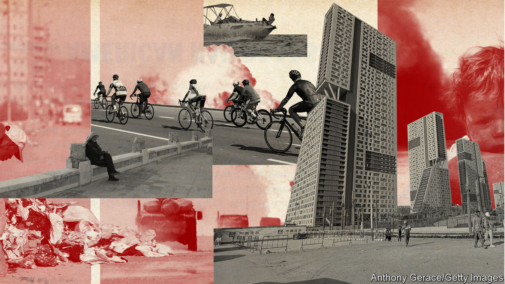
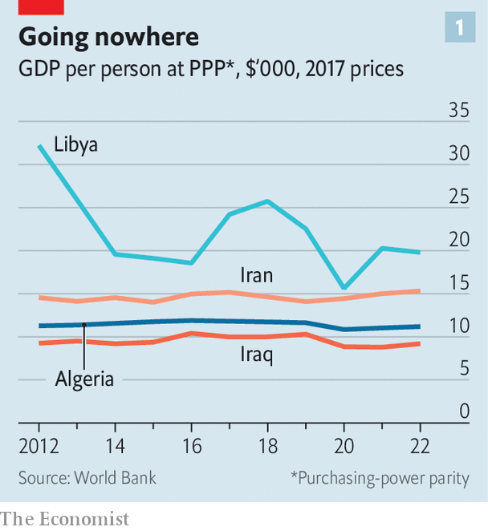
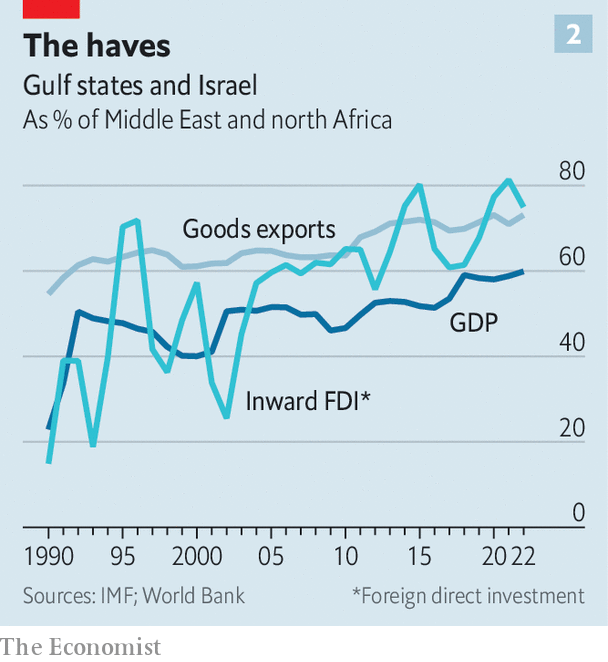
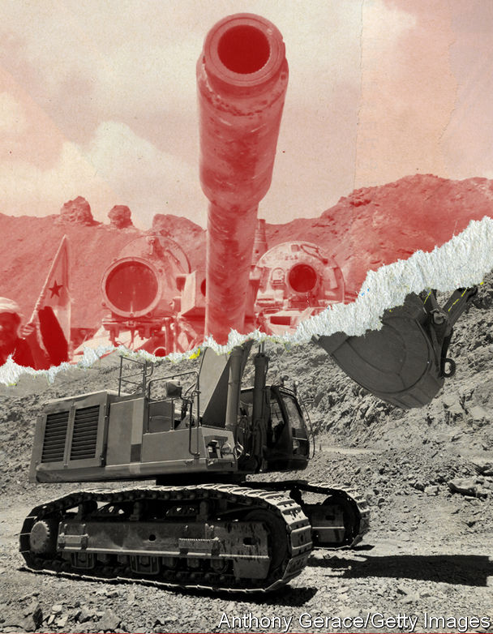

###### Reorientation

# The Gulf countries want to reshape the Middle East in their image 

##### Stability and development is a tempting formula, but it has been tried before 

 

> Sep 7th 2023 

UNTIL LAST month the BRICS, a diplomatic club which comprises Brazil, Russia, India, China and South Africa, had members from every corner of the developing world except the Middle East. No longer: of the six countries invited to join the bloc at its annual summit on August 22nd, four—Egypt, Iran, Saudi Arabia and the United Arab Emirates (UAE)—are from the region. If they all accept, the Middle East will account for more than a third of the expanded bloc’s members.

The invitations are one sign among many that the Middle East is changing. Wealthy Gulf states are trying to establish themselves as non-aligned middle powers. Saudi Arabia has offered to mediate between Russia and Ukraine. The UAE, which will host this year’s global climate summit, cop28, wants to fashion a dual role as both oil exporter and green-energy powerhouse. The six-member Gulf Co-operation Council (GCC) is one of the world’s economic hotspots, drawing the talented and the ultra-rich from east and west and deploying vast pools of capital abroad.

Even more striking is the Middle East’s newfound (and relative) calm. A ceasefire has quietened the eight-year war in Yemen. Iran and Saudi Arabia agreed to ease their 40-year feud in March. Qatar has repaired relations with its neighbours. The region has even reconciled with Syria’s murderous dictator, Bashar al-Assad. America, meanwhile, is urging Saudi Arabia to join the Abraham Accords, under which four other Arab countries have established ties with Israel since 2020. 

Five years ago Muhammad bin Salman, Saudi Arabia’s crown prince and de facto ruler, offered a hopeful vision of where things might go. “I think that the new Europe is the Middle East,” he said. “The next global renaissance will be in the Middle East.” His comments fit an increasingly popular narrative in the Gulf, that a “new” Middle East will be focused on economics rather than democratisation, Islamisation or other distracting ideologies. Diplomacy will bring stability, which will foster investment and growth that helps everyone move beyond the upheavals of decades past. The Gulf states have long applied this model at home; now they want to export it.

The Middle East has huge potential. First, and most obvious, it is awash with hydrocarbons. It accounts for 36% of world oil production, 46% of oil exports, 22% of natural-gas output and 30% of liquefied natural gas (LNG) exports. Those numbers will only rise. The region has vast reserves (52% of the world’s total for oil and 43% for gas) and low production costs. At a time when Western oil majors are skittish about investing, Gulf firms are adding capacity.

Location is important, too: the region connects Europe, Africa and Asia. Some 30% of the world’s shipping containers pass through the Suez canal in Egypt, while 16% of its air cargo flies via airports in the Gulf. Its young population is another asset: 55% of Middle Easterners are under 30, compared with 36% of the population of the OECD, a club mostly of rich countries.

Monumental misfortune

Yet the story of the past two decades has been one of conflict and despair. First came America’s ill-fated invasion of Iraq in 2003. The fury of the Arab spring followed, bringing upheaval but not democracy: all the countries affected eventually either reverted to dictatorship or collapsed into civil war. Islamist violence and sectarian strife compounded the region’s woes. 

 


The Middle East accounts for 6% of the world’s population but just 4% of economic output. Strip out a few big oil producers and that figure falls below 2%. In much of the region GDP per person is stagnant or falling (see chart 1). Poverty rates have soared in Egypt and Lebanon, to say nothing of war-torn Sudan, Syria and Yemen. 

But three big shifts are under way that could change the place of the Middle East in the world. The first is the growing distance between the Gulf states and America. Three successive presidents have sought to reduce America’s military presence in the Middle East. Joe Biden, the current one, is not trying to impose democracy on the region; he does not even seem too interested in reining in Iran’s nuclear programme. America has other priorities: competition with China, the war in Ukraine, political turmoil at home. 

America’s economic role is also decreasing. Over the past 30 years the share of Middle Eastern exports going to China and India has climbed from 5% to 26%, according to the IMF; the share sent to Europe and America has fallen from 34% to 16%. Much of this reflects Asia’s booming appetite for oil, the region’s main export. In the 1990s China took less than 1% of Saudi Arabia’s crude exports, and India less than 3%; by 2021 those figures were 28% and 12%.

Oil is at the heart of the second shift, in energy markets. The region is trying to become an even bigger force in oil and gas to finance a transition away from hydrocarbons, contradictory though that may sound. Recent high oil prices have brought a windfall. Aramco, the state-owned Saudi giant, posted a record $161bn profit last year, up from $110bn in 2021. It plans to expand its capacity by 1m barrels a day (roughly 10%) over the next three years. The UAE has a similar target. It has also made itself a transit point for Iranian and Russian oil, which are subject to Western sanctions. Qatar, already the world’s biggest exporter of LNG, plans to boost production by 63% by 2027.

The proceeds are being poured into new industries. Instead of parking its petrodollars in American treasuries, as it once did, Saudi Arabia is snapping up everything from European footballers to stakes in electric-car firms. This summer the kingdom struck a $2.6bn deal with Brazil’s largest mining firm, part of a plan to spend $170bn on the industry by 2030. 

The final shift is in attitudes. Surveys show that Arabs view the economy as their top concern. About a third of young Arabs say the cost of living is the region’s biggest problem and another third cite unemployment; almost half say it is hard to find a job in their country. Asked whether stability or democracy is more important, 82% choose the former. Growing numbers believe that democracy is bad for economic growth.

Citizens have lost interest in political Islam, too. Islamist parties have been forced out of government by Tunisian voters and Egyptian soldiers. Armed Islamists failed to take control of Iraq, Libya and Syria.  in Iran last year were a sign of popular frustration with its religious rulers.

The leaders of the Gulf countries, too, seem to have a new outlook. Over the past decade they had sought to use force to change the region. They tried to impose a friendly government on Yemen; Saudi Arabia sent weapons to Syrian rebels; the UAE attempted to install Khalifa Haftar, a warlord, as Libya’s leader. Each effort failed.

At least for now, the era of macho foreign policy is over. The most unexpected diplomatic shift was the deal between Saudi Arabia and Iran. They have been at odds since the latter’s Islamic revolution in 1979, fighting a proxy war that eventually spread to Iraq, Lebanon, Syria and Yemen. With a nudge from China, though, they agreed in March to reopen their embassies, which had been closed since 2016, to tone down criticism of one another in state-backed media and to boost economic ties. They are hardly friends, but the deal has reduced the chance of conflict in the Gulf.

The most unsavoury shift is Mr Assad’s reintegration. He did nothing to earn it: after destroying Syria to keep power, he has made no gestures towards reform or reconciliation. But in May the Saudis let him reclaim Syria’s seat at the Arab League. 

The easing of tensions has nonetheless brought a measure of calm, which may help explain the improving economic outlook. The IMF expects the non-oil portion of the Gulf states’ economies to grow by 4.2% this year (unchanged from last year), even as the oily bit expands by just 1.9% (down from 10.3% in 2022). The region attracted 6% of global flows of foreign direct investment last year, up from 3% in 2019. 

Capital markets are booming. Firms in Abu Dhabi, the capital of the UAE, accounted for 14% of the world’s IPOs in the first quarter of 2023. Goldman Sachs, a bank, estimates that foreign ownership of Middle Eastern equities climbed from 2% in 2017 to 10% last year. It sees the region’s weight in emerging-market indices rising to 10% in the next few years, from 7% today.

Big domestic reforms are making headway: 31% of Saudi women were employed in the first quarter of this year, compared with 16% at the same point in 2017. Gulf states are also trying to be more exacting when doling out aid. Some still comes with few strings attached: Tunisia, for instance, secured a surprise $500m bail-out (most of it loans) from Saudi Arabia in July. But Egypt is having to raise money by selling stakes in state-run firms to sovereign-wealth funds from Qatar and the UAE.

Optimists muse about where this could lead. A calmer Middle East would mean fewer risks to global trade and energy flows, and fewer refugees (the region accounts for over 8m of the world’s 35m). As Western firms seek to diversify supply chains, a youthful Middle East could become a new manufacturing base. Morocco’s thriving car industry, which produces around 700,000 vehicles a year and sustains 220,000 jobs, shows what is possible.

The region could also do more business with itself. Trade within the Middle East is equivalent to only 2.9% of the region’s GDP, compared with 22% within the EU. Researchers at Majid al-Futtaim, an Emirati retail giant, and McKinsey, a consultancy, estimate that dropping barriers to trade could boost the region’s GDP by $230bn (5%). If Saudi Arabia and Israel buried the hatchet, commercial ties with the Middle East’s most dynamic economy would become possible.

Infrastructure could be stitched together as well. The GCC countries have long mooted integrating their railways, which could easily be connected to those of Iraq, Israel and Jordan, too. Pipelines could bring low-cost Saudi hydrogen across the Mediterranean to consumers in Europe; upgraded transmission lines could allow a sun-baked region to export solar power.

It is an alluring vision, but there are many pitfalls. The first is that the economic progress of the past few years has been uneven. The Middle East has long been riven with political schisms, between revolutionaries and royalists, nationalists and Islamists, Sunnis and Shias. Today, though, the most important distinction is economic, between the prosperous states and the penurious ones.

Unfortunately, most of the Middle East is penurious. Even in a time of regional calm, dire economies threaten these countries’ stability. In the past five years alone, since Prince Muhammad first began talking about a regional renaissance, there have been big protests in Algeria, Iran, Iraq, Jordan, Lebanon and Sudan.

Pharaonic mismanagement

Egypt, the most populous country in the Arab world, is especially alarming. Abdel-Fattah al-Sisi, the soldier who has run it since a coup in 2013, has consistently spent less than the constitution requires on health and education. But he has found the money for grandiose projects such as a new capital city in the desert and for big purchases of weapons for the army (Egypt is the world’s sixth-largest arms importer).

Egypt’s debt-to-GDP ratio has risen to 93%, with 36% of the loans denominated in foreign currencies. Its non-oil economy has been in contraction for 33 consecutive months and for 81 of the past 90 months. The currency has lost half its value over the past two years and will probably be devalued again soon. Annual inflation hit a record high of 38% in July. Citizens endured blackouts in sweltering heat this summer because the government could not afford to import enough fuel for power plants.

A fully fledged balance-of-payments crisis seems likely. Even if the government limps on, it will be hard to reinvent the region when its largest country is moribund. And should unrest erupt on a sufficient scale, it could even damage the economic prospects of the Gulf countries. 

 


Another risk is that even the region’s prosperous countries will fail to create the jobs and growth they have promised. They have undeniably done better to date than their counterparts elsewhere in the Middle East. In 1975 Saudis and Libyans had roughly the same GDP per person; today the Saudi figure is 353% higher. The Gulf and Israel (the region’s other prosperous spot) account for just 14% of the Middle East’s population, but 60% of its GDP, 73% of its exports of goods and 75% of its FDI (see chart 2).

But Saudi Arabia, like its neighbours, is battling deep structural problems. Citizens still see a cushy public-sector job as a birthright. The government employs fully 53% of working Saudis, although that is down from 66% in 2019. Schools do not teach marketable skills. Wages are too high for the kingdom to become a manufacturing hub, at least without costly state subsidies.

Prince Muhammad hopes annual foreign direct investment will be $100bn by 2030. Last year it was just $8bn. That leaves the government as the main agent of economic transformation, which is worrying in two respects. First, its finances are hostage to oil markets. Analysts estimate that the kingdom runs a deficit when the price drops below $100 a barrel, if off-budget spending by its sovereign-wealth funds is included. It is currently about $90—its highest for almost a year.

Second, it is far from clear that the government’s investments in diversification will pay off. Vision 2030, the kingdom’s economic blueprint, predicts tourism will contribute 10% of Saudi GDP by the end of the decade. Officials claim the industry will generate 1m jobs, enough to hire one in 20 Saudis, a higher share than in France or Spain. But there is scant evidence of the hoped-for flood of 100m annual visitors. Last year there were just 16m, estimates the UN—about 1.5m fewer than in 2016, the year the vision was adopted.

Another worry is that the ideological arguments that leaders are so eagerly papering over will at some point resurface. Saudi Arabia is pursuing a détente with Iran even as the latter continues to produce highly enriched uranium for its rogue nuclear programme. Should the regime go further and manufacture a bomb, it could trigger a regional arms race—or even a war.

 


The Israeli-Palestinian conflict has been relatively subdued for the past two decades, but it is unlikely to stay that way for ever. Serious conflict in the Holy Land could shake Arab agreements with Israel. Violence has ebbed in Libya, Syria and Yemen, but the underlying disputes remain unresolved. Mr Assad faced a wave of protests last month in Sweida, a restive southern province. And Saudi Arabia and the UAE, although the main cheerleaders for the new Middle East, often disagree about both foreign policy and economic matters. 

The final risk is that the region gets its geopolitical balancing act wrong. America is still the only country willing and able to project military power across the region, and its domination of the global financial system gives it unmatched economic clout. The Gulf states cannot risk losing it as a partner. Yet their dalliances with Russia and China are prompting mounting anger in Washington. America has imposed sanctions on a few firms in the UAE, including one accused of supplying drones to Russia. It has delayed a deal to sell F-35 fighter jets to the country because of allegations of a Chinese military presence at a port in Abu Dhabi.

Gulf states are “planning in part their future prosperity on the assumption that China’s economic rise will continue”, notes Emile Hokayem of the International Institute for Strategic Studies, a British think-tank. There are warning lights flashing over China’s economy, though: slow growth, an ageing population, a moribund property market. A big gamble on China that alienates America could leave the Gulf in a difficult spot.

The fact is, Prince Muhammad is not the first regional leader to wax lyrical about a renaissance in the Middle East. There are many parallels between the current era and the 1990s, another time when the region seemed to be trying to put its violent past behind it. The Oslo accords appeared to herald an end to the Israeli-Palestinian conflict. Lebanon’s long civil war had sputtered to a halt. Autocrats in Egypt, Jordan and Syria talked about opening their hidebound economies. So did Abdullah bin Abdulaziz, the Saudi crown prince of the day, who promised bold reforms and sought better relations with Iran.

In 1993 Shimon Peres, then Israel’s foreign minister, wrote a book called “The New Middle East” arguing that trade would pacify the region. “Ultimately, the Middle East will unite in a common market,” he stated. “And the very existence of this common market will foster vital interests in maintaining the peace over the long term.”

History, sadly, had other ideas. The Israeli-Palestinian peace process gradually ground to a halt. America invaded Iraq in 2003 and Israel sent its army into southern Lebanon in 2006. Supposedly modernising autocrats across the region proved quite bad at the modernising bit, which precipitated the Arab spring. Gulf economies stayed oily, save for Dubai, which never had much oil to begin with.

An era of peace and development is a tempting vision, but to attain it, the region’s autocrats must be serious about keeping the peace and smart about fixing their economies. The present circumstances give them a chance to change, and technological and geopolitical forces provide an incentive. The rest is up to them. ■

