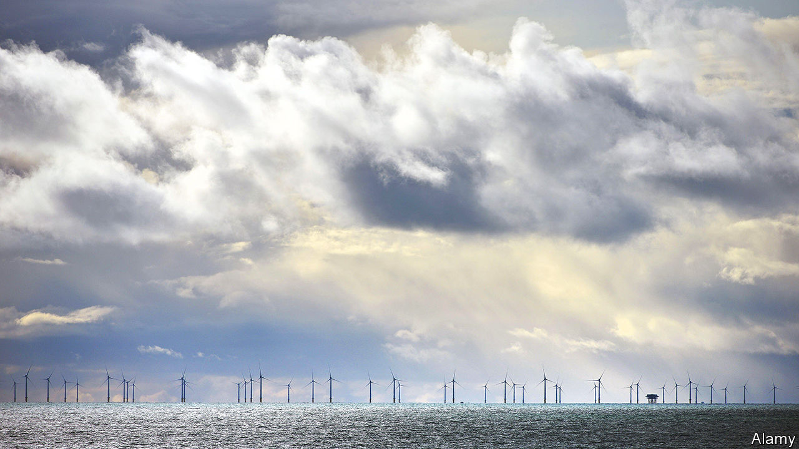
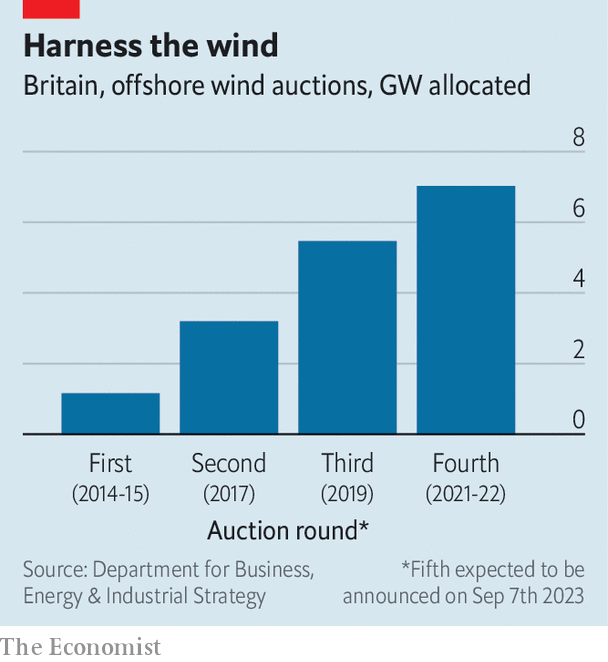

###### Clean energy

# Britain is losing its way in cutting carbon 

##### A slowdown on wind power is a sign of drift 

 

> Sep 5th 2023 

STAND ON THE cliffs above Happisburgh, a Norfolk village, and imagine the electricity to power a large city flowing beneath your feet. Some 80km offshore stand 130 turbines, each over 300 metres tall, or the height of three Big Ben clock towers stacked atop one another. Cables that emerge from the seabed pass underground between flint-clad villages, carrying energy for 1.5m homes.

 


That, at least, was the plan. The Norfolk Boreas was intended to be one of the largest  anywhere. Vattenfall, a Swedish developer, won permission for it in 2021. The blades were to start turning by 2027. No more. In July the company halted work because of spiralling costs. Other projects are in doubt. The results of the government’s latest renewable-energy auction were also due shortly after  was published. In contrast to previous rounds (see chart), few if any offshore wind projects were expected to win contracts.

If so, that would be a clear sign that once-impressive progress towards net zero by 2050 is at risk of faltering. Previous gains came in part because manufacturing has declined and a dependence on coal was kicked early. But as other countries try to speed their own transitions, policymaking progress has slowed. In June the Climate Change Committee, a watchdog, warned that Britain risks missing its next targets.

One problem is a studied lack of leadership on the environment from , the prime minister. In July, after a by-election victory seen as a rejection of London’s  (ULEZ) for vehicles, Mr Sunak touted policies, such as the need for more oil extraction from the North Sea, viewed as provocative by environmentalists. He hinted to ministers that net-zero policies could be watered down. On August 31st he named Claire Coutinho as his latest energy secretary, the fourth occupant of the post in just a year. 

How much does his lack of interest matter? He is buffeted by others. Some in his party hope to paint Labour politicians as eco-zealots. But he must also contend with backbenchers, including his immediate predecessor, Liz Truss, who demand more green activity. That group compelled the government to say, on September 5th, it would ease an effective ban on building onshore wind farms in England. Nonetheless, there is growing concern that green progress will stall. 

Start with offshore wind, the core of recent green efforts. Over the past decade, and four rounds of auctions, the cost of electricity produced from such fields has fallen by almost 75%. Only China has more offshore turbines. Last year wind, mostly offshore, produced more than a quarter of all electricity. Boris Johnson, prime minister until 2022, had bold goals to lift capacity to 50 gigawatts by 2030—it is 15 today.

That was always going to be difficult, requiring three or four new Norfolk Boreases a year. With other wealthy countries also keen on the technology, competition for skills and parts is fierce. Inflation has also hurt. Vattenfall, Orsted, a big Danish wind-farm developer, and others say building costs are up by 40% from last year. Pricey steel is a problem. Overstretched suppliers, including those of boats needed during construction, are another.

Most analysts think building costs will remain high globally. Despite this, Britain’s government refused to increase the maximum strike price—the highest bid allowed to developers in a reverse auction, in which rivals compete to offer the lowest price—from last year. It may have worried about giving any hint of consumer bills rising to support green projects. If so, that was wrongheaded, says Jess Ralston of the Energy and Climate Intelligence Unit, a think-tank. With gas prices expected to remain high and no obvious alternatives, offshore wind projects still offer savings for consumers. Ministers were also probably influenced by developers crying wolf before, saying a price could not be met only to bid below it. 

If few, or even no, new offshore wind projects are agreed on after the renewable energy auction, that would create uncertainty for suppliers to the industry. Developers may drift away to other markets: Germany completed its largest auction round so far in July. And even if one or two projects win support, if prices are too low for the developers to deliver them, they may decide to delay.

The outlook for onshore wind farms may seem brighter. But these are much smaller than those at sea and anyway tight planning restrictions will remain, even if these are less arduous than previously, when a single objection from a local resident would scupper a project. In England just two onshore turbines have gone up in the past three years, on land owned by Keele University. Scotland has been more hospitable, but still cannot match the scale that can be achieved at sea. Across all technologies, builders say a lack of investment in the grid is a big barrier to getting more renewable power installed. 

Mr Johnson had talked of easing planning rules, or finding ways to reward areas hosting wind farms, but no specific proposals have yet emerged. In Norfolk, councillors grumble that locals see no gain from disruptions in the county. Other countries do a better job of dangling carrots, for example with developers paying communities a share of their annual profits.

Two other indicators illustrate Britain’s drift. The first concerns heat pumps to replace household gas boilers. Last year 69,000 of these were installed, whereas Germany managed to put in 236,000. A target to get 600,000 into British homes each year by 2028 is all but certain to be missed. Regulations and taxes that apply to electricity, but not to gas, discourage switching. A lack of skilled engineers to install the pumps is another constraint. 

The second is the administration of Britain’s emissions-trading scheme, introduced after Brexit to replace the one used in the European Union. Having closely tracked the European carbon price previously, the British price has been drifting steadily lower this year. A partial reason for that is that the government, since July, said it would issue more allowances for polluters. That gives investors in Britain less incentive than those in Europe to seek out green projects.

The pace has not slowed in every sector. Even if the push to decarbonise the grid is slowing, the switch to electric cars continues: one-fifth of cars bought by Britons in August were electric. It helps that electric-car prices have been falling globally, but also that Britain is sticking to its promise to end the sale of new petrol and diesel cars by 2030 and has introduced a goal for manufacturers to make more vehicles electric. Some Conservatives have called for both of those to be ditched. Instead Mr Sunak listened to the car industry—notably the Tata Group, which in July announced plans to build a battery factory in Somerset, helped by a large subsidy.

More tensions will come to the fore this month, as an energy bill reaches its final stages in Parliament. Ms Coutinho faces pressure on matters such as the ending of installation of oil boilers in households (Duncan Baker, Conservative MP for North Norfolk, calls it “the rural ULEZ”). If Labour were to form the next government, it says it wants all of Britain’s electricity to be zero-carbon by 2030—five years before the Tories’ target. Another year of drift would leave it with a lot to do. ■


