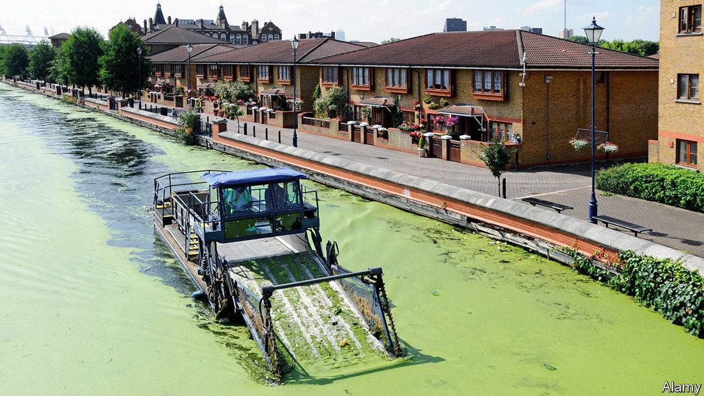

###### River pollution and housing

# Britain will ease some environmental rules for housebuilders 

##### Builders will cheer, but conservationists are worried 

 

> Sep 7th 2023 

FOUR YEARS ago Natural England, a body that gives advice on nature conservation, warned local authorities in the catchment of the Solent river basin in southern England about pollution. Excessive nutrients in rivers were causing “dense mats of green algae” that damage protected areas and birds. To prevent further harm, it said, any new housing development had to achieve “nutrient neutrality”. By March 2022 that legally binding stipulation had been extended to 27 protected river catchments covering 74 local authorities and 14% of the land area in England. 

Making housing nutrient-neutral, however, is difficult. Water companies need the wastewater-treatment capacity to ensure that, as housing goes up, no extra run-off goes into rivers. In fact, they don’t have it. The government is forcing water companies in affected areas to improve water-treatment standards, but not until 2030. 

Until then, housebuilders had been expected to offset the nutrient pollution. But such mitigation looks costly. Calculations by Lichfields, a planning consultancy, set out various scenarios. For a 20-hectare development of 500 homes in Kent, for example, it suggested 560 hectares of farmland would have to be made fallow or 43 hectares of wetlands created. It suggested doing that would cost as much as £114,000 ($143,000) per dwelling built. As a result, house-building in the 74 authorities has stalled. The government says the nutrient-neutrality rule threatened to halt the building of 100,000 homes this decade. 

On August 29th Michael Gove, the secretary of state responsible for housing and planning, said rules for housebuilders would be reformed, to their delight. An EU-era law protecting habitats will remain, but its interpretation for local authorities scrutinising planning applications will be weakened with an amendment to a bill now making its way through Parliament. 

Conservationists are worried. A new Office for Environmental Protection says there is a risk of “substantial harm to protected wildlife sites”. England’s rivers are in a dire state. In 2019 just 16% of water bodies were assessed as having “good” ecological status, but farms and existing homes are mostly to blame for that. The Environment Act passed in 2021 means the government is legally obliged to stop species decline by 2030—and increase it by 10% by 2042. The Royal Society for the Protection of Birds, a once-staid organisation that is increasingly activist, tweeted that official assurances about environmental protection were a “lie”.

Assuming the amendment passes, builders will cheer Mr Gove, who is under pressure to show that house-building can pick up from its current low level. Other environmental constraints may come under scrutiny. From November, the Environment Act will compel housebuilders to show that their sites increase biodiversity by 10% upon completion. In water-stressed parts of Sussex, Natural England has said new housing must show “water neutrality”. And in the Chilterns, developers must see to it that some vulnerable beech trees don’t get too many visitors. ■


