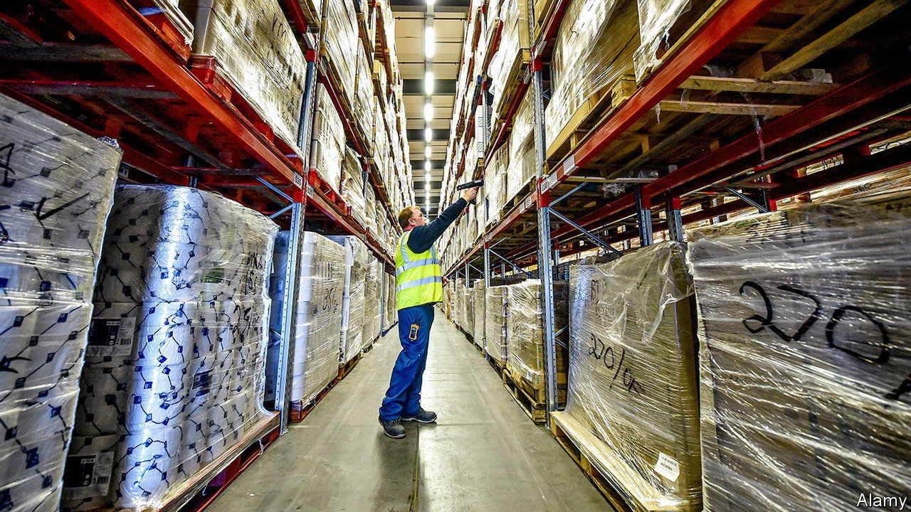
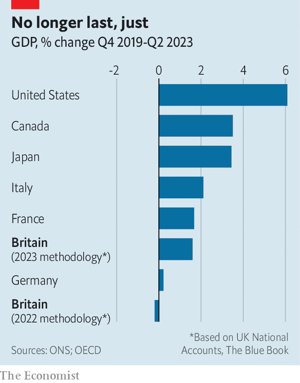

###### Dismal science

# Britain’s statisticians fix a blunder and find a bigger economy 

##### The figures used to look abysmal. Now they’re only poor 

 

> Sep 4th 2023 

IT’S RARE THAT tweaks to already published figures make big news. But then it’s also rare for statisticians at the Office for National Statistics (ONS), a body that produces official data, to make dramatic adjustments. In an update on September 1st they found, in effect, almost two percentage points’ worth of GDP hidden behind a sofa.

 


Doing so, the ONS rewrote . Previously its data had shown the economy, at the end of 2021, to be still 1.2% below its pre-pandemic size. Now it reports that national output at the time was in fact 0.6% higher. As the government has been quick to point out, the revisions require a rethink of Britain’s performance. For much of the past two years Britain had seemed to be a laggard, with the weakest growth of any G7 rich economy. Now the record looks more respectable. Britain has been outgrowing Germany and just about matched the pace of France (see chart). 

GDP numbers are always subject to revision as more information emerges. They should, in theory, grow more accurate as time passes. The latest update marks a large absolute adjustment, but is not unusual in proportion to the underlying changes in GDP to which it relates. The magnitude of the swings in national output in 2020 and 2021 was without precedent. For that reason, proportionally normal revisions mean big changes in the headline figures. Even without the wild gyrations in GDP, the pandemic was a tricky time for compiling data. For example, with many workers trapped at home, firms did not make it a priority to fill in forms for official statisticians. 

One big adjustment concerns stockpiling. The ONS now reckons that in 2020 companies were adding to their piles of unsold stocks, not running them down. That inventory build-up meant that the reported fall in GDP was less severe than first thought: 10.4% rather than 11%.

More significantly, growth in 2021 has been notched up from 7.6% to 8.7%. Whereas the initial estimates for this year were mostly based on companies’ reported turnover figures, the ONS now has access to more detailed surveys. These let it examine inputs and outputs of different sectors with a finer degree of granularity. That, coupled with an updated methodology to match the latest international statistical standards, has led it to believe that margins in 2021 were healthier than once thought. Thus profits, income and GDP were also higher than first understood. 

The change in the level of GDP was large, but mostly concentrated in two quarters: the second quarter of 2020, near the beginning of the pandemic, and the second quarter of 2021, during the reopening after the roll-out of vaccines. The broad trajectory of the recovery remains unchanged, although the initial fall in output was a bit less steep than once feared and the first recovery turned out somewhat faster. 

The underlying shifts in the sectoral composition of growth also matter. In wholesale trade, the change in gross value added (a measure of the value of goods and services produced by a sector) in 2021 was revised up from just 2.7% to 32.4%. The growth in output of health services was lifted from 34.6% to 57.1%. That reflects better accounting of the economic impact of the vaccine roll-out, the test-and-trace programme and more robust recovery in normal health services than once thought. The broad picture is that the service sector did better than previously believed, though the manufacturing, construction and agricultural sectors performed worse. 

The revisions help to explain away some mysterious quirks of Britain’s recent economic performance. The Office for Budget Responsibility (OBR), the government’s fiscal watchdog, had been struggling to reconcile surprisingly resilient tax receipts with tepid economic growth. The revision has resolved that puzzle. However, it is not likely to lead to large shifts in the OBR’s forecasts for the fiscal picture: no one should expect a cut in taxes or a boost to spending as a result. The once equally perplexing strength of hiring now also makes more sense.

The ONS is keen to point out that it is one of the first national statistics bodies to update its estimates for 2020 and 2021 in light of better data on sectoral inputs and outputs. Other countries will follow suit, and their own GDP rates may also be revised (if so, probably upwards too). Britain’s better performance relative to her peers, therefore, might not last long. Before the ONS rewrote the story of 2020 and 2021, the economy’s performance looked abysmal. After the revisions it looks merely poor. Any improvement is welcome, but the economic narrative has not fundamentally changed. ■


