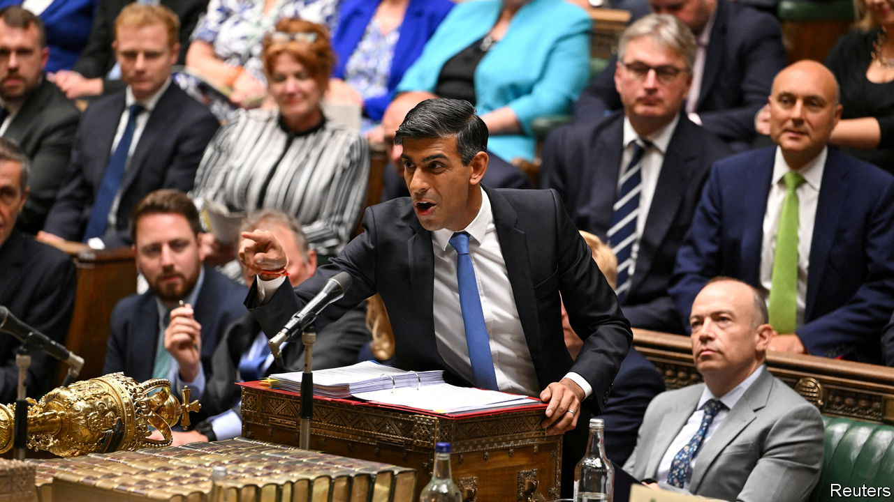

###### Bare-faced cheek

# British MPs debate a crisis over school buildings. Childishly 

##### Rishi Sunak is stuck with a dreadful political narrative 

 

> Sep 6th 2023 

The first week after the summer holidays can be tricky. Everyone is overexcited; they get noisy; they shout. Much to the distress of the speaker of the House of Commons. “Calm down,” shouted Sir Lindsay Hoyle during prime minister’s questions (pmqs) on September 6th. “I understand that people are excited to be back at school. But I expect better behaviour.” The class ignored him; Sir Lindsay got crosser. He threatened to send one of the naughtiest offenders out of the room; reprimanded another for “language”; told a third to “just sit down.” 

The new political term has begun over-excitably because in many schools the new educational term has hardly begun at all. Some 150 schools are reported to have reinforced autoclaved aerated concrete, or , that might make them unsafe. Most of these are closed, at least partially. This is bad for pupils (who are being taught online) and for parents (who must tolerate having the children at home, yet again). Above all, it is bad for Rishi Sunak, who had hoped to get voters feeling more upbeat. 

Mr Sunak got through PMQs unscathed. But he knows that is not enough: for he needs a change of narrative. The Conservatives remain stuck in the polls, trailing Labour by 16 points, roughly where they have been for months. Sir Keir Starmer enjoys a hefty 17-point personal advantage over Mr Sunak. The longer the prime minister is forced to suffer an embarrassing attack of metaphor made reality—fears over falling roofs that reinforce the idea that Britain is generally —he can’t expect to change any voters’ minds. 

Which is splendid for Sir Keir. He used PMQs as a chance to air his own fine (and less fine) metaphors. The crisis was the result of “botched jobs” and “sticking-plaster politics”; the “sort of thing that you expect from cowboy builders”. Sir Lindsay, had he been in the mood, might have given him a gold star for effort. Sir Lindsay was not in the mood. Because the class, despite the gravity of Britain’s slow descent towards the bottom of various league tables, had become distracted by something more fun. Namely actual bottoms. 

The language of the concrete debate has frequently been of the sort that would see you sent to the head. Earlier, the education secretary, Gillian Keegan, had been caught saying “fucking” and “arse” on camera. She later apologised. Her classmates, however, clearly spotted a fun game and—with the sort of oracy that Sir Keir admires—started to demonstrate their skill with synonyms. One MP used the word “backside”; a second countered primly with “posteriors”; a third, a Scottish nationalist, bluntly accused the Tories and Labour of being “two cheeks of the same arse.” This was a little too much for Sir Lindsay. “Let’s think about language,” he said. ■


