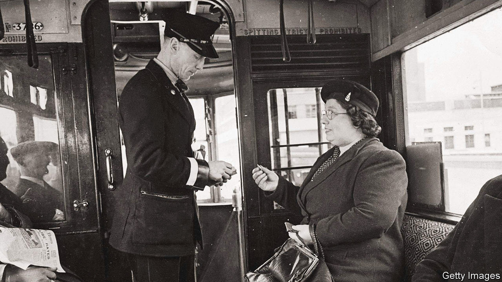

###### The invention of exercise

# How London bus drivers changed the world 

##### And led to the invention of exercise 

 

> Sep 7th 2023 

A new study has found that smiling at London bus drivers—an act rarely attempted in the capital except under experimental conditions—increases their happiness. The finding feels simultaneously obvious (of course it would) and faintly unexpected: London has been operating a control group in which passengers and drivers greet each other with surly indifference for decades; any affection feels anathema. The authors of the research, which was conducted by the University of Sussex and others, hope it will lead to “more interaction and kindness on buses”. On the Number 24 bus to Hampstead Heath, Londoners are sceptical. Bus drivers, says Liz Hands, a passenger, are generally a “miserable” lot. 

It might seem improbable that a report on London’s buses could change behaviour. But it has happened before. For London’s buses have an underappreciated role in the history of medical science. In the 1940s, a single study of London’s transport workers transformed epidemiology, medicine and the way we live now. Every time you go on a run, check your stepcount, or take the stairs instead of the lift, you are treading a path forged by the feet of the workers on London’s buses. 

In the late 1940s, medics were worried. Britain, like many rich countries, was suffering from an “epidemic” of heart disease and no one knew why. Various hypotheses, such as stress, were suggested; but one thing that was not exercising researchers was exercise. The idea that health and exercise were linked “wasn’t the accepted fact that we know today”, says Nick Wareham, a professor of epidemiology at Cambridge University. Some even felt that “too much physical activity was a bad thing for your health”. Navvies, miners and farm labourers did physical exercise by the spade-load. They also suffered disproportionately from various diseases, died young and featured in novels by D.H. Lawrence. It was a miserable existence. 

At this time a young doctor called Jerry Morris started to suspect that the excess deaths from heart disease might be linked to occupation. He began studying the medical records of 31,000 London transport workers. His findings were breathtaking: conductors, who spent their time running up and down stairs, had an approximately 30% lower incidence of disease than drivers, who sat down all day. Exercise was keeping people alive. Morris looked at postal workers, and found a similar pattern: postmen (who walked all day) had far lower rates of disease than telephonists (who typically sat). 

Morris’s research was eventually published in 1953, just three years after a study by Richard Doll proving the link between smoking and lung cancer. As any Londoner could tell you, you wait centuries for a paradigm-changing epidemiological study to turn up; then two come along at once. Morris’s work had consequences both big and small. Morris (who had given up smoking when he read Doll’s study) now also took up exercise, handing his jacket to his daughter on Hampstead Heath and just running. “People thought I was bananas.” Slowly, the rest of the world took off its jacket and followed. ■


