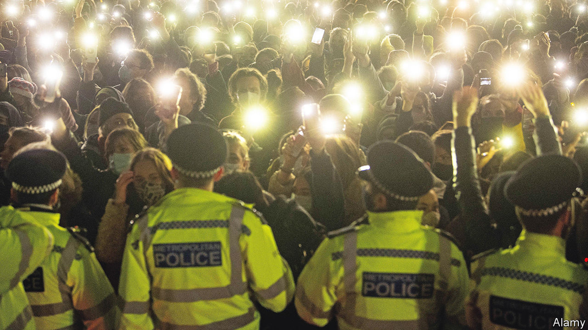

###### Policing the police

# Should Britain’s police chiefs be able to sack rogue officers? 

##### A change in the way misconduct hearings are run is controversial 

 

> Sep 7th 2023 

When sir mark rowley became commissioner of the Metropolitan Police Force in 2022 he knew he had to sack a lot of degenerate officers. He just wished he had the power to do so. In 2016 lawyers, known as Legally Qualified Chairs (lqc), replaced police chiefs as chairs of police-misconduct hearings. It is through such a hearing that a police officer, generally, may be sacked. The change, made to protect whistle-blowers and increase transparency, meant bosses could not, in most cases, fire rogue officers. Several police chiefs agreed with Sir Mark that they needed that power to clean up their forces.

The Home Office has agreed to grant that wish. On August 31st it said that police chiefs would once again chair misconduct hearings. (Police may be disciplined in various ways, but can be fired only if they admit or are found guilty of gross misconduct for a range of offences, from wrongful arrest to excessive force.) The hearings would still be held publicly, the Home Office said, and an independent lawyer would sit in, but in a supporting role. The law would also be changed so that officers are vetted throughout their careers. Those who fail such tests could be sacked.

The changes are controversial, however. Both the National Association of Legally Qualified Chairs (nalqc) and the Police Federation, which represents officers, say they will campaign against the measures, which are likely to come into force early next year.

The call to restore sacking powers to police chiefs was bolstered by research by Professor Lawrence Sherman, a professor of criminology at Cambridge University and the Met’s first chief scientific officer. He found that hearings chaired by police chiefs in Britain’s biggest force were 38% more likely to decide to fire an officer than those run by lqcs. 

Yet John Bassett, president of the nalqc, says the research establishes no causal explanation for this difference (it did not try to). He points out that in 2017 the College of Policing introduced statutory guidance requiring chairs to begin with the least severe sanctions when disciplining police officers. No such requirement existed when police chiefs chaired the hearings. Before 2016, he says, the public often dismissed police misconduct hearings as a “whitewash” and police reckoned their fate had been decided before proceedings even began. “What will be lost is an open, transparent and fair process,” he says. Steve Hartshorn, chair of the Police Federation, describes the change as a “return to kangaroo courts”.

In his most recent annual assessment of policing in England and Wales, Andy Cooke, His Majesty’s Chief Inspector of Constabulary, said that public confidence in policing “hangs by a thread”, in part because of inadequacies in the way police are disciplined. More research on the lqc system and “scrutiny” from the Home Office was needed, he said. He added however that “As a matter of principle, the head of an organisation should be able to decide who is employed by that organisation.”

Will the changes improve public confidence in the police? Probably not. Most people do not interact with the police in any given year because they do not experience crime. Nonetheless, trust in policing has been dramatically eroded by a series of dreadful crimes by officers. In 2021 Wayne Couzens, a Met officer, was found guilty of the kidnap, rape and murder of a young woman, Sarah Everard. In February this year David Carrick, also of the Met, was jailed for life after pleading guilty to 49 serious offences including 24 rapes.

Yet neither man got anywhere near a misconduct hearing before being charged and found guilty. Complaints and warnings about both had been ignored or dismissed for years. Those failures suggest that a lot more change is needed than adjustments to disciplinary proceedings. Critics of the new measures point out that the police chiefs who will soon have greater powers to sack officers themselves rose up through the ranks of forces plagued with toxic behaviour. Some were in charge, for years, when their officers were committing horrific crimes. ■


