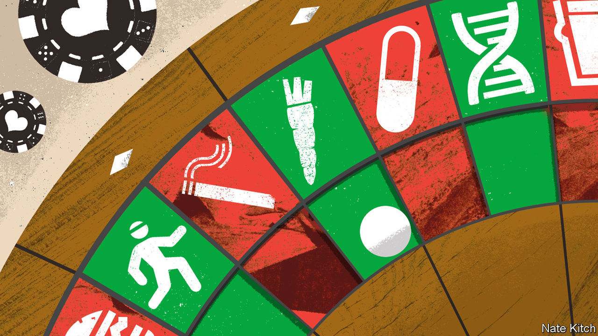
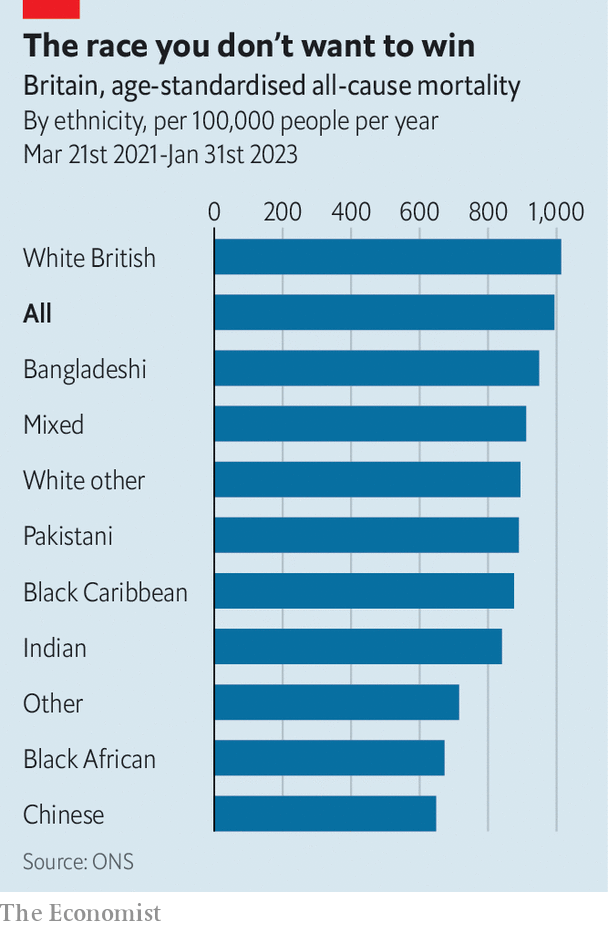

###### Ethnicity and health

# What is killing white Britons? 

##### New data reveal a surprising trend in deaths 

 

> Sep 7th 2023 

TROUBLING RACIAL disparities are well known to those who look at health outcomes. A black woman in Britain, for example, is four times likelier to die in pregnancy or labour than a white woman. A man of Bangladeshi ethnicity spends, on average, a decade less in good health than a white man. When the covid-19 virus struck, it killed ethnic minorities at twice the rate of white people. It is surprising, however, that—despite the effects of covid—white Britons die at higher rates overall than any ethnic group.

Evidence for that comes from new research by the Office for National Statistics (ONS), gathered to assist an attempt by the government to slow a surge in Britons getting sick and dying young. By linking death records to data from the 2021 census, statisticians have been able to analyse death rates by ethnic group, cause and other variables. They looked at the period from March 2021 to January 2023.

 


Death rates, when adjusted for age, proved to be lowest among the Chinese, Black Africans and the “Other” categories. They were high among those who were of mixed and Bangladeshi ethnicity, and highest of all among the white British. These were expressed in age-standardised rates per 100,000 person-years, meaning that of 100,000 white Britons who were tracked for a year, some 1,013 would die (see chart).

The statistics are experimental, meaning that, while they are official, they could conceivably be revised. Already, some have voiced doubts over their release. “I was a bit disappointed,” says Professor James Nazroo, who studies racial inequalities at the University of Manchester and has previously criticised efforts to estimate life expectancy for different ethnic groups in England and Wales. Certain ethnicities’ death rates are more likely to be underestimated, he argues, depending on whether members of a group fill in census forms. Another hypothesis, known as the “salmon bias”, suggests that migrants sometimes go back to die where they were born. Three-fifths of people who are ethnic minorities in Britain were born abroad.

But the findings, to most eyes, are robust. The ONS points out that 97% of adults filled in the census: more than for any survey. Their findings, broken down by cause, appear to corroborate results of other studies: black men are more likely to die from prostate cancer than white men; cancer rates are highest among white populations; diabetes is most prevalent among South Asians. “It tallies with everything we’ve known for over 40 years,” says Veena Raleigh of The King’s Fund, a think-tank.

The data may offer the best picture available of what is happening with death rates in England. They make no claim, however, to explain why deaths vary between groups. One phenomenon seen in many countries is the “healthy migrant effect”: that the people who migrate are generally in better shape than either those left behind, or those whom they join. To move, after all, you usually require good health and resources.

The effect also appears to fade over time. In a survey in 2019, 6% of working-age people who had moved to Britain within the past two years said that they had a “limiting” health problem, compared with 20% of adults who were born in Britain. Among those foreign-born residents who had moved more than 15 years ago the migrant advantage had disappeared completely, with 19% reporting comparable illness. This may explain why black Africans do better: they tend to have migrated more recently, notes Kevin McConway of the Open University.

Native Britons also seem to be more compelled than others to engage in behaviours that could damage their health. More white Britons report drinking harmful levels of alcohol than do black or Asian Britons. They also smoke more–with the exception of Bangladeshi men who, the data show, also die at higher rates from lung cancer. Any genetic differences seem less significant than behavioural and environmental risk factors, which are largely preventable. On its website, Public Health Scotland states that “the main effort to improve health should be focused on the unhealthiest group...the indigenous white Scottish population.”

The most puzzling finding concerns poverty. ONS data show death rates are high in the poorest areas, as measured by its index of multiple deprivation. Especially big proportions of the Pakistani, Bangladeshi and black communities live in such areas, yet the worst rates are largely in poor areas with overwhelmingly white populations, such as Blackpool, Hull and Knowsley. 

The ONS is doing more work to understand this. It may be that ethnic minorities are, in some ways, better protected than white Britons from the deadly effects of poverty. And whereas white Britons tend to move to live in the most expensive area they can afford, many ethnic minorities choose to stay within their community which may be classified as a deprived area, says Vahé Nafilyan, a researcher at the ONS. That may skew results.

Some outcomes are more to be expected. The 20 towns that have the worst death rates were found to be in the north of the country, except for two in the Midlands. In such places there is evidence that left-behind whites predominate in the population. Problems of racial inequality remain in health care. But you are still most likely to die tomorrow if you are white, northern and working class.■


