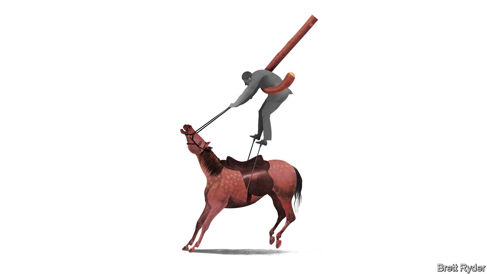
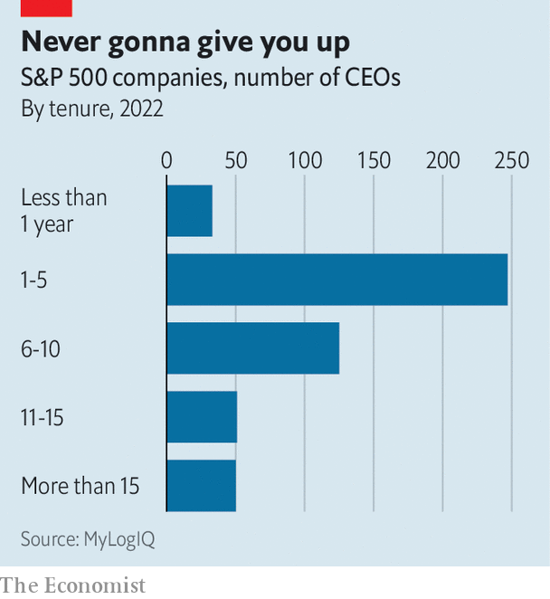

###### Schumpeter

# America’s bosses just won’t quit. That could spell trouble 

##### Bob Iger is not the only one hanging around for too long 

 

> Sep 4th 2023 

Of the many worries that whirl around the minds of , few are more unsettling than the question of succession. Having toiled their way to the top of the corporate ladder, many bosses struggle to imagine relinquishing control and placing their legacy in the hands of another.

A growing number of America’s bosses have instead opted to defer the matter altogether. By the end of last year 101 S&amp;P 500 CEOs had held the corner office for more than a decade, up from just 36 ten years earlier, according to figures from MyLogIQ, a data provider. Although some, like Warren Buffett, the longest-serving of the lot with 53 years on the clock, built the companies they run, most are hired hands.  of JPMorgan Chase, a bank, Shantanu Narayen of Adobe, a software firm, and Chris Nassetta of Hilton, a hotel franchise, are among the many who have outlasted their predecessors. Such long-serving chief executives have pushed up the average tenure of S&amp;P 500 top dogs from six years to seven over the past decade.

 


Some bosses have become infamous for their reluctance to move on. Earlier this year Howard Schultz ended his third stint as boss of Starbucks, a coffee chain. Late last year Bob Iger took back the reins at Disney, a media giant, from his chosen successor, Bob Chapek. In July his two-year contract was extended until the end of 2026. The question of succession has long loomed over Mr Buffett’s conglomerate, Berkshire Hathaway.

Of course, plenty of companies are well served by chiefs who hang around. And with populations healthier for longer, forcing bosses out once they reach an arbitrary retirement age, as many firms still do, is unnecessary. Yet the lengthening tenures of America’s business leaders is a cause for concern.

In 1991 Donald Hambrick and Gregory Fukutomi, then both at Columbia Business School, published an influential paper on the “seasons” of a chief executive’s tenure. They suggested that, in the early years, performance improves as the boss learns the ropes, but later declines as they become more resistant to change and less engaged in the job. A paper in 2015 by Francois Brochet of Boston University and co-authors sought to quantify that tipping-point by studying the relationship between market value and CEO tenure among listed American firms. They found that performance rose through roughly the first decade on the job before flattening off, then starting to dip after around 15 years.

“Eventually you lose the oomph and the creativity,” says Bill George, who once ran Medtronic, a medical-technology company, and now teaches at Harvard Business School. That vigour is especially crucial when a company is in need of reinvention. Microsoft’s transformation under Satya Nadella into a cloud-computing giant in the vanguard of artificial intelligence may never have happened had Steve Ballmer, who led the business through a period of stagnation from 2000 to 2014, stuck around.

An extended stay carries risks even when a chief executive’s long stint seems justified by stellar performance. Mr Iger delayed retirement three times during his original 15-year spell as Disney’s boss, leading a number of potential successors to try their luck elsewhere. Boards waiting to find a replacement CEO with experience comparable to the incumbent’s necessarily find it harder the longer they delay, notes Jason Baumgarten of Spencer Stuart, a headhunting firm.

Ideally, succession planning should begin the day the CEO starts, says Claudia Allen of KPMG, a consultancy. That involves building a pipeline of candidates, assessing their skills and developing a plan to fill gaps. Public spectacles like the six-year saga to replace Jack Welch at GE, a once-mighty American industrial giant, are best avoided. Separating the roles of chief executive and chairman of the board can help, too (appointing a lead independent director is seldom sufficient to keep in check an almighty boss with both jobs, let alone sack one). Two in three S&amp;P 500 CEOs who have been in the role for longer than a decade also chair the board, compared with two in five for the whole group. 

Perhaps the most important rule for succession is to make a clean break. Bosses who hang around after their turn has ended do their successors a disservice. The most pernicious example of this is the chief executive who stays on as “executive chairman”, a loosely defined title that gives its bearer the right to meddle in big decisions while shirking operational responsibility. James Gorman of Morgan Stanley will take on the title when he steps down as the bank’s CEO in the coming months.

Last year 15% of S&amp;P 500 companies were presided over by an executive chairman. Some, like Jeff Bezos and Rupert Murdoch, are founders eager to maintain a say over the companies they built. For the rest, the role may look like a handy way to smooth a transition. But it brings dangers. Predecessors may struggle to accept shifts in strategy, and confusion may reign as to who is ultimately in charge. During Mr Iger’s stint as executive chairman of Disney, he and Mr Chapek clashed over a number of big decisions, denting the new hand’s credibility.

Get an afterlife

That CEOs find it hard to let go is unsurprising, and not only because power is seductive. Many struggle with the sense that, having reached their professional pinnacle, there is little left to do, says Mr George. Rather than retiring to a life of leisure, he counsels bosses to find ways to make use of their wisdom. Some may choose to sit on boards. Others, like him, may teach. Others still may try their hand at politics. Before his latest return to Starbucks Mr Schultz toyed with a presidential bid; Mr Dimon is being urged by some to pursue one. It is uncomfortable to accept that an organisation you lead will survive without you. But stepping down need not mean stepping into obscurity. Many of America’s bosses still have plenty to give—not least a shot for the next generation.■


