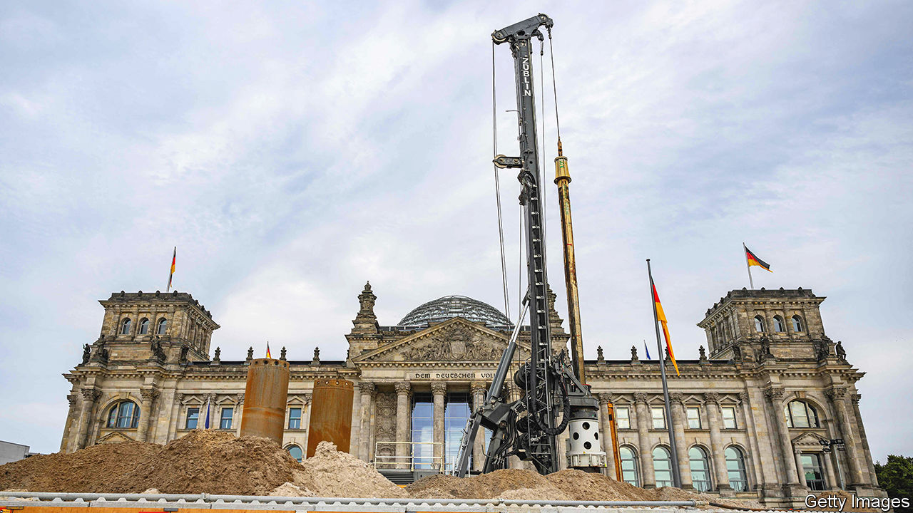

###### Shovel-unready

# German builders are on the brink of collapse 

##### The construction industry is being strangled by rising costs and remorseless red tape 

 

> Sep 7th 2023 

“We are sending our construction industry into the abyss,” warns Rolf Buch, boss of Vonovia, Germany’s biggest landlord. The crisis afflicting German builders is far from the country’s only economic problem. But it is particularly acute, and concerns a sector that makes up 12% of GDP and employs 1m construction workers. That makes it important for the health of the German economy and of its society. 

The government promised to build 400,000 flats a year when it came to power in 2021. Industry groups reckon that something more like 700,000 a year are needed, not least to house the more than 1m Ukrainians who have fled their war-torn country. Whatever the true figure, everyone agrees that the 295,000 built last year did not cut it. Mr Buch calls the resulting shortage of affordable flats in parts of the country a “societal tinderbox”. 

This year the number is likely to be lower still. The prices of materials and energy have shot up as a result of supply-chain disruptions, some of them war-related. Higher interest rates, meanwhile, have increased the cost of debt that many German builders rely on to get projects off the ground. As a result, construction firms and property developers are going bust in droves. In the first four months of this year 437 building companies filed for insolvency, an increase of 20% compared with the same period in 2022. Last month Gerch and Development Partner, two developers from Düsseldorf, Project Immobilien from Nürnberg and Euroboden from Munich went belly up. 

“It is not a functioning market,” says Clemens Fuest, head of Ifo, a think-tank. The reason, he says, is red tape. In 2015 Germany introduced a “rent brake” in popular parts of big cities to limit the price of fresh leases to no more than 10% above a level determined by an index of rents in a particular location. Although new builds are in theory excluded, the policy still deters housing development in places where it is most needed. Moreover, says Mr Fuest, tenants are well protected by law, which is a further burden for the industry.

Other rules are making construction ever more expensive. Already strict environmental regulations are set to become stricter. If a new standard for insulation called eh-40 is introduced as planned on January 1st 2025, it will add 20% to construction costs that have increased by two-thirds in the past few years as it is, estimates Dirk Salewski, president of the BFW, a federal association of independent real-estate and housing companies. “We have the best fire-protection and soundproofing regulation in the world,” he adds. He does not exactly mean that as a compliment: all this world-beating regulation is choking the industry, he laments.

Tim-Oliver Müller, head of Bauindustrie, the federation of the German construction sector, points to other bureaucratic headaches. An application for a building permit requires filing eight paper copies with the authorities. Each of the federal republic’s 16 states has different building rules. Cities, and even some of the country’s nearly 11,000 communes, weigh in with their own strictures. Whenever a fault, no matter how minor, is found with an application, the clock for its processing is reset. Mr Müller suggests that all applications should be digital and that if the authorities don’t respond to an application within three months it ought to be automatically approved.

On September 25th Olaf Scholz, the chancellor, will host a summit with 60 politicians, business leaders and representatives of civil society. At a pow-wow in Meseberg castle near Berlin, his cabinet recently passed measures to lighten the corporate-tax burden, including new rules on the deduction for wear and tear for builders. That is nowhere near enough, say industry types. They are demanding a relaxation of the green rules for buildings, more tax relief and help with high borrowing costs. If the government does not do something, the abyss beckons. ■


