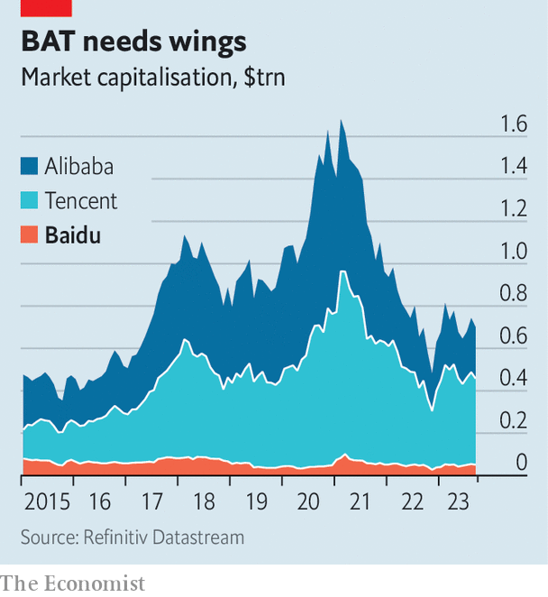

###### AI with Chinese characteristics

# Meet Ernie, China’s answer to ChatGPT 

##### Baidu’s bot is catapulting its maker back to stardom 

 

> Sep 3rd 2023 

Ernie Bot has some controversial views on science. China’s  (AI) chatbot, which was released to the public on August 31st, reckons that covid-19 originated among American vape users in July 2019; later that year the virus was spread to the Chinese city of Wuhan, via American lobsters. On matters of politics, by contrast, the chatbot is rather quiet. Ernie is confused by questions such as “Who is China’s president?” and will tell you the name of Xi Jinping’s mother, but not those of his siblings. It draws a blank if asked about the drawbacks of socialism. It often attempts to redirect sensitive conversations by saying: “Let’s talk about something else.”

Ernie’s reticence will come as no shock to Chinese users familiar with a . They may be more surprised by the chatbot’s origins. For Ernie is the brainchild of Baidu, a Chinese tech giant that has for years been outshone by rivals. Now, thanks to ai, the company is staging a comeback. The extent to which it succeeds will say much about the , which is squeezed on one side by  and on the other by Mr Xi’s increasing authoritarianism. 

A decade ago Baidu, as the operator of China’s largest search engine, was at the centre of the country’s internet. Together with Alibaba and Tencent, China’s two most valuable internet businesses, it formed a triumvirate known as “BAT”. With foreign search engines banned or heavily censored in China, it faced little competition in its core business. 

 


Baidu never lost its dominance of Chinese search; it still enjoys more than 90% of search traffic in the country. Yet shifts in the technology landscape have left the company a shadow of its former self. Most Chinese internet users now trawl the web with the help of  such as Tencent’s WeChat. Advertising dollars have shifted to apps like Douyin, the Chinese cousin of TikTok. Meituan, a delivery platform, and Pinduoduo, an e-commerce firm, have  past Baidu’s market value of $50bn. In an effort at emulation, it launched its own delivery and shopping offerings, along with other services such as payments and social media. These mostly flopped. The company’s market capitalisation is now equivalent to one-eighth of Tencent’s, down from one-fifth five years ago (see chart).

Baidu’s rollout of AI, however, is reigniting excitement about the company. Ernie was downloaded 1m times within 19 hours of its release (ChatGPT reached 1m downloads after five days, according to its American maker, OpenAI). Baidu’s share price rallied by more than 4% on the day of release, as analysts, investors and common folk bombarded the bot with questions. Although four other firms, including SenseTime, a facial-recognition business, launched similar services on the same day, and six others have been granted approval by China’s government, Ernie is generating the most buzz.

Last month Robin Li, Baidu’s chief executive and co-founder, said that the roll-out of AI had been a “paradigm shift” for the company. That shift did not, however, happen overnight. Years of investment have turned Baidu into one of China’s most sophisticated AI companies, with a system that encompasses chip design, a deep-learning framework, and proprietary AI models and applications. The company started building Ernie in 2019, making it one of the earliest firms anywhere to experiment with such “generative” AI.

So far Baidu has shied away from giving explicit guidance on what the technology will mean for its bottom line, but analysts believe Ernie will drive more traffic to its search engine and other services, raising advertising revenues. Baidu has also cemented itself as China’s largest AI cloud provider, and has started offering bespoke services for companies that want AI models tailored to their specific needs.

Enthusiasm for Baidu’s other important foray into AI, an , is more muted. The service has been launched in a few cities across China, allowing users to hail robotaxis via a mobile app. But trips must still be monitored remotely, and a wider roll-out could be years away. Few analysts expect the unit to generate meaningful profits soon.

Much of what comes next for Baidu will depend on policymaking in Beijing and Washington. Restrictions on the sale of advanced semiconductors to China imposed by President Joe Biden’s administration are causing the company a world of pain. Almost all of those chips, which most AI builders use to train their models, are produced outside China. Using a larger quantity of lower-powered processors is possible, but expensive. 

In Baidu’s case, its AI efforts rely on the Kunlunxin chip. Although it designed the chip itself, production is outsourced to companies like . America’s restrictions put limits on the types of chip that foreign foundries can sell to Chinese firms, and no domestic supplier has been able to produce such advanced components. Since America’s restrictions were announced, Baidu has been downplaying the importance of the Kunlunxins, which may hint that it is having problems procuring them. 

China is trying to catch up in the manufacture of advanced chips. On August 29th Huawei, a maker of telecoms-gear clobbered by American sanctions, began selling a 5G smartphone that, after being dismantled by analysts, appeared to contain unexpectedly advanced Chinese-made silicon (albeit not quite cutting-edge). 

Xi’s laws of robotics

That still leaves obstacles closer to home. China’s government has taken a keen interest in the regulation of AI, moving faster than most other countries. This has yet to cause too much consternation among the country’s tech executives. Regulators recognise the commercial value of AI and want companies to make money from it, says one executive. They also grasp the importance of allowing Chinese companies to compete at the global level, the person says. The approval of the first batch of bots was quicker than some had feared. Long delays to product launches, such as those for new video games, often hurt the share prices of their Chinese makers.

Yet many AI enthusiasts still find some rules onerous, especially for a nascent industry. Companies offering generative-AI services are required to identify and report “illegal content”. They must also adhere to China’s “core socialist values”, a sweeping and ambiguous command. After netizens spotted that a prompt for a “patriotic cat” in Ernie’s drawing application produced a picture of a feline with an American flag, the words “patriotism” and “patriotic cat” were blocked in the tool. Users may be put off by what Chinese AI cannot say, or fearful of being reported for asking the wrong questions. The costs of censorship and compliance will start to add up for Baidu and other companies, warns Kai Wang of Morningstar, a research firm.

Recent experience has made it clear to China’s tech executives that they operate at the pleasure of the government, and that its favour can be quickly withdrawn. Internet companies were hit with several regulatory crackdowns between 2020 and 2022. Another such assault on AI could do great damage to the firms that have invested in the technology, Baidu foremost among them. The company is testing the waters in a difficult environment. For that reason it is important to watch what Ernie says—and all that it doesn’t. ■


