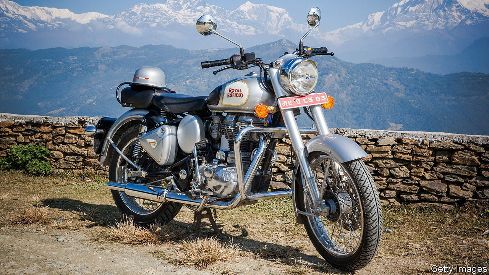

###### Biding the Bullet

# Meet the world’s most enduring product 

##### The Royal Enfield Bullet has barely changed in its 91 years 

 

> Sep 7th 2023 

Companies can survive for aeons, but their products are usually ephemeral. Apple may be the world’s most valuable business, yet the Apple II computer and the original Mac that provided the early foundation of its success live in museums, if at all. Apple’s smartphone rival, Samsung, began by selling noodles. Ford’s latest F-150 Lightning electric pickup truck shares little with the Model T except for four wheels. The dictum “If it ain’t broke, don’t fix it” carries little weight in a world of evolving technologies, business models and consumer tastes.

Unless, that is, you are Royal Enfield. In 1932 the motorcycle-maker, then based in Britain, launched the Bullet. Ninety-one years later the company, in Indian hands since 1994, has unveiled the latest version of the iconic two-wheeler. It looks virtually identical to the original. 

Changes have, the company insists, been made to the engine (which boasts just two-thirds of the original’s horsepower), the chassis and the seat. Yet besides a missing kick-start (which has provoked some grumbling from fans) and an added fuel gauge (which has elicited no comments), these are unnoticeable. Features common on other 21st-century motorbikes, like tachometers or temperature gauges—to say nothing of computer-assisted ride modes for different conditions—are absent. The ride and, as one YouTuber put it, “the sweet crunch sound of exhaust”, are probably much the same as they would have been in the 1930s.

That gives the Bullet a strong claim to being the most unchanging vehicle in continuous production—and among the most immutable products ever manufactured (the AK-47 rifle has been around for a mere 75 years). It is also, in India, a commercial and cultural phenomenon. It still outsells most of Royal Enfield’s other offerings, including more modern designs. More than 8,000 of an earlier version were sold in June. The total number on India’s roads is hard to gauge but is almost certainly in the millions. And few items elicit the same degree of affection—not just from the country’s motorcycle enthusiasts. 

There are at least 1,200 devoted riding clubs. Specimens covered by a rusty patina can be seen chugging through fields in Punjab, over dangerous mountain slopes in Ladakh, and avoiding cows and cars on city streets. It is an indispensable piece of equipment for Bollywood heroes and villains alike. The Indian armed forces, which first sparked the Indian Bullet craze with an order of 500 two-wheelers in 1949 to patrol the country’s northern border, has a stunt team who ride exclusively on Bullets. In 2017 the Tornadoes, as the squad is called, performed a feat of carrying 58 people on a single motorcycle.

All this, plus the fact that the machines never seem to expire and can be fixed anywhere by just about anyone, explains the Bullet’s enduring popularity. For many Indians who can hardly imagine owning a home or even a car, the Bullet is at once aspirational and, at $2,400 a pop, just about obtainable. With such unchanging appeal, who needs change? ■


