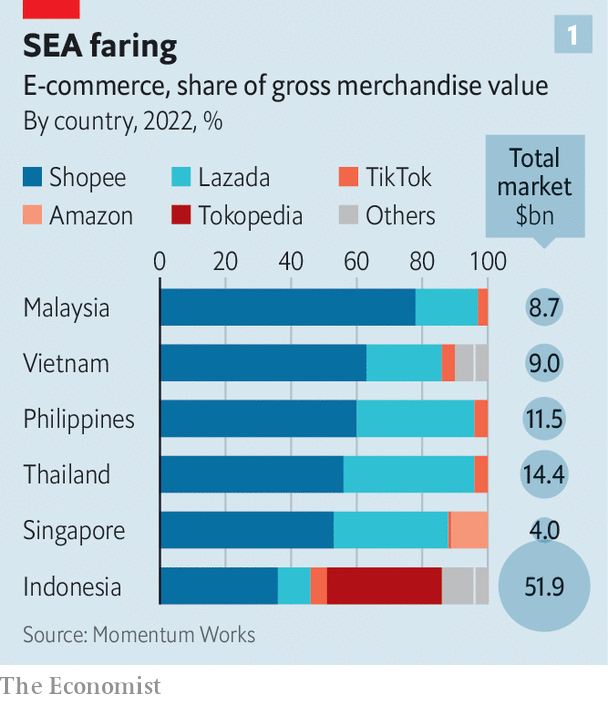
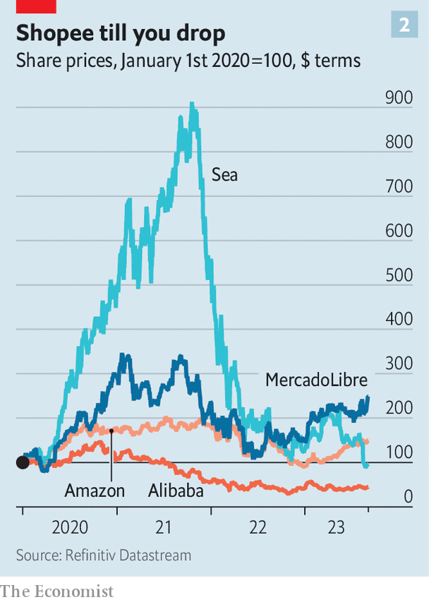

###### Island shopping

# TikTok is wading into South-East Asia’s e-commerce wars 

##### Battered incumbents brace for a costly fight 

 

> Sep 7th 2023 

IN MARCH TIKTOK’S chief executive, Shou Zi Chew, faced angry lawmakers in Washington, who grilled him for five hours on topics ranging from misinformation to mental health. A threat of a ban in America, the short-video app’s largest market, looms large. Other Western governments are making similar noises. TikTok, which is owned by a Chinese firm called ByteDance, has already been locked out of India, another big market, since 2020 on grounds of national security. 

Contrast that with the welcome Mr Chew received in June in Jakarta. He charmed a crowd in the Indonesian capital that included government officials with his plans for the company in South-East Asia, promising to invest “billions of dollars” in the region over the next few years. As uncertainty looms over its prospects elsewhere in the world, TikTok, which in 2020 moved its global headquarters to Singapore, is eyeing South-East Asia’s nearly 700m consumers to bolster its fortunes. Reactions to his talk ranged from favourable to gushing—except among the region’s digital incumbents.

That is because TikTok’s ambitions in South-East Asia go beyond silly dance videos. In 2021 it launched TikTok Shop, which lets users buy products directly from the app. According to Momentum Works, a research firm in Singapore, last year products worth around $5bn were sold globally on its platform. This year the target is $20bn, with three-quarters of that coming from South-East Asian wallets. 

 


This foray into e-commerce comes at a volatile time for the sector in the region. Shopee, which accounted for almost half the $100bn or so in goods sold online last year in South-East Asia (see chart 1), has reported two quarters of declining sales on its platform. The market value of its Singaporean parent company, Sea Group, is a tenth of the $200bn it reached in October 2021. Sea has cut staff, retreated from ventures beyond South-East Asia and, in August, told investors to brace for losses as it boosts spending in the face of rising competition. Lazada, a Singapore-based e-commerce platform that has probably never turned a profit, is on its fifth CEO in as many years. In March its Chinese parent, Alibaba, added more commotion by splitting itself into six companies. 

Can TikTok take advantage of its rivals’ troubles? The app certainly looks well-suited to South-East Asian online-shopping habits. It already has more than 300m users in the region. A study by Bain, a consultancy, and Meta, which owns Facebook and Instagram, found that nearly half of consumers there use social media, particularly short-video and messaging apps, to find products when shopping online. As in China, the home of “social commerce”, the line between entertainment and commerce is blurred among those “mobile first” shoppers, notes Fred Liu of Hayden Capital, an investment firm. To lessen its reliance on live-streamed product reviews, TikTok is testing a marketplace tab in its app, which lets sellers list their goods on the platform without having to pay influencers to plug products in their videos. 

 


Don’t count the regional incumbents out just yet, though. Whereas TikTok Shop is dominated by things best-suited for promotional video and impulse purchases, such as clothes and cosmetics, its rivals offer a broader assortment of wares, from gadgets to furniture. Vion Yau of Momentum Works estimates that the average order value on TikTok is around $5, compared with $8 at Shopee and $10 at Lazada. 

Shopee, Lazada and Tokopedia, another local champion, have also built their own logistics networks and payment systems to get around South-East Asia’s tricky peninsular and archipelagic geography, and often shabby infrastructure. This allows the companies to operate more efficiently than TikTok, which relies on external suppliers to store and ship its products, giving it less control over the shopping experience and eating into margins. And though South-East Asians use social-media apps like TikTok to discover new products, they are less likely to buy them there. According to the report by Bain and Meta, more than half of shoppers switch to old-school e-commerce sites at the time of sale, lured by better quality and faster delivery times.

TikTok may overcome these hurdles. Thanks to its Chinese parent’s $220bn valuation its pockets are deeper than most. But Shopee’s belt-tightening has given Sea a cash buffer to defend its turf. Lazada got an injection of $845m from Alibaba in July. And the local incumbents are not TikTok’s only competition. Last month Temu, an offshoot of Pinduoduo, another large Chinese e-commerce firm, quietly launched its online store in the Philippines. The battle for South-East Asia’s online shoppers is only getting started. ■


