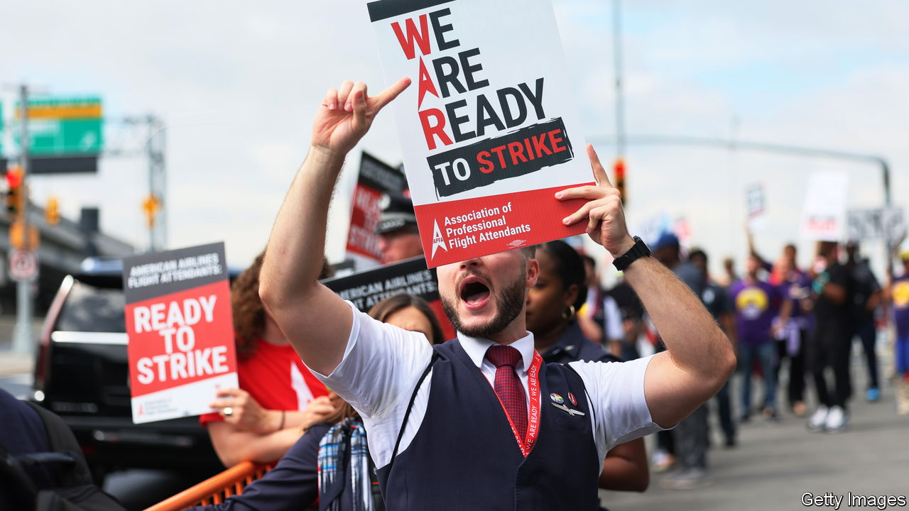

###### Workers of the world unite

# Trade unions take on more American firms—and not just in America 

##### Chevron is the latest casualty of reinvigorated labour organisers 

 

> Sep 7th 2023 

OVER THE past four decades American bosses have grown unused to labour unrest. Ever since Ronald Reagan sacked thousands of striking air-traffic controllers in 1981, shortly after being elected president (and despite once leading the Hollywood actors’ union), American trade unions have been relatively meek. America experienced an average of 17 big work stoppages (affecting 1,000 workers or more) a year from 2000 to 2022, down from 84 annually between 1977 and 1999. Union membership has fallen from a peak of 20m members in 1979 to just over 14m last year, split evenly between the public and private sectors. Just 6% of private-sector workers belong to a union these days, compared with more than 20% in the 1970s. 

This year a confluence of tight job markets, accelerating technological change (think ChatGPT) and rising public support for unions (which enjoy a record 67% approval rate among Americans, according to Gallup, a pollster) has emboldened workers. Strikes are proliferating. There have been 16 big ones in the country in the first seven months of this year, up from 11 in the same period in 2022 and the most since 2005. Hollywood writers and actors are in a months-long standoff with studios. On August 30th 99.5% of unionised American Airlines flight attendants voted to go on strike. Workers at Detroit’s big carmakers are threatening to follow suit. 

If that weren’t irksome enough for American bosses, some of their businesses are feeling the pain abroad, too. On September 8th workers at two Chevron plants producing liquefied natural gas (LNG) in Australia may halt work. They will down tools for up to 11 hours a day, escalating to a full-blown strike if no agreement on pay is reached. Offshore Alliance, the union representing Chevron’s Aussie workers, recently rejected the energy supermajor’s pay proposals, claiming that they were stingier than those offered by its second-rate competitors. 

Chevron knows how to snuff out industrial action. Last year union workers at its refinery in California caved in and ended a ten-week strike without securing better pay. Demand for gas is lower at the end of the northern summer, which could weaken Offshore Alliance’s bargaining position. 

Yet a prolonged dispute down under could spell trouble for the American energy giant. The two Australian plants, Gorgon and Wheatstone, together made close to $7bn in net profits for their owner last year, contributing nearly a fifth to its bottom line. Moreover, nearly 90% of Chevron’s LNG production from Australia is sold under long-term contracts, on which it would rather not renege. Chevron’s bosses in America understand this. So do its workers across the Pacific. ■


