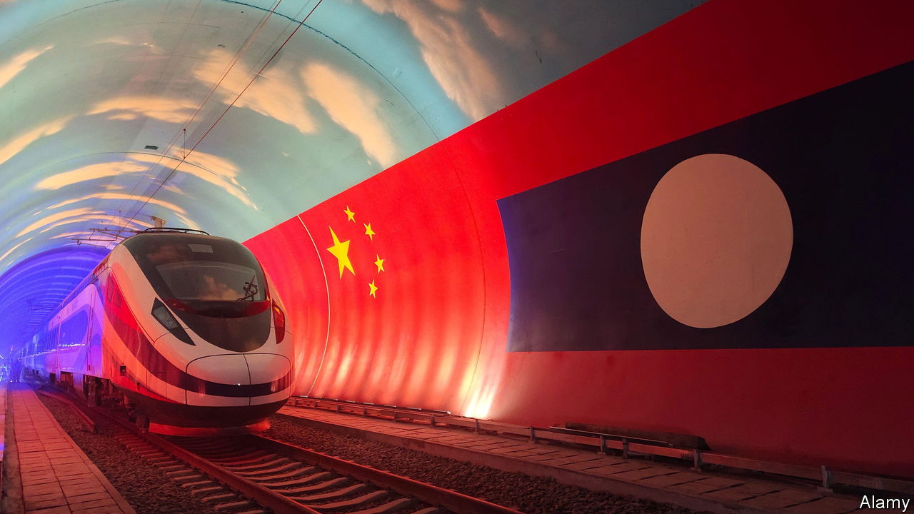
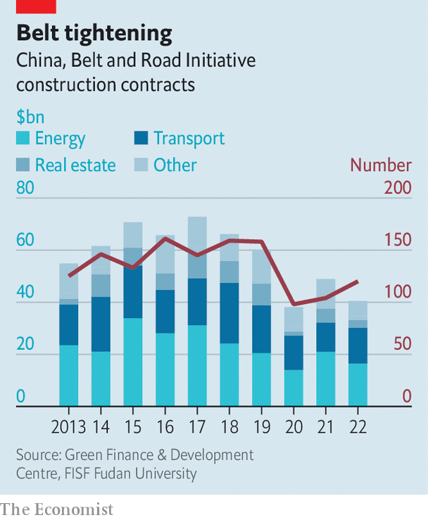
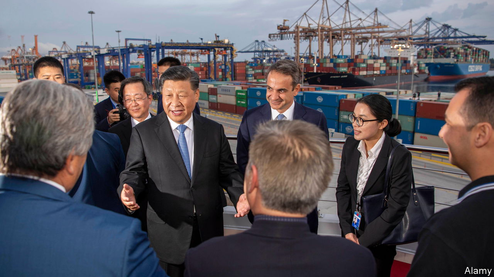

###### Where to from here?

# The path ahead for China’s Belt and Road Initiative 

##### Now ten years old, China’s global infrastructure-building plan enters a new stage 

 

> Sep 6th 2023 

THERE WAS little hint in the speech that Xi Jinping gave on September 7th 2013 in Kazakhstan that he was thinking of a concrete-pouring binge across the world, spurred by hundreds of billions of dollars in Chinese loans and investment. No one predicted that the project would become a defining feature of his foreign policy and dramatic symbol of China’s rise as a global power. Mr Xi talked of building an “economic belt” along the ancient “silk road” linking China with Europe. He called for better infrastructure and reduced barriers to trade. If he had a grand plan, the lede was buried amid musings on history and Kazakh poetry. The West was in for a shock. 

China is about to celebrate the project’s tenth anniversary with fanfare. It will tout the Belt and Road Initiative (BRI), the scheme’s official name in English, as a gift to the world that has created huge economic benefits. China claims that 420,000 jobs have been created in BRI countries and 40m people lifted out of poverty thanks to BRI-generated growth. America, and many of its allies, see the BRI as far less benign: a political tool aimed at stifling foreign criticism of Mr Xi’s iron-fisted rule and providing a leg-up for his country’s firms that has saddled countries with crippling debt. 

Among rich countries, China’s BRI festivities will do nothing to allay anxieties. The highlight will be a Belt and Road Forum, which is due to take place in Beijing in October. World leaders have been invited, but none from the West is expected to attend. The most prominent guest will be Russia’s Vladimir Putin. His presence, alongside Mr Xi, will highlight what many in the West see behind the BRI veil: an attempt by China to sell an alternative model of development that eschews democracy and creates a world safe for dictators. In the build-up to the event, China has been struggling to keep on board the one G7 member that has signed up to the scheme—Italy. Its deputy prime minister, Antonio Tajani, has just visited Beijing with a message: his country may pull out. 

More resistance is expected at a meeting of the G20 in Delhi on September 9th and 10th. President Joe Biden will offer an alternative vision of helping poorer countries by beefing up the role of the World Bank and the IMF—institutions that his national security adviser, Jake Sullivan, said were “founded on and continue to embody US leadership”. These, he added, would provide “the most bang for our buck” in countering China’s “coercive and unsustainable lending”. For unclear reasons, Mr Xi plans to skip the gathering. 

When the BRI was launched, there was little sense of an impending struggle between China and the West over something so innocent-sounding as building roads and railways, ports and pipelines. Mr Xi’s speech in Kazakhstan barely raised eyebrows. Neither did another one he gave in Indonesia, nearly a month later, in which he called for a “maritime silk road”. It was not until the following year that Mr Xi began using a shorthand for these two ideas—“one belt, one road”. Some Western officials did wince at that: the term sounded too China-centric and simplistic for what was beginning to emerge as a complex scheme involving scores of countries. So China tweaked the name for foreigners (not in Chinese). In 2015 it became the BRI. 


That was before relations between China and the West, already prickly and mistrustful, began to spiral downwards. Donald Trump would not become America’s president until 2017, unleashing a trade war with China that would become part of a broader campaign by America against China’s norm-changing global behaviour. It was four years before the European Union began calling China a “systemic rival”. The mass internment of Xinjiang’s Muslims and the sweeping clampdown on dissent in Hong Kong were still well in the future. Even in the West, China found open doors. Eighteen of the EU’s 27 members have signed up to the BRI. 

One of them is Greece, which suffered an economic meltdown in 2009. China was already in place. In 2008 COSCO, a Chinese state-owned shipping giant, had reached an agreement to lease two container piers at Piraeus, the country’s main port, in the south of Athens. In 2016 Greece, then under pressure from its financial rescuers in the EU and the IMF to generate funds by privatising state assets, took a step further. It agreed to sell a 51% stake to COSCO in the entire facility. For the first time, a European port would be controlled by a Chinese firm. In 2021 it bought another 16%. 

China was triumphant. Its officials called Piraeus the “dragon head” of the BRI in Europe. After a visit in 2019, Mr Xi said the port was proof that the BRI was “not a slogan or tale, but a successful practice and brilliant reality”. It is certainly impressive. At the beginning of COSCO’s involvement, Piraeus ranked 93rd among container ports worldwide. Now it is in the top 40. Colossal blue cranes, made in China, unload containers from ships that, pre-COSCO, would have been too big for the port to handle. Since the firm arrived and began a massive upgrade, container-handling capacity at Piraeus has grown more than four-fold. 

But if China had hoped that gaining control of a vital port would give it enduring political clout in a country that is a member both of the EU and NATO, it may be disappointed. After granting COSCO control, Greece blocked EU statements attacking China’s behaviour in the South China Sea and its human-rights record. However, a more pro-American government took over in 2019. “Greeks no longer see China as a saviour for their economy. In fact, polls show an increasingly defiant Greek public,” said a report in 2021 by the Carnegie Endowment for International Peace, a think-tank in Washington. 

In recent years, attitudes towards China have changed considerably across Europe. The EU has tightened the screening of foreign investments for possible security risks. There are only a few big BRI projects in Europe. One is a high-speed rail line being built between Hungary and Serbia, funded by Chinese loans. China’s eventual hope is to link it with Piraeus, but North Macedonia and Greece are still mulling how to proceed with their sections. 

China’s presence is far more extensive in Africa, where it had been a big player long before the BRI was proposed. The scheme boosted China’s involvement in big infrastructure projects, from railway lines to ports. Sub-Saharan Africa has soaked up a large share of BRI lending. But as countries have become laden with debt, many loans have turned sour. For China, Africa has become a financial quagmire. 

A trap for whom?

China’s banks were willing lenders, but hard-nosed. Much of the credit was granted on commercial terms. The banks have been resisting Western calls to help African states by writing off some loans. But in June China joined other foreign government creditors in reaching a deal with Zambia over how to restructure billions of dollars in debt, much of it owed to China. That was a shift. China normally prefers to resolve such problems in secretive bilateral talks. Still, it did not agree to a haircut.

Some Western officials complain that China has been setting “debt traps” to ensnare unwary recipients of BRI lending: the idea being that when a borrower defaults, China can extract concessions, such as ownership of vital infrastructure. One alleged example involves a Chinese firm’s takeover in 2017 of Hambantota, a Chinese-built port in Sri Lanka, after the country’s government struggled with debt. But there is little proof of any deliberate trap having been laid, there or elsewhere. 

Rather, China’s banks have been ensnaring themselves by lending without proper assessments of risk. Now they prefer to keep borrowers afloat rather than let them sink. Between 2016 and 2021 they extended $185bn in bail-out loans, according to a report by AidData, an American research group. It says that in 2010 less than 5% of Chinese lending abroad supported borrower countries in distress. By 2022 that figure had risen to 60%. China’s banks have been relatively tough-minded about this kind of lending, too. AidData—writing in March—said interest on a rescue loan from the IMF was typically 2%. The average rate on a Chinese one was 5%.

China may be learning lessons. Having reached a peak in 2016, its outbound lending has fallen, according to the Rhodium Group, another research firm. “China’s big banks are re-evaluating their lending practices after high-profile stumbles,” it says. In 2020 China’s new lending to African governments was less than $2bn. This was the lowest amount since 2004. 

It has been a similar story in Pakistan, a close ally, where a flagship BRI enterprise has involved talk of as much as $60bn of spending (though only about half has materialised) on megaprojects such as road upgrades and power plants. Known as the China-Pakistan Economic Corridor (CPEC), it aims to stimulate trade across their mountainous border and down to the port of Gwadar more than 1,500km to the south-west. China has managed Gwadar since 2013, but the port’s development has involved nothing like the success of Piraeus. It has been beset by militant violence and Pakistan’s political strife. The country’s binge of CPEC-related borrowing has helped to foment a debt crisis. It has been turning to the IMF, and China, for help.

 


But China remains wedded to the CPEC idea. In countries around its borders, the BRI has an added layer of importance. China sees its help with infrastructure-building as a security guarantee as well as a commercial opportunity, in some cases providing alternative land routes for its energy imports that would bypass the Malacca Strait, a choke point that America could throttle. In Pakistan’s case, China hopes for multiple dividends. A prosperous Pakistan, it reckons, could act as a counterweight to India, China’s rival. It would be less likely to foment violent extremism that could spill over into neighbouring Xinjiang. Western security experts speculate that Gwadar could become a base for China’s navy (despite rumours, there is no firm evidence that it is building one there). 

In parts of the world, the BRI will become less bold and brash. But for security and economic reasons, China will keep pursuing the idea in its own backyard. The International Institute for Strategic Studies (IISS), a think-tank in London, says that South-East Asia will be a particular focus. “No region is more strategically important” to China, it says. Amid growing tensions with the West, China is becoming more concerned about its economic security. “It wants to use the BRI to create alternative markets for its goods and alternative links in its supply chains,” the IISS says, particularly for China’s high-tech products. South-East Asian countries are critical to those chains. 

Progress is being made. In 2021 China finished building a new rail line, costing nearly $6bn, connecting the Chinese city of Kunming with Vientiane, the capital of Laos, one of Asia’s poorest countries. The 422km section in Laos cuts through mountains still dotted with unexploded American bombs from the Vietnam war. Nearly half the track is in tunnels. 

In April passengers began using the line to cross the border. The journey from Vientiane to the Chinese frontier, once a bumpy day-long drive, is now a smooth 3.5-hour ride. Lao farmers have begun to plant high-value crops such as durians to sell to China by train. “US dropped bombs in Laos, China builds railways” said a recent headline in , a tabloid in Beijing. This is a recurring feature of the BRI’s message: China is benevolent and America is a bully. Among some people in Laos, it strikes a chord. China is “the big brother that we can learn from”, says Phouphet Kyophilavong of the National University of Laos. 

But polls suggest that in countries near to China, publics are more wary of Chinese influence, which they see as growing. In conversations in Vientiane, Lao analysts often criticise their government for failing to extract more benefits from Chinese projects. They say Laos spends so much on debt servicing that it has neglected critical needs such as education. 

Laos is up to its neck in debt. At the end of 2022 it owed $10.5bn to foreign lenders, the equivalent of 84% of its GDP. About half of the money had been borrowed from China. Last year Laos’s foreign-currency reserves fell so low that it struggled to buy fuel. Credit-rating agencies warned that it was close to defaulting. China has allowed Laos to defer debt repayments.

 


China sees the China-Laos railway as one leg of a much longer rail network that it hopes will eventually connect Kunming with Singapore. For China, the line’s success will depend not on how it is used by Laos’s population of 7.5m. Far more important is laying track through richer Thailand, which has ten times as many people. Work on that is under way, though completing the project region-wide will be dogged by messy politics in Thailand and Malaysia, tough negotiations over project terms (Laos was relatively easy-going) and wariness among some local lawmakers about being drawn too close to China.

It can be difficult to discern what the BRI really is about. It is often compared to the Marshall Plan, America’s funding for rebuilding Europe after the second world war. But it is not that. Very little BRI activity involves aid. Indeed, many BRI countries are relatively wealthy. Globally more than 150 have signed up to the scheme. About half of them are labelled as upper-middle or high-income by the World Bank. The silk-road language is misleading. There is no geographic bar to joining. 

But it is becoming clearer how it might morph. In 2015 China said the BRI would also create a “digital silk road”, a fancy way of describing the pursuit of business abroad by Chinese companies—state and private—in industries such as telecommunications and cloud computing. The West, especially America, worries that China aims to capture markets with its low-priced, cutting-edge technologies in ways that could threaten Western security and intrude on personal freedoms. America’s tech battle against China is, in part, a response to such fears.

As countries deal with debt shocks and China struggles with weaker growth at home, BRI language is becoming more cautious. In 2021 Mr Xi called for a new phase emphasising “small but beautiful” projects. These would have higher standards and better returns, and involve industries like green energy and digital infrastructure. China would stop building coal-fired power plants abroad, he said. Even during the pandemic, China’s greenfield investments in digital technology abroad steadily increased, says the IISS.

In state media, new ideas proposed by Mr Xi have begun to vie with the BRI for attention. The Global Development Initiative, the Global Security Initiative and the Global Civilisation Initiative are concepts rather than action plans, but with strong implicit messages: that China’s development model is better for poorer countries than Western templates stressing human rights, that Western military alliances threaten world peace and that criticism of Chinese communism amounts to a racist attack on China’s ancient culture. 

But the BRI is far from being abandoned. In the build-up to next month’s summit in Beijing, a message is being promoted by China’s official media. It is that the scheme is Mr Xi’s cherished project. As an obvious tribute to him, the Communist Party agreed in 2017 to enshrine the task of pursuing the BRI into its charter, thus making it a heresy to doubt it. Reports on state television show Mr Xi visiting projects around the world, as if delivering China’s wealth in person. An article in August praised him for “opening up a ‘happy road’ that benefits all countries”. The BRI, in other words, has plenty of life left in it. ■


