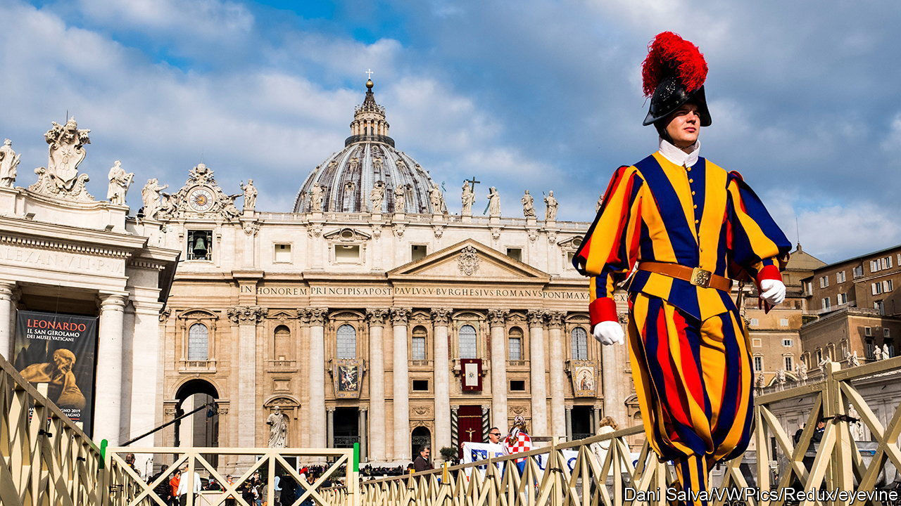

###### Rome and its popes

# A history of the papacy and its relationship with Rome 

##### The religious institution still influences politics today, as a new book shows 

 

> Sep 7th 2023 

. By Jessica Wärnberg. 

The papacy is one of the world’s longest-running institutions. It may also be one of the strangest. There have been rival popes, an English pope and even, legend has it, a female pope.

Many books have been written about the papacy. Jessica Wärnberg’s does not try to cover all the 266 men who have been chosen by conclaves of cardinals. It barely touches on the , for instance, or the  pope who vowed that, God having given him the papacy, he would enjoy it (as many have done). But the book’s strength is its range, from St Peter in the first century all the way to  today. 

Ms Wärnberg is especially good on the early years, when Christianity and the papacy emerged under the shadow of a hostile imperial Rome. Her chronology can be confusing, and she makes a few slips (Julius Caesar was never an emperor, for example). Yet the story of how popes became leading actors is well told. 

The papacy has long had tricky relations with temporal authorities, such as  and European monarchs. French kings, in particular, clashed repeatedly with pontiffs, leading to the papacy’s exile to Avignon during the medieval era. As French emperor,  struggled against the papacy. But it was the arrival of Martin Luther and the spread of Protestantism across northern Europe in the 16th century that did most to undermine papal authority.

Two big themes stand out from the book. The first is the reactionary instincts of the institution and its occupants. Popes have generally backed those in power against reformers or liberals. In the 19th century, Pope Gregory XVI banned railways (“highways to hell”) and even streetlights in his territories. 

Second is the link to Rome and the Italian government based there. Rome often seems ungovernable, and the papacy is one reason. Most ordinary Italians are no longer in thrall to their church, yet its hold on the political class remains palpable. The latest evidence of this is the conservative social policy of Italy’s current prime minister, , who opposes gay marriage and abortion. Even under Francis, who is socially liberal by historical standards, the papacy’s political influence persists.■


