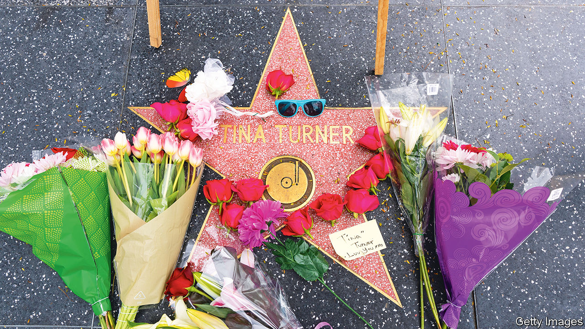

###### Back Story

# Lots of people mourn when famous writers and musicians die. Why? 

##### What we talk about when we talk about dead artists 

 

> Sep 3rd 2023 

After Alexander Pushkin was shot in a duel in 1837, crowds of mourners formed in St Petersburg. Russia’s nervy authorities moved his funeral service and mustered 60,000 troops. When the wagon bearing the poet’s body reached Pskov province, where he was to be interred, devotees tried to unharness the horses and pull it themselves.

The death of Rudolph Valentino, a silent-movie idol, in 1926 set off similarly fervid lamentation. Mounted police restrained the fans who mobbed the funeral parlour in New York where he lay on view (several reportedly killed themselves). In 1975 some of the millions of Egyptians who paid their respects to Um Kalthoum, a megastar singer, took hold of her coffin and shouldered it for hours through the streets of Cairo.

Today’s celebrity obsequies tend to be less fanatical, and largely digital rather than in-person. But they are passionate all the same. In the past few months, grief has coursed around the internet for , ,  and, most recently, Jimmy Buffett. If you stop to think about it, many such outpourings for writers, actors and musicians are odd, even irrational.

Unlike other kinds of grief, this one does not stem from personal intimacy. If you ever interacted with a cherished author, it was probably during a book tour when, caffeinated to the eyeballs, she signed your copy of her novel and misspelled your name. Maybe you delude yourself that you once locked eyes with a frontman hero during a gig and that he smiled only for you. But you didn’t really know them, and they certainly didn’t know you.

Nor would you always have liked them if you had. Their books or songs may be touching and wise, but (in the parlance of criticism) it is a biographical fallacy to assume that the work reflects an artist’s life or beliefs. Your favourites may indeed have been lovely people; or perhaps, beneath their curated images, they were spiky money-grubbers, consumed by rivalry or solipsists who drove their families nuts. Rarely do you know for sure.

Though the artists are gone, meanwhile, the art you prize is not. Death does not delete it—on the contrary, curiosity and nostalgia often drive up sales. (David Bowie’s only number-one album in America was “”, released days before he died in 2016.) The dead, it is true, write no more books and record no songs. Philip Roth will never set a novel in the era of Donald Trump; you will never hear another operatic Meat Loaf ballad. The cold reality, however, is that many artists’ best work was done long before their demise. 

The sorrow makes more sense when a star dies young or violently. Had she not perished at 27, like Jimi Hendrix and Janis Joplin, who knows what music  would have added to her small, exquisite oeuvre? , another casualty of 2023, lived a troubled life that ended too soon. Buddy Holly (killed in a plane crash), Amedeo Modigliani (dead of tubercular meningitis at 35), Wilfred Owen (slain in action a week before the armistice in 1918): such premature and cruel exits are tragic.

Objectively, though, the death of a long-lived and fulfilled artist is far from the saddest item in an average day’s headlines. And whereas most mortals sink into oblivion, laureates live on in their output, which Horace, a Roman poet, called a “monument more lasting than bronze”. The standard reasons for mourning don’t apply. Why, then, are these losses felt so widely and keenly?

One interpretation is that the departed celebrities are merely the messengers. The real news is death itself, which comes for everyone, immortal or impervious as some may seem. If the reaper calls for Prince, with all his talent and verve, he will certainly knock for you. As Jim Morrison sang before he, too, died at 27: “No one here gets out alive.” 

Part of your past—the years in which the mute musician was the soundtrack, the silenced writer your ally—can seem to fade away with them. Just as plausibly, the grief can be seen as a transmuted form of gratitude for the solidarity and joy they supplied. On your behalf, they undertook to make sense of the world and distil beauty from the muck of life. 

Yet as much as anything else, the passing of an artist is an occasion for communion. In an atomised age, in which the default tone is abrasive, a beloved figure’s death is a chance to share benign feelings and memories with fellow admirers. Like water-cooler moments in a cemetery, these sombre holidays from spite and strife are the artists’ parting gifts. ■


