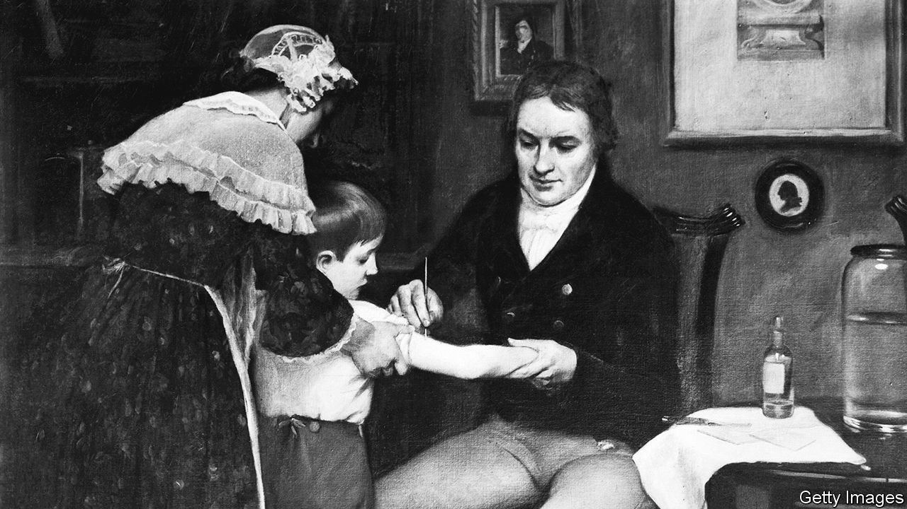

###### Vaccines

# Simon Schama’s “Foreign Bodies” tracks the history of vaccines 

##### From smallpox to covid-19, a new book offers a fascinating story of vaccines’ spread 

 

> Sep 6th 2023 

 By Simon Schama.

The first recorded vaccine—for smallpox—was administered by Edward Jenner, an English doctor, in 1796 to an eight-year-old boy, James Phipps. Jenner (pictured) took fluid from the lesions of a dairymaid who had become infected with cowpox and used it to inoculate Phipps against cowpox and . 

That people could become immune to diseases after being exposed to them had been known for more than a thousand years before Jenner carried out his experiments. But the idea that people could be purposely infected as a way to ward off future illness, though ancient, took a  to spread and become accepted around the world.

In “Foreign Bodies”, Simon Schama, a British historian, lays out a sweeping , a range of methods used to protect people against disease that would eventually include vaccination. In tracing the transmission of this idea, Mr Schama’s gaze moves from China to colonial Europe. He highlights forgotten characters, including a Greek woman who was one of the earliest and most prolific public-health servants, inoculating more than 4,000 patients herself and causing no ill effects. Along the way, readers meet vaccination’s most regular travelling companion—distrust. 

Mr Schama opens his book with the story of François-Marie Arouet, the French philosopher and writer better known as Voltaire, who suffered from smallpox in 1723. As he burned with fever, he drank 200 pints of lemonade in the hope of “encouraging the coursing of foreign matter towards evacuation through the broken surface of the skin.” He also performed bleeds and several emetic purges. “The wonder is that Voltaire survived,” Mr Schama writes. 

While Voltaire suffered in France, the authorities in China had already made inoculation against smallpox a state policy. The preferred way to create a mild infection there was insufflation: blowing dried pus into the noses of children and adults (which works). Inoculation could also be carried out by scratching the skin with a needle and introducing pus into the resulting wound. The nobility of Europe, however, were suspicious, believing that the Orient was “hopelessly mired in decadence and superstition”. 

Suspicions continued to be directed at later vaccinators, too. Waldemar Haffkine, a Russian bacteriologist working in India from 1893 to 1915, emerges as a heroic and hitherto uncelebrated figure in the history of public health. Haffkine created and administered a range of vaccines against everything from cholera to the bubonic plague. He first tested them on himself in order to build up trust with those he intended to vaccinate later. 

Nevertheless, it was a battle to persuade government officials to fund the mass-vaccination campaign that Haffkine thought was needed to protect the population from devastating disease outbreaks. He was also unpopular among the elite, with Lord Curzon, viceroy of India, blaming him for the deaths of Punjabi villagers during a vaccination campaign. Lord Curzon subsequently called for Haffkine to be hanged; the microbiologist was not killed, but his career was over.

Today paranoia about vaccines and vaccinators is experiencing yet another outbreak. Anthony Fauci, who formerly served during the covid-19 pandemic as America’s vaccinator-in-chief and as director of the National Institute of Allergy and Infectious Diseases, has become a hate figure for many Americans.

Modern suspicions verge on the “feverish”, Mr Schama writes.  froth that vaccinators want to puncture people’s skin to pump in tiny microchips, so that Bill Gates, a tech billionaire, can track them. (Why he would want to is unclear.) Some anti-vaxxers simply reject science; others object to making jabs mandatory. Both tendencies have spawned rallying cries for populist politicians. For example, , the governor of Florida and a candidate for the Republican nomination for president in 2024, has railed against businesses forcing people to get vaccinated and warns darkly of a “biomedical security state”. 

Mr Schama sees the history of vaccines as constantly pulled between medical advances and backlash from a sceptical public: “Hard-earned, exhaustively tested truth…always seems on the verge of overtaking error, when its exhilarating progress is sandbagged by indignation.” ■


