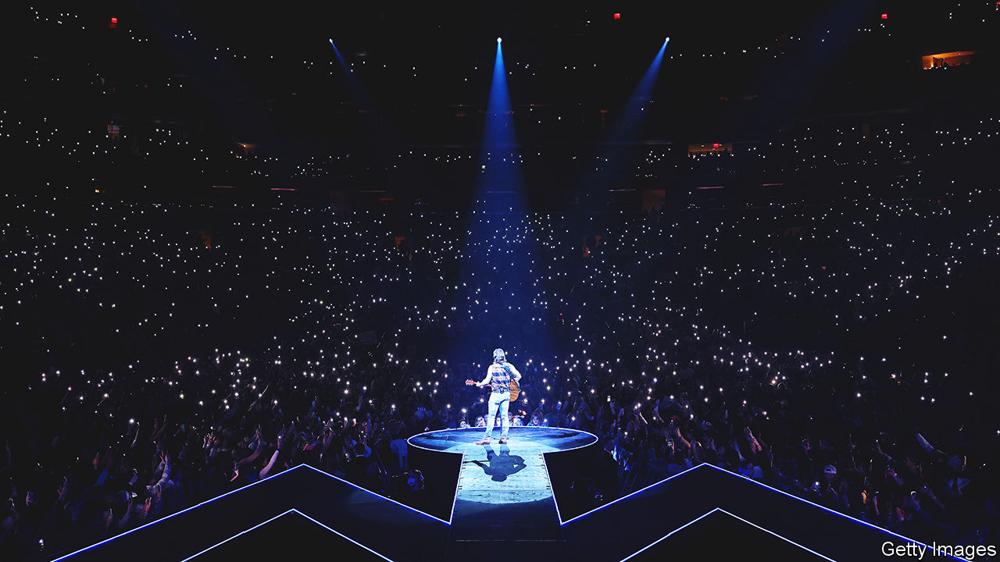

###### Riding high

# Thanks to Morgan Wallen, country music’s popularity has surged 

##### Newer sounds and stars are drawing young audiences to celebrations of rural living 

 

> Sep 1st 2023 

The first songs branded “country” were recorded in Atlanta and sold in 1923. In the century since, Americans have danced and sung to country music with gusto, often sporting stetsons and boots. But today the genre is breaking new records. In August three country songs claimed the  on the  Hot 100, America’s singles chart. It is the first time that a trifecta of country songs has reigned since the chart was launched 65 years ago.

Around 150m Americans (45% of them) listen to  at least once a month. That is more than triple the number that tune in to an hour or more of Fox News, America’s most-watched cable network. A whopping 36% of the streams of Spotify’s top 50 songs in America have been country songs in 2023; in 2016, it was just 2%. Today the genre is even more popular in America than hip-hop and R&amp;B, according to a recent poll conducted for  by YouGov. Though it has yet to outpace pop, country music is finding legions of new listeners, as Nashville’s cowboy crooners reinvent country’s sound and young urbanites take to it.

Morgan Wallen is the biggest star many people have never heard of. A millennial, he pipes about lost love and east Tennessee. His latest record dominated the  200 albums chart for 12 consecutive weeks—the longest reign for an album in 25 years (when the “Titanic” soundtrack floated across airwaves). His tune “Last Night” crowned the singles chart longer than any other country song in history. 

Mr Wallen is both an embodiment of country’s broader appeal and a driver of it. Country-music streams in America rose by more than 20% in the first half of 2023 compared with the previous year; Mr Wallen propelled 40% of that growth, according to Luminate, an analytics firm. 

Youthful punters are packing stadiums to catch the heartthrob on his first international tour. Country listeners tend to be older, conservative Americans, sometimes living in places where wealth is measured in cattle. Yet around a third of Mr Wallen’s fans are women aged 18 to 24, according to Chartmetric, a music-data firm. He is more popular among urbanites than rural Americans, with his biggest audiences in cities like Minneapolis and Chicago. In Boston he filled Fenway Park, a venue that seats 38,000 people, three nights in a row. 

Digital natives outside America are discovering country’s twangy ballads too. Views of TikTok videos tagged #CountryMusic have risen by 67% in Britain in 2023. In the first six months of the year, the Philippines notched up more than 600m country-music streams, according to Luminate. Record labels are cottoning on: one plans to spend a fifth of its country-music marketing budget to attract new listeners in Australia, Canada, Germany and Sweden.

Country has been through evolutions before, even as it holds tight to tradition. Its roots go back to enslaved Africans, who played  on southern plantations. European and British immigrants played folk music on the fiddle. The sounds eventually merged, spawning country music. The genre was popularised by the Grand Ole Opry, a live-radio show that grew into a country-music mecca in Nashville. 

The cheerful reception of country in non-southern cities may seem odd, given the genre’s . But many artists, like Mr Wallen, try to stay clear of politics. (After using a racial slur in 2021, he was briefly boycotted.) For a smaller group, politics explains their rise. Oliver Anthony, who recently had the top single with , shot to fame after conservatives promoted his hillbilly elegy (although Mr Anthony claims to be a centrist). But many younger fans are either ignorant of the genre’s politics or say they do not care.

So what explains country’s broader appeal? One factor is the tone of country songs, which is piquing listeners’ interest. Today’s country musicians are modest and sympathetic; young artists like Mr Wallen, as well as fellow stars like Zach Bryan and Luke Combs, talk more about sobriety than binge-drinking. Mr Wallen paints himself as a simple man chasing big dreams. He serenades his mother and seems surprised by his success. Nashville insiders say the singer still looks startled when bachelorettes swarm him at bars. Mr Anthony of “Rich Men” fame is also down-to-earth; music videos showcase him strumming his guitar alongside his dogs.


Country’s appeal in urban settings can also be explained by listeners’ hunger for escapism. For city folk stuck in matchbox apartments, the tunes represent bucolic freedom without the inconveniences of rural living (slower Wi-Fi, no food-delivery apps). Country “expresses everything about a Friday night”, insists one city-dwelling 21-year-old; listening to it “you forget about all the politics and your daily activities”. TikTokkers now set videos of proms and weddings to country anthems; the mood suits America’s holiday weekends (including Labour Day on September 4th), when streams peak. 

The genre is sounding less like hillbilly blues and more like pop, which also broadens its allure. This may be the influence of Taylor Swift, who was considered a country singer until she shook it off in 2014 and launched a pop career. A chattering hi-hat often heard in trap (a subgenre of rap) kicks through some of Mr Wallen’s tracks; “Last Night” shares hip-hop’s syncopated cadence. Country-music purists may sniff at these hybrid tracks, but they work: the new songs are “earworms”, says one fan. 

Despite his fame in some circles, only a third of Americans know who Mr Wallen is. This is due to streaming; with so much music available, fewer artists become universally known. But if the Tennesseean troubadour can sustain his spell at the top, the self-proclaimed “redneck” who was “born with a beer” in his hand will become an even bigger global sensation, bringing the whole genre along with him. ■


