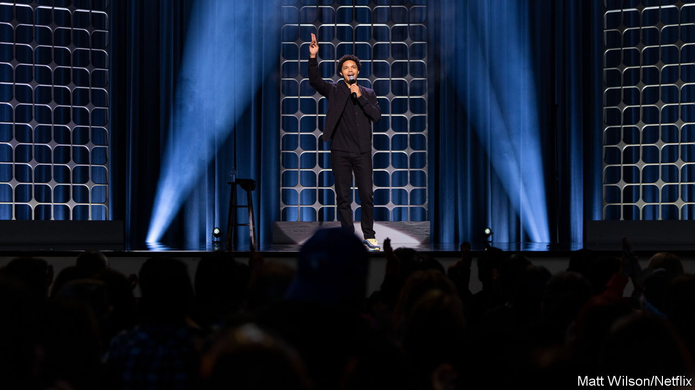

###### Laugh, the beloved country

# Trevor Noah’s tour spotlights South African comedy 

##### When politics and the economy are grim, sometimes you just have to mock it all 

 

> Sep 6th 2023 

There is plenty to cry about in South Africa. The country has the third-highest murder rate and the highest unemployment rate in the world. Graft has corroded the shine of the ruling African National Congress. Nearly three decades on from April 1994, when millions queued to elect , most people will probably stay at home when the country votes in next year’s general election.

In spite—and often because—of the woes, there is plenty to laugh about, too. And few comedians make South Africans chortle more than Trevor Noah (pictured), whose career began in the clubs of his home town, Johannesburg, before he  of “The Daily Show”, an American television programme. 

On August 30th Mr Noah began a 12-show tour of South Africa. (Afterwards he will travel to India, the United Arab Emirates, America and Britain, finishing in March next year.) He symbolises the role comedians can play in South Africa, a country of many nations—merchants of mirth, but also translators across divides.

Under apartheid, comedy, like all culture, was subject to heavy regulation. Long opposed by the government, television was not introduced until 1976. When it finally came, whites were fed milquetoast fare. Comedians who tried to slip in unscripted jokes were kept off-air for years. State-sponsored “African” shows depicted the supposedly wacky ways of “tribal” life to emphasise blacks’ otherness. 

In its dying days apartheid was satirised by a few white stand-ups. One of them, Casper de Vries, says he “wanted to rebel against my conservative culture”, which made him the target of an assassination plot by far-right extremists. But after the end of apartheid in 1994, opportunities for black stars and the exuberance of the democratic era created a culture where all comedians were “trying to find a common understanding”, says Mr de Vries. 

Mr Noah has argued that comedy contributed to catharsis; it was much easier to break taboos while laughing at them. Black comedians frequently mock their audiences. “Do white people know where Gugulethu is?” asked Loyisa Gola, a popular comic, in one of his routines, referring to the poor part of  where he grew up. “Well, you should know, you put us there, motherfuckers.” 

Comedy is a way for different people to understand each other, says Ndumiso Lindi, another comedian. “Comedians bring out things that other people don’t see,” he adds. It helps that South Africans can laugh at themselves. His skit about the reaction of white suburbanites to the arrival of an upwardly mobile black family—and their cows—mocks both the curtain-twitching of whites and stereotypes of his ethnic group, Xhosas. 

Mr Noah is perhaps the ultimate comic interpreter. The son of a Xhosa mother and a Swiss father, he was “Born a Crime”, as declared by the title of his bestselling memoir, published in 2016. Not quite black, not quite white and not quite “Coloured”—a term South Africans use to describe mixed-race people whose primary language is Afrikaans—he grew up something of an outsider. Languages helped him survive: he speaks seven of South Africa’s 12 , as well as German. 

Mr Noah also entered the industry when there was little alternative to shows in English. Today the rise of “vernacular” comedy reflects the growth of a non-white middle class, eager for shows in their mother tongues. Many of the most popular comedians in South Africa mix “vernac” and English shows, a blend they say hones their craft. Virgil Prins, who speaks English, Afrikaans and Xhosa, notes that whites are impatient for punchlines; black audiences enjoy the journey as much as the destination. “The way white people receive humour and express humour is very different to how the black or vernac audiences do,” he argues. 

Vernac can involve stereotyping. This is not unlike that common gag in Britain that begins, “An Englishman, an Irishman and Scotsman walk into a bar.” Instead, in the South African version, it is a Pedi, a Zulu and a Xhosa walking into a shebeen, or a speakeasy. According to Mashabala Galane, a pioneer of vernac, Pedis are frequently mocked for being mummy’s boys, Zulus for their aggressiveness and Xhosas for their pretensions. 

Yet vernac shows help comedians confront taboos beyond race and take aim at many sensitive subjects. These include sex—“which we don’t normally talk about as black people”, says Mr Galane—as well as traditional medicine and polygamy, still practised by some Zulus. (A bonus is more material for mother-in-law jokes.) 

Mr Noah has said that satire is important in a country where politics is one of the few shared experiences. But “vernac comedians don’t normally touch politics,” says Mr Galane: “People come to comedy to escape politics.” This means that one consequence of the growth of vernac may be that South African comedy loses some of its political potency.

That hints at a broader apathy after almost 30 years of unmet expectations. Or perhaps it is just hard to satirise public life when so many South African politicians are unwitting comedians. Cyril Ramaphosa, the president, nearly resigned last year in a scandal involving $580,000 in cash stuffed in a sofa from the sale of buffaloes. 

The  does not make it easy for comedians to follow in Mr Noah’s footsteps either. For most South Africans, shelling out the equivalent of $50 for a comedy ticket would be an absurd luxury. Covid led to the closure of the last comedy club still standing in Cape Town. To make an income, many comics take corporate gigs, playing at firms’ bashes. According to Mr Lindi, “They come with rules, like no race jokes. But how do you avoid race issues in a country like ours?” ■


