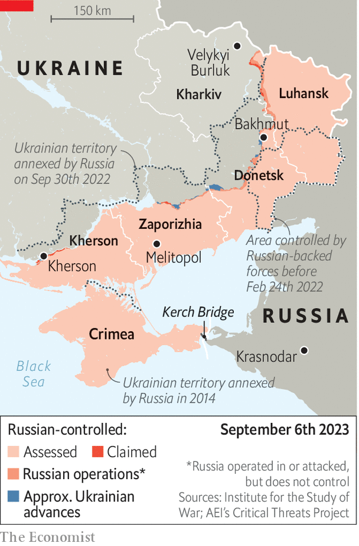

###### Crime and punishment

# Inside Ukraine’s assassination programme 

##### Its agents have become expert in dark revenge. But some worry a clear strategy is absent 

 

> Sep 5th 2023 


THE OPERATION was a month in the making. Yevhen Yunakov, the mayor of Velykyi Burluk, in the Kharkiv region, had been identified as a collaborator with the Russians. “Caucasus”, a special-forces commander, and a group of local officers were given the job. His men watched their target meticulously for days: when he shopped; when and where he moved; the extent of his security. Once they detonated their bomb, from a distance, they disappeared to safe-houses inside occupied territory. The group would return to  only weeks later, after the town had been liberated. Yunakov’s body has never been found. 

Over 18 months of war, dozens of people like Yunakov have been targeted in clinical operations across occupied Ukraine and inside Russia itself. They have been shot, blown up, hanged and even, on occasion, poisoned with doctored brandy. Ukraine is tight-lipped about its involvement in assassinations. But few doubt the increasingly competent signature of its security services. The agencies themselves drop heavy hints. “Any person who betrays Ukraine, shoots at Ukrainians or fires missiles on Ukrainians should understand that they are being watched and will be brought to justice,” says Andriy Cherniak, an officer of HUR, Ukraine’s military-intelligence agency. In an interview in July his boss, General , went further: “If you are asking about [creating a version of] Mossad…We don’t need to. It already exists.” 

 


Mention of the Israeli spy agency animates Ukrainians, . In fact, the origins of political assassination are a little closer to home. Mossad learned much of its craft from the Soviet-era secret police and its founding practitioner, Pavel Sudoplatov, who was born in Melitopol in now-occupied southern Ukraine. In a quirk of history, Sudoplatov spent the 1930s infiltrating Ukrainian nationalist groups, and personally blew up one of their leaders with a chocolate-box bomb. (He also masterminded the assassination of Leon Trotsky in 1940.) 

In modern Ukraine, assassinations date back to at least 2015, when its domestic security service (SBU) created a new body after Russia had seized Crimea and the eastern Donbas region. The elite fifth counter-intelligence directorate started life as a saboteur force in response to the invasion. It later came to focus on what is euphemistically called “wet work”. 

Valentin Nalivaychenko, who headed the SBU at the time, says the switch came about when Ukraine’s then leaders decided that a policy of imprisoning collaborators was not enough. Prisons were overflowing, but few were deterred. “We reluctantly came to the conclusion that we needed to eliminate terrorists,” he says. A former officer of the directorate describes it in similar terms. “We needed to bring war to them.” In 2015 and 2016 the directorate was linked to the assassinations of key Russian-backed commanders in the Donbas; Mikhail Tolstykh, aka “Givi”, killed in a rocket attack; Arsen Pavlov, aka “Motorola”, blown up in a lift; Alexander Zakharchenko, blown up in a restaurant (pictured). 

Intelligence insiders say the SBU’s fifth directorate is playing a central role in counter-Russia operations. The SBU’s relative size and budget—five times bigger than HUR’s—mean it has been most able to pull off the most sophisticated jobs, for example bombing the Kerch bridge, linking Russia to Crimea, in October 2022. Others, though, emphasise the role of HUR, with its underground networks and increased wartime prominence. “We are mostly the white-collar guys,” insists an SBU source. Another increasingly important player in occupied Ukraine is the Special Operations Forces (SSO). This is a relatively new group that co-ordinates Rukh Oporu (Resistance Movement), Ukraine’s partisans. The operation in Kharkiv, for example, was the SSO’s. Denys Yaroslavsky, an officer in the SSO, says the service is now pushing for more powers to сonduct operations within Russia itself. That is not universally welcomed elsewhere in Ukraine’s intelligence community. 

Ukraine’s president is understood to authorise the most controversial operations, though other decisions are delegated. A high-level government source with knowledge of the work declines to discuss the details: “It’s important not to comment or even think about such operations.” But he says that Volodymyr Zelensky has issued a clear order to avoid collateral damage among civilians. “The president communicates this instruction to people formally, and, on occasion, by shouting at them.” Ukraine had to choose its targets carefully, the source adds; it might “not always” have done so. 

Ukraine’s leadership came under particular scrutiny in October, when the  reported that the American government was blaming it for a car-bomb that , daughter of Alexander Dugin, a nationalistic philosopher. That sharpened an already-lively internal debate within Ukrainian intelligence. It was unclear if Ms Dugina was meant to die; some reports suggest she had switched cars with her father. 

But a subsequent string of operations targeting mid-level propagandists showed a trend that few of the insiders interviewed for this article were happy with. “These are marginal figures,” says one source in SBU counter-intelligence. “It makes me uncomfortable.” The former SBU fifth-directorate officer suggests the operations were designed to impress the president rather than bring victory any closer. “Clowns, prostitutes and jokers are a constant around the Russian government,” he says. “Kill one of them, and another will appear in their place.”

The former spy says he is concerned that Ukraine’s assassination campaign is driven by impulse rather than logic. Some of the killings have a useful psychological role, he says: to raise the cost of war crimes and the spirits of ordinary Ukrainians. This was “certainly” the case with Stanislav Rzhitsky, a former submarine commander believed to have fired the missiles that killed 38 Ukrainians in Vinnytsia in July 2022. He was shot dead a year later while jogging in a park in Krasnodar, in Russia. But other operations suggested an absence of strategy. They risked exposing sources, methods and the extent of Ukrainian infiltration into Russia: “Our security services shouldn’t do things just because they can.” 

Andriy Yusov, a military-intelligence spokesman, insists Ukraine is avoiding what he called “blind terror”. The aim is “not to frighten the enemy,” he says, but “to force it from occupied Ukrainian lands.” But Ukrainian spies would continue to “identify and take advantage of Russian psychology and vulnerabilities” wherever they found them. 

Of course, the converse is also true. The infiltration of Ukraine’s security services by Russian agents remains a big issue. In the estimation of some insiders, it is the largest single barrier to any attempts to create a Ukrainian Mossad. The former head of SBU’s internal security has fled Ukraine under a cloud of suspicion, and is being investigated for treason in absentia. Trust remains an issue in the service, with all but the least sensitive operations conducted in small groups. “People are always our weakest link,” says the SBU counter-intelligence source. “They are by far the most slippery part of our calculations.” ■ 


