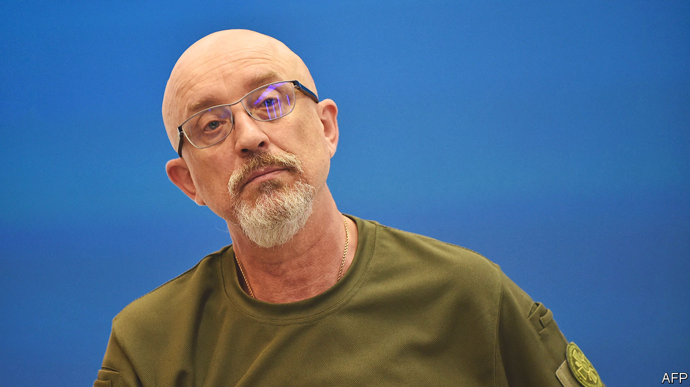

###### Zelensky’s shuffle

# Is Ukraine really interested in fighting corruption? 

##### Volodymyr Zelensky removes his defence minister and goes after an oligarch 

 

> Sep 4th 2023 


In the space of two days last weekend, Ukraine saw two big  stories make the news. At face value they show the government wresting back the initiative on reform. On September 3rd President Volodymyr Zelensky said he would replace his defence minister, Oleksii Reznikov (pictured), following months of corruption scandals at his department. A day earlier the SBU, Ukraine’s domestic security service, had detained Ihor Kolomoisky, a controversial oligarch, on suspicion of fraud and money-laundering. There are questions about the timing and nature of both interventions. 

Mr Zelensky focused on his minister’s role as a brave and trusted comrade over 550 days of war. But in recognising the need for a change, the president was acknowledging that his record has been tarnished. Mr Reznikov was seen by many, including Western partners, as a charismatic and resourceful negotiator. He was in the inner core that stayed in Kyiv throughout the invasion, despite the huge dangers. 

To his detractors, however, he will be remembered for two scandals, involving eggs and winter coats. The journalism of Yuriy Nikolov had exposed both. In February his investigations revealed that Mr Reznikov’s ministry had been paying 17 hryvnia (46 cents) for eggs when the market price was just five. Mr Reznikov survived that scandal, only to be hit by another in August, which showed his ministry had bought military coats from Turkey, also apparently at a huge mark-up. Invoices in Turkey showed the coats had a value of $29, rather than the $86 paid by Ukraine. 

Government insiders say Mr Reznikov does not appear to have had a direct hand in either of the contracts. He did not appoint the officials who signed the deals. But his poor handling of both scandals, including picking fights with journalists about irrelevant details, made his departure inevitable. “The defence minister had become a focus of jokes,” says a source close to Ukrainian law enforcement. “That’s not a good look at a time of war.” 

The presidential office also appears to have had an eye on the polls when taking on Mr Kolomoisky. Once one of Ukraine’s most powerful men, the oligarch has been a much diminished figure since the nationalisation of his main banking assets following allegations of serious fraud. Mr Kolomoisky had at one point been close to Mr Zelensky, with the oligarch’s 1+1 TV channel promoting first his comedy and then presidential ambitions, but the two have also slowly fallen out. 

The role of the SBU, a service controlled by the president, in taking on Mr Kolomoisky has, however, raised eyebrows. The law-enforcement source says the more independent (and Western-backed) National Anti-Corruption Bureau (NABU) had been planning to issue charges against the oligarch later this week. Some interpret the SBU’s move as an attempt to steal the headlines from NABU—or even less charitably, as an attempt to disrupt the case and allow Mr Kolomoisky to avoid court. 

The eventual resolution of both stories will go some way in determining how willing the West is to continue to underpin funding for Ukraine. But Mr Nikolov says that the renewed focus on corruption is positive: it can only help expose crooks in government. The price of a military egg is a good indicator of the effectiveness of his work. It’s back down to seven hryvnia. ■

