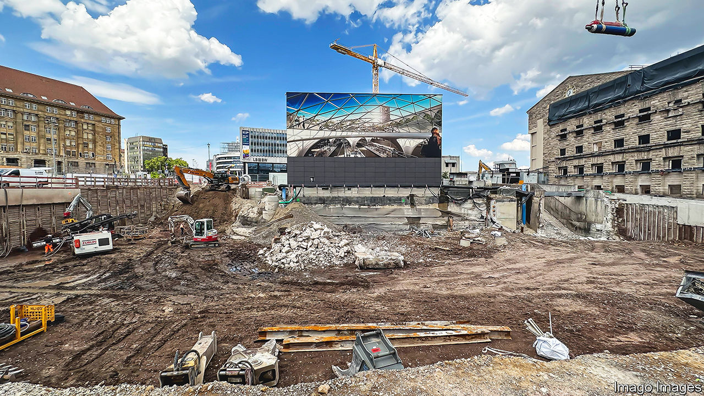

###### German engineering

# Stuttgart’s ever-receding station is Germany’s latest transport fiasco 

##### It has become a €12bn embarrassment 

 

> Sep 7th 2023 

TRAVELLERS ARRIVING at or leaving from Stuttgart’s main railway station should be warned. They must allow an extra 10-15 minutes to get out of the building or get to the platforms to catch a train, because of an ugly maze of detours around Germany’s biggest construction site. “It has been like this since I was at school 13 years ago,” shrugs the barista at a nearby coffee shop.

The ambitious plan for a new station in the capital of Baden-Württemberg, one of Germany’s most prosperous states and home to Daimler-Benz, Bosch and Porsche, was to be an advertisement for the state’s engineering prowess. By relocating tracks and platforms largely underground, it was supposed to speed up journeys to other places in Germany and all over Europe, while reclaiming space for shops, housing and parkland in the centre of town. The city picked a design by Christoph Ingenhoven, a cool modernist architect from Düsseldorf, and the late Frei Otto, winner of the prestigious Pritzker prize for architecture.

But its fate has been similar to that of Berlin’s new airport, which was completed after a nine-year delay in 2020, having exceeded its budget by more than €4bn ($4.7bn). “Stuttgart 21” (named for the 21st century) was meant to be completed by the end of 2019 at a cost of €4.5bn. It is now forecast to be finished by 2025, and the cost may rise to nearly €12bn. The mega-site currently employs some 6,000 construction workers, who even have their own priest, Peter Maile, to provide (much-needed) pastoral care. The bosses of Deutsche Bahn may need the consolations of religion too. The loss-making German railway operator is in court, fighting the state, city, region and airport over who will cover Stuttgart 21’s exorbitant additional costs.

For some, Stuttgart 21 remains an awesome engineering masterpiece in the making; for others it is a bottomless pit wasting more and more taxpayers’ cash. In June the station could have celebrated the topping-out ceremony of its main building. Oddly enough, no one felt much like an underground party, or indeed any party at all. ■

