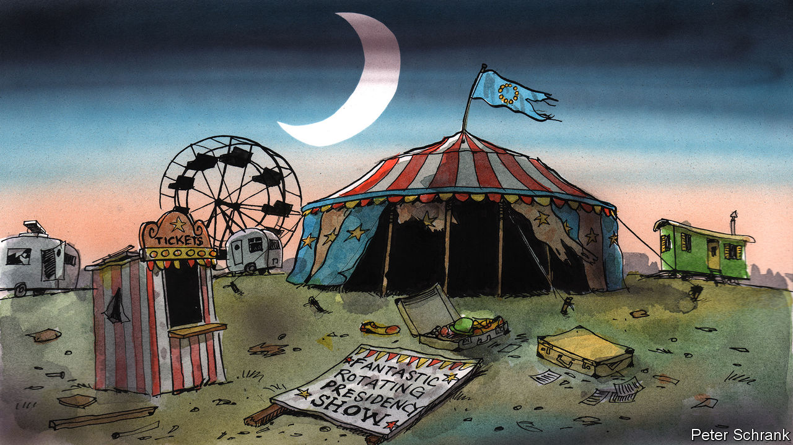

###### Charlemagne

# The EU’s rotating presidency should be scrapped 

##### Several misfiring ones are in prospect 

 

> Sep 6th 2023 

The flip side of Europeans taking much of August off is that they are expected to put in a bit of a shift come  . The back-to-school feeling has been palpable in Brussels as thousands of Eurocrats return from the 27 member states to get the EU show back on the road. After much air-kissing and a few long lunches, the prospects for the months ahead are addressed, starting with European elections ahead of next year’s summer holidays. Before then, the bloc will have much to keep it busy, such as how to police artificial intelligence, push ahead with plans to admit new members, or increase its budget to keep money flowing to Ukraine. On September 13th a grandiloquent “state of the union” speech by the president of the European Commission, Ursula von der Leyen, will dispel any memories of beaches and sunny getaways from those who still harbour them.

An organisational quirk dating back to the EU’s earliest days is meant to help smooth the continent back into action: the rotating presidency. Every six months, a new country is put in charge of running vast swathes of the bloc’s business. Spain took over the honours from Sweden on July 1st; until the end of the year its ministers and diplomats will chair most meetings of their peers. Few expect “EU presidencies” (technically the presidency of the Council of the European Union, one of its three main bodies) to achieve much during the summer break. Alas, even now Spain’s ability to manage the bloc’s business is in doubt. Inconclusive elections in July mean all its ministers are in “acting” mode, and focused on the political imbroglio at home, not to mention their careers. Foreign-ministry types who run much of the presidency business remain in place, but lack political direction as fresh elections loom. Pedro Sánchez, the (acting) prime minister, was meant to lay out Spain’s priorities as holder of the EU presidency to the European Parliament in July. That has been pushed back to October.

Presidencies used to be more visible until a new EU treaty in 2009 curtailed their reach. The biggest change was that the summit meetings of European leaders are no longer chaired by national leaders taking turns, but by a permanent “president” (the job title is used liberally in Brussels). Still, holding the mantle gives each country plenty of behind-the-scenes sway. Lots of ministerial meetings are held in presidency countries, giving diplomats home advantage. More broadly, whoever chairs a meeting can often decide what goes on the agenda—and what gets left off. A savvy minister can discern what “consensus” emerged from a flaming row, skewing policies this way or that. A misfiring presidency can thus hold back EU business for months. 

Denizens of the Brussels bubble have a sinking feeling that several such misfiring presidencies may now be afoot. After Spain it will be the turn of Belgium, which takes over on January 1st next year. One of the EU’s founding members, it has plenty of experience of running the bloc’s agenda. But it will hold the role just as its own campaign for national elections culminates on June 9th—the same date as pan-European elections. Like Spain’s, its presidency risks descending into showboating by politicians. Its last presidency, in 2010, took place during a 589-day period when the country operated without a government. A repeat could well be in prospect after the polls close.

Worse is to come. In July 2024 Hungary will inherit the mantle. Few national leaders are blessed with two turns at the helm of a presidency, now separated by thirteen-and-a-half years. Unluckily for the EU, that includes Viktor Orban, its current . Expect the Hungarian leader to use his perch to liven up Brussels with barmy speeches in defence of Russia’s invasion of Ukraine, along with plenty of culture-war trolling. The nightmare might extend into 2025, when Poland takes over. If the ruling Law and Justice party prevails at the polls next month, it will have its own feuds to feed with Brussels. More EU-bashing awaits.

Such a run should raise the question of whether the rotating presidency is fit for purpose. Its fans think giving each country responsibility for EU business makes them feel a sense of ownership of the bloc’s agenda. Training hundreds of officials to master every EU dossier deepens understanding of how the club works in national capitals. Instead of a monolithic Brussels machine setting priorities, countries can bring focus to pet causes. The Spanish presidency has played up Europe’s links with Latin America, Estonia can be trusted to bang on about digital services, and so on. A programme of cultural events set by each presidency livens up Brussels—flamenco one month, a  festival the next. 

The 13.5-year itch

But the downsides are all too obvious. Some countries are simply too small, or diplomatically under-resourced, to handle the job: who wants a meeting of fisheries bods chaired by a minister of landlocked Luxembourg? Putting new people in charge every six months is a recipe for sapping momentum. The shifting allocation of a bully pulpit makes Europe look not so much diverse as befuddled. Politicians keen to take credit for stuff—yes, they exist—rush through dossiers to show what they have “achieved”. Germany in 2020 rammed through a big investment agreement with China, unveiled on December 30th. By spring it had fizzled. 

The solution is in plain sight. Finance ministers of euro-zone countries have already opted out of the rotation system, electing one of their own members to chair meetings for two-and-a-half years (with the job title of “president”, of course). Other forums of ministers and diplomats should follow suit. This would empty the rotating presidencies of all but their ceremonial elements. The EU is about to embark on a review of how it operates ahead of potentially letting lots of new members join in the coming decade. Some ideas likely to come up, such as dropping national vetoes in more areas, will prove contentious. Ending the travelling circus that is the rotating presidency should not be. ■


