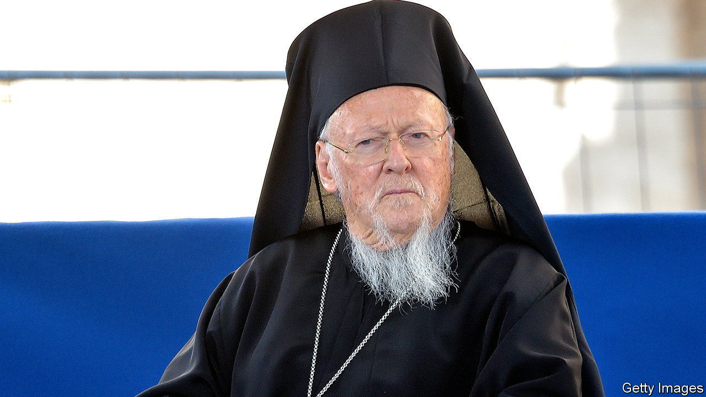

###### Point of no return

# The uncertain future of Greeks in Turkey 

##### The exodus steadily persists 

 

> Sep 7th 2023 

OUTSIDE a small chapel on Imbros, a windswept Turkish island on the Aegean Sea, the spiritual leader of the world’s Orthodox Christians relaxes under a canopy of oak trees, catches up with old friends and reminisces about his birthplace’s dark past. Bartholomew I, the Ecumenical Patriarch of Constantinople, born Dimitrios Arhondonis, left the island in the early 1960s to study abroad. By the time he returned a few years later, he could hardly recognise it. The vast majority of the island’s 6,000 Greeks were gone, replaced by settlers from Turkey. Convicted prisoners, also shipped in from the mainland, terrorised those Greeks who remained. Some women were raped; several men were killed. The government in Ankara closed the Greek schools, seized nearly all the arable land, and changed the island’s old Greek name, to Gokceada.

Over the past few years the island’s Greek culture has come back to life. Tourism has taken off. On summer evenings in Zeytinlikoy, the village where Bartholomew grew up, restaurants, many of them Greek, swarm with mostly Turkish diners. After Turkey’s government, headed by President Recep Tayyip Erdogan, allowed three Greek schools to open on Imbros a decade ago, descendants of the Greeks displaced in the 1960s began trickling back, their children in tow. The island’s Greek population, which had plummeted to under 200, has since tripled. Dimitris and Maria, a lorry driver and a biologist, arrived from Thessaloniki in 2015, enrolled their four children in school, and learned Turkish. They now run a popular café in the island’s main town. “In terms of the Greek language and education,” says Nikos Lemopoulos, the local headmaster, “we’ve experienced a small renaissance.”

But elsewhere in Turkey the picture is bleak. Some 2,700 years after their ancestors founded Byzantium on the shores of the Bosphorus, Turkey’s Greeks are on the verge of extinction. The Ottoman sack of Constantinople in 1453 turned them into strangers in their own lands. A brutal population exchange between Turkey, the Ottoman Empire’s successor state, and Greece in the 1920s, saw over a million of them deported. Those allowed to remain suffered whenever Turkey and Greece locked horns. Official discrimination, extortionate taxes, and a pogrom in 1955 drove most of them into exile. 

Things began to improve in the 1990s, when Turkey started to shake off decades of de facto army rule. But the exodus has not slowed. Out of a population of some 200,000 Greeks at the dawn of the Turkish Republic, which turns a hundred this October, only some 2,000 remain, most of them in Istanbul. “There’s a level where population decline becomes irreversible,” says Laki Vingas, a leading member of the community. “We’re at this level now.”

New incentives, including a path to Turkish citizenship for the descendants of Greeks forced into exile, might have helped. But such measures are not in the pipeline. Even on Imbros, the Greeks face an uncertain future. Nearly all the graduates of the local Greek schools have moved abroad, mostly to Greece, to attend university. Whether and when they will come back is unclear. 

Greeks still face prejudice from some quarters. Last month a motley crew of nationalists, including government and opposition supporters, sought to prevent Bartholomew from saying mass at an ancient Greek monastery in northern Turkey. Days before, a Turkish journalist, Melike Capan, had called off an exhibition about the exiles of Imbros after a local official accused her of “offending the Turkish nation”. 

Yet Turkey’s Greeks no longer feel as forsaken as they did when nationalism reared its ugly head in the past. Many Turks, on Imbros and elsewhere, have embraced their Greek neighbours, and understood the need to protect the country’s endangered Greek heritage, says Mr Vingas. “We know we are not alone,” he says. Days after Ms Capan cancelled her exhibition, more than 100 islanders filed a criminal complaint against the Turkish official who forced her to do so, accusing him of hate speech. Most were Turks. ■

