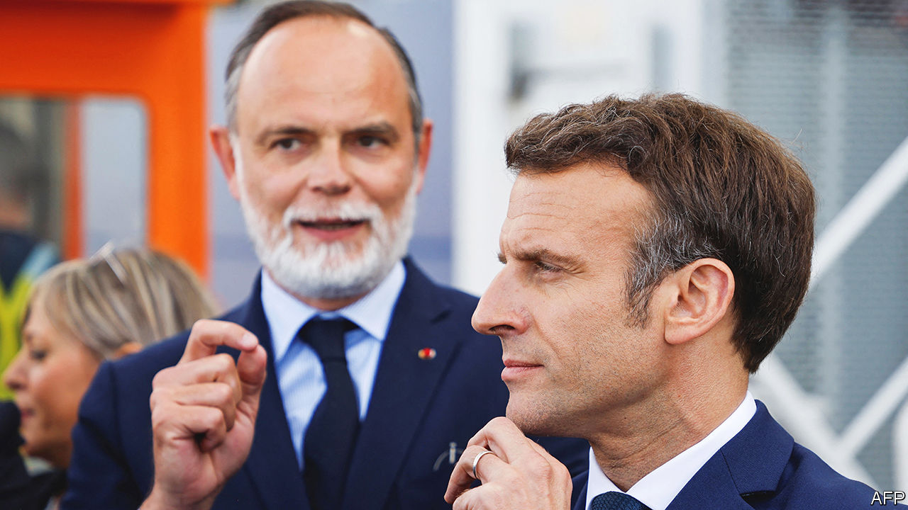

###### Four more years

# The undeclared race to replace Emmanuel Macron 

##### Can the contenders keep Marine Le Pen out of the Elysée Palace? 

 

> Sep 3rd 2023 

In a memorable phrase that captured his precocious ambition four years before he ran for the French presidency, Nicolas Sarkozy confessed in 2003 that his mind was focused on the top job and “not only when he shaved” every morning. The comment marked the start of his long and fractious struggle to succeed his boss, Jacques Chirac, which he did in 2007. Today, four years before the French elect a successor to their current president, an undeclared race to take over from Emmanuel Macron is also breaking out among his present and former lieutenants. 

The French constitution allows a president to serve only two consecutive terms (though after stepping down in 2027, when he will be only 49, Mr Macron could stage another bid five years later). This still leaves him plenty of time to try to reshape France, and he gives no sign of tiring of the job, nor of shrinking ambition. He vowed recently to keep governing “until the last quarter of an hour” of his term. 

Yet would-be successors from within Mr Macron’s broad centrist camp are keenly aware not only that there is no single natural successor among them, but that they cannot leave it too late if they are to stand out. On everyone’s mind is the need to find a credible candidate to take on the hard-right Marine Le Pen, whom Mr Macron has twice defeated in a final run-off vote for the presidency. Three front-runners seem to think they have what it takes. 

The showiest is Gérald Darmanin, the tough-talking interior minister, appointed by Mr Macron to secure his right-leaning flank. On August 27th he staged a big political event, over  and chips, in the industrial northern city of Tourcoing, where he was formerly mayor. Ostensibly to discuss political strategy, the happening carried more than a whiff of personal ambition. Elisabeth Borne, the prime minister, was hastily dispatched to the event to keep him in order. The son of a bar-owner and a housekeeper, Mr Darmanin is styling himself as a politician who—unlike the dry technicians who sit beside him in cabinet—understands everyday worries. If mainstream politicians cannot find a way to appeal to the working-class and middle-class vote, he declared, outlining a job description tailored to himself, Ms Le Pen’s victory in 2027 will be “quite probable”.

A more discreet but no less resolute aspirant is Edouard Philippe, formerly  (pictured, with Mr Macron). Like Mr Darmanin, he comes originally from the conservative Republican party, and tops polls as the most popular French politician with 55% approval. That is 13 points ahead of Ms Le Pen in ninth place and 18 points ahead of Mr Darmanin in 18th, according to Ifop, a polling group. Mr Macron trails in 23rd place, on 32%. A new poll out on September 3rd suggests that Mr Philippe is the candidate best placed to appeal to both the centre and the conservative right in 2027, well ahead of Mr Darmanin. This holds even among voters on the opposition right. 

As French politicians do, Mr Philippe will mark , or the return to work, by publishing a new book, outlining his vision and ties to France, on September 13th. After leaving government in 2020 he founded his own political movement, Horizons, which sits in parliament as part of Mr Macron’s minority coalition. Mr Philippe is also mayor of Le Havre, a port city in Normandy. This gives him a convenient perch from which to appear semi-removed from daily political manoeuvring in Paris. Those who have seen Mr Philippe recently say that he is indeed firmly focused on preparing for 2027.

A third potential runner is , the finance minister, yet another ex-Republican and the second-most-popular politician, with a 46% rating. More discreet in public about his personal aspirations, and more usually spotted in airless international-summit meeting rooms, he was to be seen this summer in shirtsleeves enthusiastically greeting holidaymakers on an Alpine mountain pass. Earlier this year the besuited technocrat raised eyebrows when he published a racy novel. Mr Le Maire has now been finance minister for the longest unbroken period of any under the Fifth Republic, created in 1958. But he may at some point feel that he needs to move on if he is to broaden his appeal and work on his own chances. 

Others too are said to be mulling over theirs, including Jean Castex, , Yaël Braun-Pivet, head of the National Assembly, or even Gabriel Attal, the 34-year-old education minister. Each will have to tread a delicate line between the desire to remain loyal to Mr Macron, to whom they owe their jobs, and the political need to distance themselves from the unpopular president, who has faced  and  this year. Even if it were in his gift to anoint an heir, this might not do the anointee any favours. 

Four years is a long time, and Mr Macron himself was a little-known back-room adviser that long before his first presidential bid. Nor is there any organised process within his party, Renaissance (formerly En Marche), to pick a candidate. The party anyway lacks roots, and may not in its current form even outlive the president. 

Yet the threat of a Le Pen presidency lends the matter great urgency. The hard-right leader has been quietly biding her time, sitting politely on the opposition parliamentary benches and trying to look like a president-in-waiting. Mr Macron may not like to think about succession planning. But the most painful legacy for a leader who has done much to modernise France would be for his two-term presidency to be followed by her election, just as Barack Obama’s was by Donald Trump’s. ■

