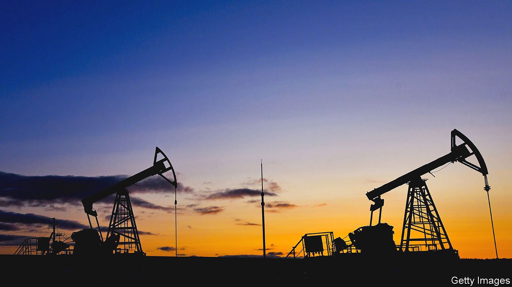
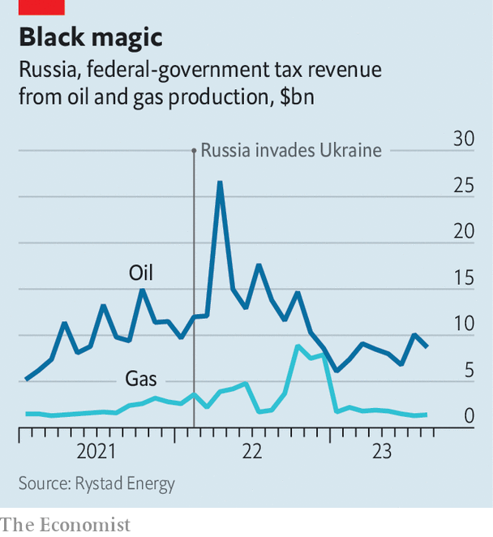

###### Crude sophistication

# A higher global oil price will help Russia pay for its war 

##### The Kremlin tries new tactics to keep proceeds afloat 

 

> Sep 6th 2023 

The bonanza could not last for ever. After reaching  in recent months, despite Western embargoes, dwindling production and the risks of navigating the Black Sea, Russia’s crude shipments fell to 3m barrels a day (b/d) in August, some 800,000 lower than the April-May average and below pre-war levels. They are likely to remain sub-par. On September 5th Russia said it would extend a “voluntary” 300,000 b/d cut first announced for August to the end of 2023 (the baseline for this reduction is unclear). 

 


Sagging exports deprive the Kremlin of  just when it wants to replenish its military arsenal. In August federal-tax revenues from crude sales dropped to $8bn, down from $10bn in July and $13bn in August last year, according to estimates by Viktor Kurilov of Rystad Energy, a consultancy (see chart). The , which was for a long time another symbol of Russian resilience, has crashed to near 100 to the dollar, its cheapest since the invasion. Both slumps have injected urgency into Russia’s efforts to earn more money from every drop of crude it pumps out. Three types of tactic feature in its new playbook. 

The first—chasing higher prices for the fewer barrels it sells—has faced difficulties. Between January and August, the price of Urals, Russia’s main grade of crude, averaged $59 a barrel, down from $83 in the first eight months of last year. This was mostly because of a lower global oil price, which fell from $104 to $81 over the period. But Western embargoes, which make it easier for other buyers, such as China and India, to negotiate down prices probably played a part, too. So did the g7’s “price cap”, which bans Western shippers and insurers from facilitating Russian crude exports unless fuel is sold below $60 a barrel. 

More recently, though, the strategy of chasing higher prices has seen some success. Expectations of peaking interest rates in America, as well as production cuts both by Russia and Saudi Arabia, have helped lift the global oil price, which rose above $90 a barrel for the first time this year on September 5th. That benefits Russia, which has recently built a “grey” fleet of tankers—often ageing ships owned by obscure intermediaries in the Gulf, Hong Kong or Turkey—and a state-backed insurance system which insulates much of its distribution network from the price cap’s effects. It is also shipping less from the Black Sea and more from its Baltic and far-eastern ports, where breaches of sanctions are harder to detect. Since mid-August Urals has been trading above $70 a barrel. 

The West is unlikely to push for stricter enforcement of its price cap: it wants to keep Russian oil flowing to avoid supply shortfalls later this year if the global economy rebounds. Therefore gains in the price of Urals look secure, even if it will be difficult to persuade customers to accept smaller discounts relative to the global oil price. India insists that the rising price of Urals has eroded the grade’s competitive edge, especially compared with Gulf crude. This is a little disingenuous. Urals continues to trade at a solid $7 rebate to the cheapest grade of Saudi crude, reckons Kpler, a data firm, despite being a superior blend. India’s obduracy hints that it probably has the upper hand in talks. 

As Russia sells less crude, it is also trying to sell more of its premium refined oil—its second tactic for keeping proceeds afloat. To do so, it can process more crude through its refineries by mobilising idle capacity, which Kpler estimates at 10% of the total. Analysts reckon it will postpone much of the maintenance scheduled for this month to autumn next year. And it is maximising yields of diesel, a highly profitable product, to the detriment of jet fuel. In August the country exported more such “clean” products than during the same month in any of the past six years. 

The third way that Russia is trying to compensate for lower crude shipments is by developing new channels to distribute its oil. Exporters are discreetly cranking up piped flows to those European countries that still can, and do, buy Russian oil: namely, the Czech Republic and Hungary. Analysts expect this to continue until 2025, by when the Czech pipeline operator should have capacity to take more crude from a conduit linking it to Italy. 

Russia is also starting to send more cargoes through the Arctic, which could cut the cost of shipments to China. The route is 30-45% shorter than those departing from the Baltic and Barents seas. Kpler data show an eight-fold rise in Russian crude tankers using this path in 2023. Navigating the Arctic is possible only in the summer and early autumn but Russia, betting on global warming, is targeting year-round sailing by 2025. That may come too late to support the war effort. Much of what will decide Russia’s export receipts in the interim—starting with the state of the global economy—remains beyond its control. ■


