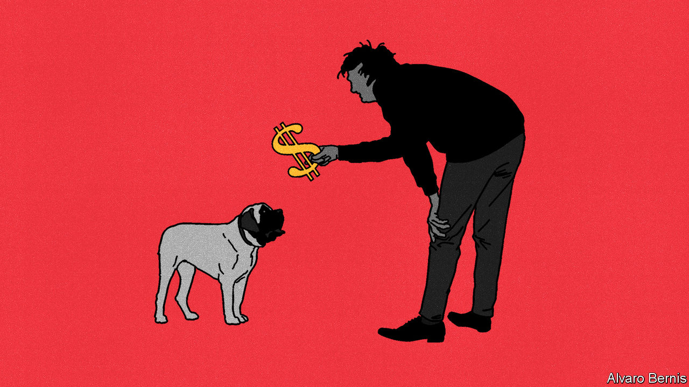

###### Free exchange

# Argentina needs to default, not dollarise 

##### A Milton Friedman tribute act is not the answer to the country’s problems 

 

> Sep 7th 2023 

Milton friedman looms large in the personal and political life of Argentina’s probable next president. Javier Milei’s ideas, which carried him to an unexpected victory in the country’s primaries in August, take cues from the 20th century’s most prominent free-market economist. Friedman influenced both Mr Milei’s opinions on the ideal size of the state (tiny) and its role in the economy (non-existent). So deep is Mr Milei’s admiration that he has christened one of his four pet mastiffs in Friedman’s honour. The former economics lecturer told  in a recent interview that Milton and his other dogs, all of which are named for economists, make “the best strategic committee in the world”. 

The most far-reaching of Mr Milei’s Friedman-influenced proposals is to dollarise the economy. This would involve replacing the peso with the greenback, and mean getting rid of Argentina’s central bank, which Mr Milei calls “the worst thing in the universe”. He exaggerates, but only a little. Argentina’s economy is in tatters. Annual inflation is at 113%. The central bank has exhausted its dollars. The peso’s value against the American currency has halved since the beginning of the year. In short, the time for radical thinking has arrived. Unfortunately, dollarisation is more likely to be a curse than a solution to Argentina’s problems. 

When a country hitches its economy to another’s currency, it gives up on making its own monetary policy. Interest rates would be determined by the Federal Reserve, making them more predictable and just about impossible to fiddle. For a country with a record as chequered as Argentina’s, this would relieve a number of headaches. Most Argentines use dollars anyway. Making this state of affairs official would allow the public to avoid the hassle of converting back and forth from the American currency to pesos. Exchange rates for dollars, the world’s most heavily traded currency, would be unmoved by anything happening in Argentina, a fairly small economy, meaning currency values would no longer seesaw. It is a formula that, for a while at least, kept things relatively stable in Ecuador after it dollarised in 2000. 

The main draw, however, is that Argentina would be blocked from printing cash. Friedman was critical of central banks, convinced that most are too weak to keep inflation in hand, since doing so means standing firm against pressure from politicians to make it easier to pay bills or to let the economy run hot at election time. As Mr Milei is quick to point out, Argentina’s central bank has been one of the most irresponsible. Dollarisation would put the printing presses firmly out of reach. This means, proponents argue, that it would be only a matter of time before the state downsizes and the long battle with inflation comes to an end. 

Yet this argument has a problem: it takes an unrealistically rose-tinted view of governments. It assumes that politicians—aware that they are no longer able to call on the central bank in a crisis—will automatically reduce their borrowing to a safe level. This would be true if the only reason governments were borrowing too much was because they knew that the central bank would bail them out. In reality, most governments borrow because there is enormous pressure to do so. Lenders need repaying. Bureaucracies must be restructured. Opposition parties push incumbents to spend. And, most pressing of all, voters come to expect certain services from the state. The absence of printing presses is not sufficient to outweigh these concerns. 

When a disaster strikes, things get scary in a dollarised economy. There is no central bank to act as lender of last resort to either the government or the banking system. Defaults thus become much more likely. Banks that could have been saved with emergency liquidity fail, and the government lacks the dollars to cover deposits, leaving millions out of pocket. Moreover, most borrowing could by then be under American law, putting the government on the back foot in any restructuring negotiations. 

Indeed, Ecuador is currently experiencing many of the downsides of dollarisation. When the policy was introduced, it stabilised prices straight away. But it also failed to stem the government’s fiscal deficits. Policymakers have since resorted to increasingly creative ways to finance the bill, pushing the country into a deal with imf in 2019. 

Milei, rocked

A future in which Argentina falls into disaster is more easily foreseeable than one in which policymakers see through the tough decisions required to make a success of dollarisation. Fiscal excess has been a problem for the better part of a century. The country has had 22 imf bail-outs over the past 65 years, leaving the fund so exhausted that it has given up demanding the country break even. A string of left-wing governments have built a sprawling welfare state and vast bureaucracy. Mr Milei promises cuts worth 15% of gdp, to a public sector that accounts for 38% of gdp, but struggles to outline where they will come from. 

There are plenty of other problems. A significant one is how Mr Milei’s government would find the $40bn his team thinks is necessary to make the switch to dollars. Currently Argentina cannot even repay the imf, to which it owes $44bn. Having run out of American currency, the central bank is instead burning through yuan borrowed from China. Mr Milei has suggested selling state-owned firms and government debt in an offshore fund to raise the necessary capital. It is hard to imagine there will be many buyers.

Whoever takes power in December will be starting from a terrible position. Forget about finding the money to enable dollarisation. Growing numbers of economists reckon that the country is once again insolvent, meaning that it will be almost impossible for it to pay back its existing debts. The country’s bond prices reflect the fact that financial markets are pricing in another debt restructuring. In order to make a fresh start, Argentina may need to default, not dollarise. ■


