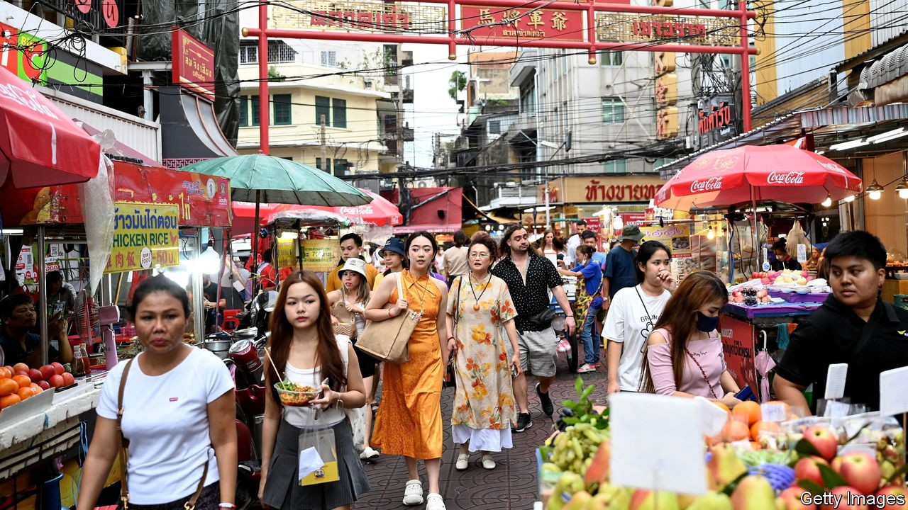
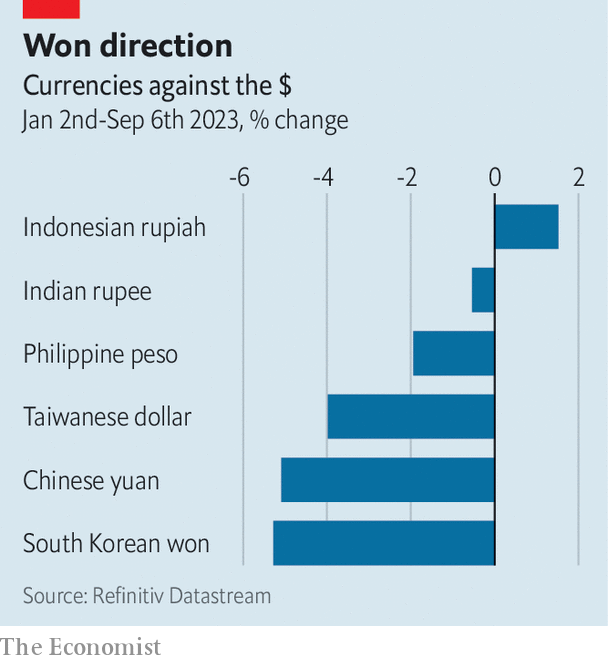

###### Spillovers aren’t over

# China’s slowdown is rattling Asian economies 

##### Governments are rushing to limit the damage 

 

> Sep 7th 2023 

Bali, a holiday destination in Indonesia, and Busan, a port in South Korea, are not easily confused. The former produces little industrial machinery; the latter falls short on year-round tropical weather. But the two have something in common. They are among the regions of Asia now imperilled by the less-than-impressive reopening of China’s economy, and the prospect of a prolonged slowdown. 

Many Asian countries benefited from Chinese growth over the past two decades, becoming entwined with the world’s second-largest economy. Since China is in the midst of a real-estate slump, with property investment down 9% in the first seven months of the year, these countries now face a headache. China is less of a big buyer of their wares than it was. According to data released on September 7th, its imports dropped by 7.3% in the year to August. 

In the richer parts of the continent, makers of semiconductor circuits and car parts are nursing losses. South Korean exports to China fell by 20% year on year in August. On September 4th the government pledged fresh support, announcing loans for exporters worth up to 181trn won ($136bn), in addition to tax breaks and other schemes earlier in the year. Between January and July exports from Taiwan to mainland China and Hong Kong fell by 28% against a year before. Almost 10% of the country’s gdp is driven by mainland Chinese consumption and investment, estimates Goldman Sachs, a bank.

Some exporters may hope that China’s slump, which has been exacerbated by a global slowdown in sales of electronic goods, has bottomed out, since the year-on-year decline in imports has stabilised. But most do not expect a rapid turnaround. The Korean Chamber of Commerce and Industry recently published a survey of 302 domestic companies that export to China. Almost four in five expected the slump to continue. Without more fulsome stimulus from the Chinese government, such low expectations are likely to be met.

In South-East Asia tourist numbers are yet to return to anything like their pre-covid levels. Thailand received just 1.8m Chinese travellers between January and July, compared with more than 11m in 2019. A new government in Bangkok last week announced it would relax visa rules to encourage Chinese visitors to return. Several countries in the region have tourism industries large enough to affect their overall balance of trade. In Cambodia, Laos, Malaysia and Thailand, tourism accounted for between 9% and 25% of total exports in 2019—before covid struck—with China the largest source of visitors to all four. 

 


A few Asian countries, such as India, Indonesia and the Philippines, are less exposed to the slowdown, according to Vincent Tsui of Gavekal Research. Their smaller industrial bases mean they have forged fewer Chinese connections over the past two decades. Mr Tsui believes this lower exposure accounts for the better performance of the countries’ currencies against the dollar this year (see chart).

Even during an economic slump, not everything moves in the same direction. Thailand’s exporters of durian, a pungent fruit that is inexplicably popular across much of Asia, have been recent winners. In the first seven months of the year, Chinese imports of the fruit have risen by 52%, relative to the same period last year. Thai officials credit new transport links, particularly a train line connecting Laos and China, for the boom. Sadly for the rest of Asia, not everyone is a Thai durian farmer. ■


