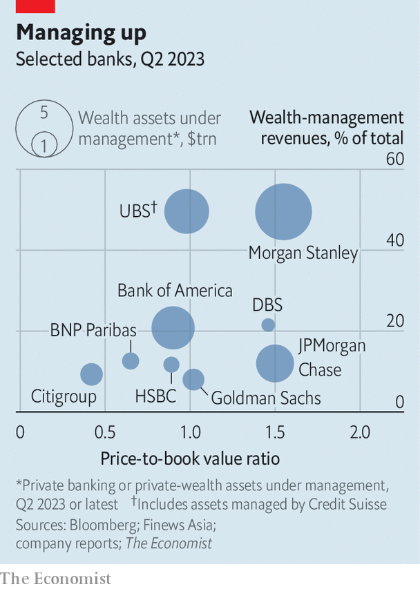
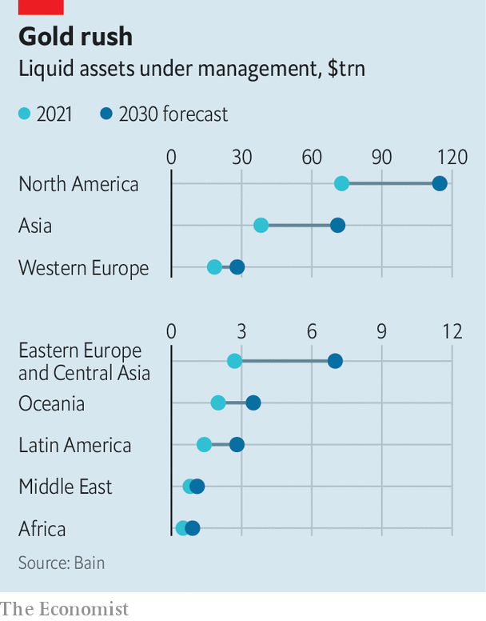

###### Rich and famous

# The $100trn battle for the world’s wealthiest people 

##### Two financial giants look likely to crush the competition 

 

> Sep 5th 2023 

The über-rich hire all kinds of people to make their lives easier. Landscapers maintain gardens, housekeepers tidy homes, nannies raise children. Yet perhaps no role is as important as that of the wealth manager, who is hired to protect capital. 

These advisers are scattered across the globe in cities like Geneva and New York, and are employed as fiduciaries, meaning they are required to act in the interest of their clients. As such, they are privy to the intimate lives of the rich and famous, who must expose their secrets so advice may be offered on, say, the inheritance of a child born of an extramarital affair. Advisers also help families allocate investments, stash cash in boltholes, minimise tax bills, plan to retire, arrange to pass down wealth and satisfy unusual wishes. A Singapore-based manager recalls being told to invest a “double-digit” percentage of a family’s wealth in “bloodstock horses”—steeds bred especially for racing—a term he hurriedly looked up after the meeting.

For decades wealth management was a niche service, looked down upon by the rest of finance. Now it is perhaps the most attractive business in the industry. Capital and liquidity requirements set after the global financial crisis of 2007-09 have made running balance-sheet-heavy businesses, such as lending or trading, difficult and expensive. By comparison, doling out wealth advice requires almost no capital. Margins for firms that achieve scale are typically around 25%. Clients are loyal, meaning that revenues are predictable. Competition has crushed profits in other formerly lucrative asset-management businesses, such as mutual funds. And whereas the pools of assets managed by BlackRock and Vanguard, the index- and exchange-traded-fund giants, are huge, they collect a fraction of a penny on every dollar invested. A standard fee for a wealth manager is 1% of a client’s assets, annually. 

Wealth management is all the more appealing because of how quickly it is expanding. The world economy has grown at a decent enough clip over the past two decades, at more than 3% a year. Yet it has been left in the dust by growth in wealth. Between 2000 and 2020 the total stock rose from $160trn, or four times global output, to $510trn, or six times output. Although much of this wealth is tied up in property and other assets, the pool of liquid assets is still vast, making up a quarter of the total. Bain, a consultancy, estimates that the pool will expand from just over $130trn to almost $230trn by 2030—meaning that a $100trn prize is up for grabs. They expect the boom to help lift global wealth-management revenues from $255bn to $510bn. 

It will be fuelled by geography, demography and technology. The biggest managers are attempting to cover ever more of the globe as dynastic wealth is created in new markets. Baby-boomers are the last generation that can rely on defined-benefit pensions for their retirement; more people will have to take decisions about how their own wealth will support them. Meanwhile, software is streamlining the bureaucracy that once waylaid wealth managers, enabling them to serve more clients at lower cost, and helping firms automate the acquisition of new ones. These gains will allow big banks to serve the merely rich as well as the über-wealthy. Firms are already climbing down the rungs of the wealth ladder, from ultra-high-net-worth and high-net-worth clients, who have millions of dollars to invest, into the lives of those with just $100,000 or so. 

Markus Habbel of Bain sees a comparison to the booming luxury-goods industry. Handbags were once prized for their exclusivity as much as their appearance, but have become ubiquitous on social media, with influencers touting Bottega Veneta pouches and Hermès bags. “Think about Louis Vuitton or Gucci. They have basically the same clients as [wealth managers] target and they increased from 40m [customers] 40 years ago to 400m now,” he notes. Upper-crust buyers have not been put off.

Which firms will grab the $100trn prize? For the moment, wealth management is fragmented. Local banks, such as btg in Brazil, have large shares of domestic markets. Regional champions dominate in hubs, including Bank of Singapore and dbs in Asia. In America the masses are served by specialist firms such as Edward Jones, a retail-wealth-management outfit in which advisers are paid based on commissions for selling funds. Only a handful of institutions compete on a truly global scale. These include Goldman Sachs and JPMorgan Chase. But the two biggest are Morgan Stanley and a new-look ubs, which has just absorbed Credit Suisse, its old domestic rival. After acquiring a handful of smaller wealth-management firms over the past decade, Morgan Stanley now oversees around $6trn in wealth assets. Following its merger, ubs now oversees $5.5trn.

This patchwork is unlikely to last. “The industry is heading in a winner-takes-all direction,” predicts Mr Habbel, as it becomes “very much about scale, about technology and about global reach”. Jennifer Piepszak, an executive at JPMorgan, has reported that her firm’s takeover of First Republic, a bank for the well-heeled that failed in May, represents a “meaningful acceleration” of its wealth-management ambitions. Citigroup has poached Andy Sieg, head of wealth management at Bank of America, in an effort to revamp its offering. In 2021 Vanguard purchased “Just Invest”, a wealth-technology company.

ubs and Morgan Stanley have grander ambitions. The firms’ strategies reflect their contrasting backgrounds, and may in time produce a clash. Morgan Stanley competes globally but dominates in America, and is focusing on wealth services for the masses, as shown by its purchase in 2020 of e*trade, a brokerage platform. James Gorman, the bank’s boss, has said that if the firm keeps increasing new assets by around 5% a year, its current growth rate, it would oversee $20trn in a decade or so.

 


This may be possible thanks to Morgan Stanley’s existing scale. In 2009 the bank agreed to acquire Smith Barney, Citi’s wealth-management arm, for $13.5bn, which helped boost margins to the low teens from 2% or so in the years before the financial crisis. Today they are around 27%, reflecting the use of tech to move into advising the merely rich. Andy Saperstein, head of the wealth-management division, points to the acquisition of Solium, a small stock-plan-administration firm, which Morgan Stanley purchased for just $900m in 2019, as crucial for building a strong client-referral machine. “No one was looking at the stock-plan-administration companies because they didn’t make any money,” he says. But these firms “had access to a huge customer base and [clients] were constantly checking to see when the equity was going to vest, what it was worth and when they would have access to it.” 

Swiss role

ubs is employing a more old-school approach, albeit with a global twist. Having taken over its domestic rival, the Swiss bank has a once-in-a-generation chance to cement a lead in places where Credit Suisse flourished, such as Brazil and South-East Asia. Deft execution of the merger would make the firm a front-runner in almost every corner of the globe. Thus, for now at least, the new-look ubs will focus more on geographic breadth than the merely rich.

In differing ways, both Morgan Stanley and ubs are seeking even greater scale. When clients hire a wealth manager they tend to want one of two things. Sometimes it is help with a decision “when the cost of making a bad choice is high”, says Mr Saperstein, such as working out how to save for retirement or a child’s education. Other times it is something exclusively available, such as access to investments unobtainable through a regular brokerage account.

 


Being able to offer clients access to private funds or assets will probably become increasingly important for wealth managers. Joan Solotar of Blackstone, a private-equity giant, says that a quarter of the firm’s assets already come from individuals, and most arrive via big banks. Greater scale for wealth managers means greater bargaining power when negotiating with private-markets firms to secure exclusive deals, such as private funds for customers or lower fees. Younger generations, which will soon be inheriting wealth, are expected to demand more environmentally and socially conscious options, including those that do not just screen out oil companies, but focus on investing in, say, clean energy. A decade ago a client would tend to follow their wealth adviser if he or she moved to a new firm. Exclusive funds make such a switch more difficult.

The winner-takes-all trend may be accelerated by artificial intelligence (ai), on which bigger firms with bigger tech budgets already have a head-start. ai could be used to create three kinds of tool. The first would take a firm’s proprietary information, such as asset-allocation recommendations or research reports, and spit out information that advisers can use to help their clients. Attempts to build such tools are common, since they are the easiest to produce and pose few regulatory issues. 

The second type of tool would be trained on client information rather than companies’ proprietary data, perhaps even listening in on conversations between advisers and clients. Such a tool could then summarise information and create automatic actions for advisers, reminding them to send details to clients or follow up about certain issues. The third kind of tool is the most aspirational. It would be an execution tool, which would allow advisers to speak aloud requests, such as purchasing units in a fund or carrying out a foreign-exchange transaction, and have a firm’s systems automatically execute that transaction on their behalf, saving time. 

It will take money to make money, then. The biggest wealth managers already have hefty margins, access to products their clients want and a head start on the tech that might put them even further ahead. “We are a growth company now,” claims Mr Saperstein of Morgan Stanley, a sentence that has rarely been uttered about a bank in the past 15 years. “We are just getting started.” 

Yet the two giants are both going through periods of transition. ubs has barely begun the open-heart surgery that is required when merging two large banks. Meanwhile, Mr Gorman, the architect of Morgan Stanley’s wealth strategy, will retire some time in the next nine months. The succession race between Mr Saperstein, Ted Pick and Dan Simkowitz, two other executives, is already under way. Either firm could falter. Although the two are chasing different strategies, it is surely only a matter of time before they clash. ubs is on an American hiring spree; Morgan Stanley is eyeing expansion in some global markets, including Japan.

And despite the advantages offered by scale, smaller firms will be hard to dislodge entirely. Lots of different types of outfit have a foothold, from customer-directed brokerage platforms, like Charles Schwab, which also offer their richest customers advice from a fiduciary, to asset-management firms, such as Fidelity and Vanguard, which have millions of customers who might seek advice. “Back in the day, when our programme was started, it was focused on how you help people manage their wealth using mutual funds. But the business has evolved,” says Rich Compson of Fidelity. The firm’s wealth arm, which oversees $1.8trn, also offers advice on ways to use individual securities, exchange-traded funds and alternative investments.

When Willie Sutton, a dapper thief also known as Slick Willie who died in 1980, was asked why he robbed banks, he replied that it was “because that’s where the money is”. The aphorism helps explain strategy on Wall Street, as firms race to take advantage of the $100trn opportunity in wealth management. Once the business was a sleepy, unsophisticated corner of finance. Now it is the industry’s future. ■


