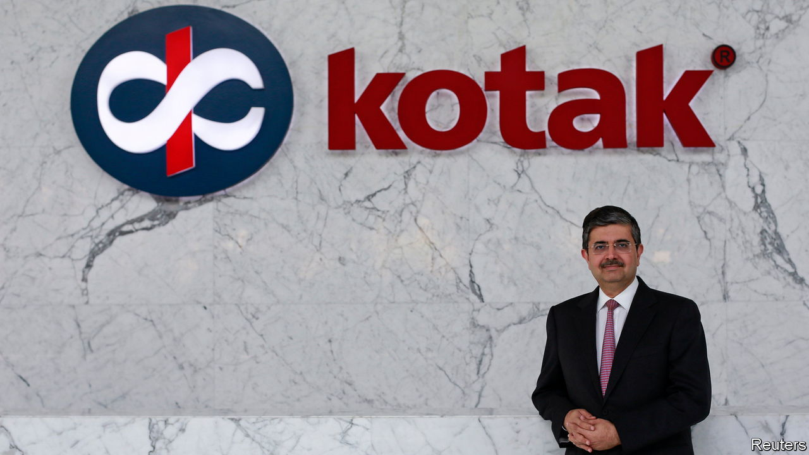

###### Official blessing

# The end of a remarkable era in Indian finance 

##### Uday Kotak, one of the past century’s great bankers, retired on September 1st 

 

> Sep 7th 2023 

Most people would go to London, New York or Hong Kong to find the world’s outstanding financiers. But perhaps Mumbai deserves a look. After all, it is home to three men who rebuilt India’s banking system after its enfeeblement by a wave of socialist experiments that began in the 1950s. The last of these giants, Uday Kotak, announced his retirement from Kotak Mahindra Bank on September 1st.

First to retire, in 2020, was Aditya Puri, who left Citibank in the 1990s to create hdfc Bank, which is now worth almost twice as much as his former firm. Second, in June this year, was Deepak Parekh, who left Chase in the 1970s to build one valuable institution himself, in housing finance, before assisting others, including Mr Puri. Finally, Mr Kotak leaves behind an outfit that leads in areas from conventional lending and investment banking to asset management and insurance. The earliest investors in his project received unimaginable returns: a $120 stake would be worth $40m today. His company went public in 1992; its shares have since made a gain of 12,000%.

Each of the three giants played a part in recreating a dynamic private sector. The government had taken a sledgehammer to Indian finance, starting in the 1950s with the nationalisation of insurance firms, before taking over private-sector banks between 1969 and 1980. Mr Kotak began his work in 1985, not long after leaving business school. His first activity, like that of Goldman Sachs’s founder Marcus Goldman, was discounting notes. Mr Kotak paid 12% for funds he lent at 16% to suppliers waiting for payment by Tata, a conglomerate, and other companies with strong credit. In 1989 he moved into automotive finance. Cars were in short supply, making them excellent collateral. Mr Kotak arranged to buy in bulk from Maruti Suzuki, the leading manufacturer, then distributed the vehicles through dealerships on the condition that they were financed. 

As India’s economy opened up in the 1990s, Mr Kotak started new subsidiaries: investment banking for public listings, then insurance and finally commercial banking in 2003. He was not alone in seeing opportunity. Thousands of financial institutions were established in India during the 1990s only to be wiped out by the global financial crisis of 2007-09. But Mr Kotak, along with Messrs Parekh and Puri, avoided the common mistake of providing credit based on political and personal criteria, and made it through. 

Kotak Mahindra’s market capitalisation peaked in 2021 at $59bn. It has since dropped to $42bn, despite superb growth, profits and credit quality. The peak came just after a rule on bosses’ tenure was imposed by the Reserve Bank of India (rbi), which set a firm end to Mr Kotak’s time in charge. (Mr Puri suffered a similar fate.) Rather than push on to the last day, Mr Kotak stepped aside a bit early, noting he had a large event to plan: his son’s wedding.

The names of two candidates to succeed Mr Kotak have been submitted to the rbi for its blessing, as is now required. The head of the central bank, in turn, is appointed by the prime minister. Although an era of explicit financial nationalisation has ended, a quieter one has emerged. ■


