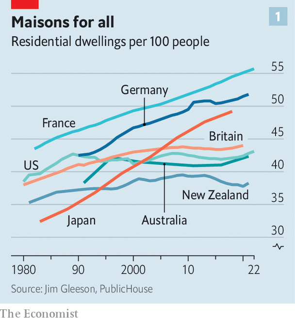
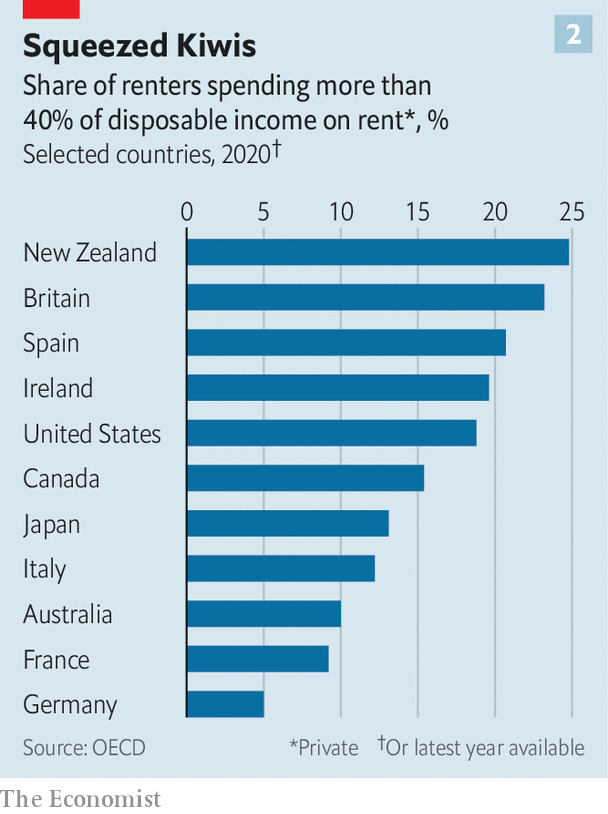

###### The new zing in zoning

# The growing global movement to restrain house prices 

##### From America to New Zealand YIMBYs push market-led solutions 

 

> Sep 6th 2023 

FLANNERY ASSOCIATES did not even have a website until the end of August. But a lawsuit involving the firm, first filed in a federal court in May, has uncovered the huge extent of its land holdings in Solano County, which lies around 60 miles (97km) north-east of San Francisco in California. The suit revealed that Flannery had committed to buying 140 properties for a total of more than $800m and was paying well over the market odds: as much as $15,000 per acre, for land valued to tax authorities for as little as a tenth of that. The entire scheme spans 50,000 acres, an area far larger than that of San Francisco proper.

Who would be willing to pay so much for seemingly so little? On August 25th the revealed that the formerly anonymous owners of Flannery Associates include almost a dozen Silicon Valley titans. Among them are Michael Moritz, former head of Sequoia Capital, a huge venture-capital firm, and Reid Hoffman, the founder of LinkedIn, a networking app. Though none of the land is currently zoned for housing, the plan, apparently, is to build a town from scratch. Its new website is branded “California Forever”, with architectural drawings of families eating in sunny Mediterranean-style plazas. This constitutes “a vision”, says Brian Brokaw of Flannery Associates.

Nowhere in the world is the failure to build enough housing clearer than in the San Francisco Bay Area. The overriding reason why boils down to Nimbyism, or “Not in My Backyard”, the tendency of locals to resist new development. A growing movement is trying to fix that. The secretive plans for a new city in Solano County are just one of the more outlandish strands of Yimbyism—a growing movement that says yes, not no, to development.

Yimbys argue that housing shortages are caused largely by laws that control who can build what and where. Zoning and planning laws, they say, are so strict that building new housing is in many places completely illegal, and in almost all it is slow, difficult and expensive. In the past decade or so, Yimbyism has spread from a minority pursuit of economists and a few dedicated activists into a plausible political movement of its own, with thousands of members and chapters spreading across countries including America, Australia, Britain and New Zealand.

Not everyone agrees on everything. Yimbys range from libertarian-leaning tech types through to self-described socialists, such as John Bauters. He is the bicycle-riding mayor of the tiny Californian city of Emeryville, who allows development because it gives him more rich people to tax. Yet all share one belief: more housing needs to be built, especially in the biggest and costliest cities.

House of straw

In recent decades house prices have outstripped income growth across the developed world. The reasons for this are numerous. Interest rates affect how much buyers can afford, as does income growth. Population changes, culture and demography all have an impact on demand, as do bank regulation, lending practices and the like. But underlying it all is basic economic logic: where demand outpaces the supply of new homes, prices tend to rise.

 


According to data collated by Jim Gleeson, a researcher at the Greater London Authority, since the millennium the number of homes in English-speaking countries is lower relative to populations than elsewhere in the rich world, and growing more slowly, too. Between 2000 and 2020, the number of homes for every 100 people rose in Britain from 43 to 44. In America it went from 41 to 42, and in Australia from 40 to 41. In New Zealand population growth outpaced construction, and the number of homes per 100 residents fell slightly, to 38. In France by contrast, the figure was already 50 in 2000, and had risen to 55 by 2020; in Germany it went from 47 to 52, and in Japan from 42 to 49 (see chart 1).

What explains this? In most markets, higher prices stimulate supply. When demand for cars increases, carmakers open more factories. But all rich countries regulate construction, for good reason. Whereas a car can be manufactured and then transported almost anywhere, land is an inherently scarce resource, and for the most part housing is only valuable when it is near jobs, public services and infrastructure. Few people want to live right next door to a sewage plant; lots want to live near a large park. Planning is meant to take such things into account.

House of sticks

 


Because jobs move, a stable ratio of housing to people across a country can mask a growing shortage in the hottest local economies. In places like California and London, wages are far higher than elsewhere in America and Britain, and have risen faster in the past decade. But for workers who do not own property, the gains are eaten up by higher rents (see chart 2). Findings published in January by the National Bureau of Economic Research show that for workers with degrees, although living in a big coastal American city comes with a substantial wage premium, a higher cost of living means that overall they are about as well off as if they lived in a poorer city. Lower-skilled workers are much worse off, which means they move out to make space. 

California’s Yimbys point to a broken system. The state’s population is shrinking even as California generates huge numbers of well-paying jobs. Consider that the median monthly rent of a one-bedroom apartment in the city of San Francisco is $3,007, or 63%, of what the median American adult working full time makes before taxes. And yet, so far this year, the Bay Area has issued permits to build only 4,500 new units of housing—scarcely more, relative to its population, than Detroit, the former powerhouse of the Midwest. The Austin area in Texas, with roughly half of the Bay Area’s population, has issued some 20,000. 

California has tried to control development since at least the 1970s. Scott Wiener, a state senator who represents San Francisco, says that with housing in the state “the rules get made up as you go along”. The process “takes years and years and is so chaotic it ultimately mutilates or kills the project entirely”. Mr Wiener was among the first Yimby politicians and crafted a new state law, SB35, which passed not long after he took office in 2017. 

SB35 encourages more development by forcing reluctant city governments to comply with state-led targets. These have existed for decades in order to facilitate new housing. For San Francisco (the city, not the entire metro area), the legal target is 82,000 homes by 2031. The number of homes that have actually been built to date means that the target looks wildly out of reach. Other laws passed by Mr Wiener and his allies have extended rights to homeowners to build “accessory dwelling units”, or granny flats, and have restricted mandates that force developers to provide masses of free parking in new buildings.

At the higher levels of politics at least, Yimbyism is now practically mainstream in California. “Pro-housing policies are pro-job policies,” tweeted London Breed, San Francisco’s mayor, in July. Gavin Newsom, the state’s governor, promised to build 3.5m homes in a speech for his election campaign. Across the state such politicians are engaged in an increasingly pitched legislative battle with local politicians, such as city council members and the leaders of suburbs, who are generally determined not to build more.

Yimbyism abounds elsewhere, too. In New York this year Kathy Hochul, the state governor, (unsuccessfully) proposed a radical “upzoning”, approving a greater density of housing in a particular area. She argued that it would allow the construction of 800,000 more homes over a decade, primarily by letting more apartments be built around railway stations in New York City’s suburbs. In Canada Pierre Poilievre, who leads the opposition Conservative Party, wants the federal government to be able to force municipalities to allow more housing construction. Both major political parties in Britain say they want more houses built, no doubt mindful of an election expected next year.

Yet constructing housing remains extremely tricky. The problem, says Brian Hanlon, a co-founder of California Yimby, a pro-housing pressure group, is that “we are all inheritors of this English town-planning system, which is disastrous”. In Britain the first extensive regulation of landowners’ rights to build on their property was introduced with the Town Planning Act in 1909 and then expanded dramatically in 1947 with the Town and Country Planning Act. In America “zoning” laws were passed in most urban areas in the 1920s and 1930s. “When Ireland got independence, we practically copied everything Great Britain did,” says Robert Tolan, a housing economist in Dublin. That included Ireland’s own version of the planning act in 1963. New Zealand got its Town and Country Planning Act, named after the British one, in 1953.

In many English-speaking countries, inspired by Victorian worries about “slums”, planning laws tended to prioritise detached houses. For urban planners, such as Ebenezer Howard, density was seen as akin to crowding. In packed industrial hotspots, “downzoning” and slum clearance were used to flatten cities and spread them out by force. The writer George Orwell was sceptical of the proceedings: “If people are going to live in large towns at all they must learn to live on top of one another,” he declared. But he reckoned that many workers in Britain did not “take kindly to flats”.

Today far fewer citizens of English-speaking countries live in flats than elsewhere. In England 80% of people now dwell in houses, and just 6% in flats in buildings taller than three storeys. In France 44% of people live in apartments, as opposed to houses. In cities including Dublin, Los Angeles and Sydney, sprawl is running out of road. At the densities allowed by law, almost all of the land within a reasonable commute of city centres has already been “built out”. Instead, new subdivisions are built in separate towns, perhaps 50 or 60 miles away from the core, with residents typically facing punishing commutes by car to work. (In Britain these workers typically leap over the “green belts” around cities within which construction is mostly illegal.)

In San Francisco construction cost on average around $440 per square foot last summer (a figure far higher than elsewhere in America). But homes sold for roughly twice that. In southern England an acre of agricultural land might cost as much as £15,000 ($19,000). An acre with planning permission is worth at least 60 times that. What this means is that giving permission to developers to build creates vast amounts of value by the stroke of a pen. And yet it doesn’t happen, largely because, through the planning system, local residents and political groups are generally able to block any development. Rules intended to regulate development, such as environmental reviews, design consultations, parking requirements and so on, in fact serve the purpose of stopping it.

House of bricks

Nimbyism has plenty of origins. Most obviously, homeowners want to protect the value of their properties. Allowing the construction of individual detached houses only on large lots—a type of zoning—is an effective way to stop poor people from moving into wealthy neighbourhoods. In America there were racist motives behind the adoption of zoning and behind its tightening in the 1960s and 1970s. 

Nowadays, people are more likely to fear that new housing will worsen traffic, or that their views will be spoiled, or that new neighbours will be annoying, or that public services will not expand to meet extra demand. This all creates strong incentives for existing residents to organise against new development. By contrast, the people who would live in homes that are not yet built do not get a say. 

Even most Yimbys do not argue that developers ought to have an untrammelled right to build anything, anywhere. In the decades after the second world war entire neighbourhoods were demolished by overzealous planners in a host of countries. But the pendulum has since swung too far the other way. In 2021 in Bethnal Green in east London, 291 homes were blocked by the High Court in part to save a mulberry tree. In Washington, DC, earlier this year a surface car park built in the 1960s was ruled to be an integral part of a historic bank, making any plans to build on it subject to tough additional scrutiny. In Dublin, Ireland, in January a development of nearly 1,600 homes was blocked by the High Court for a variety of reasons. But it was noted that the move protected a pair of “striking brick arches” from demolition.

 


David Broockman, a San Francisco Yimby who happens to be a political scientist at Berkeley, suggests that Nimbyism often wins despite the huge benefits of building. That is because a project’s interested parties squabble over how to share the value created by allowing it. Some want it to be used to subsidise affordable housing; some want environmental protections; some want prettier buildings; some want tax. “Every group is asking for too much,” says Mr Broockman. The end result is that nothing gets done and everybody is worse off, he concludes.

Is Yimbyism able to help? Housing construction has risen in California in recent years: more homes were built in the state last year than in any since 2008. Some of this is thanks to modest Yimby reforms. In the Los Angeles area, there has been a boom in the construction of accessory dwelling units. Typically, these are built in the garden of an existing house. Statewide, around 60,000 have been permitted since 2017 and in 2022 they made up one in seven of all homes constructed; most of them have been put up in the Los Angeles area.

Overall construction is still far too low to make California truly affordable again, however. The big question is whether recent reforms can induce more. In May, Emeryville, home of the socialist bicycle-riding mayor, was designated by the state of California as one of just 22 cities out of 482 to be officially “pro-housing”, meaning it plans to substantially exceed its mandated targets for construction. The city, which is wedged in between Berkeley and Oakland, about half an hour from downtown San Francisco, proposes to allow the construction of 3,687 new homes over the next eight years. That is roughly one new unit for every two existing units. But many other places are fighting their legal requirements to plan for more housing. 

What is clear is that allowing construction does reduce rents. Activists point to one place where it has already had a measurable and large effect. In 2016 New Zealand’s parliament passed a sweeping upzoning of the city of Auckland. The result, says Ryan Greenaway-McGrevy, an economist at the University of Auckland who has analysed the data, was a big increase in building. The number of new homes that got permission to be built went up from 2,500 to 15,000 between 2010 and 2021. Of course, like many other countries, New Zealand was dealing with the effects of the global financial crisis back in 2010. But all over the city, smart blocks of flats that can fit many inhabitants have quickly replaced fading 1960s detached houses. Homeowners have seen the value of their land go up, as it can now be redeveloped. But the cost of renting a single home has fallen, unlike in the rest of New Zealand.

It will take a lot to undo decades of undersupply. In Britain a study published this year by the Centre for Cities, a think-tank, estimates that the country is short of 4.3m homes relative to the number built in other European countries. A study in 2015 of America put the annual cost of restricted development in America’s biggest cities at more than 9% of GDP.

But as the costs rise, so too do the potential benefits of building. Whether Silicon Valley’s richest tech investors can take advantage of that remains to be seen. Already the existing residents of Solano County are preparing to push back against “California Forever”. More politicians should look at Mr Bauters in Emeryville and follow his example. For his part, Mr Bauters just wishes that everyone would spend much less time talking and far more time building. ■

