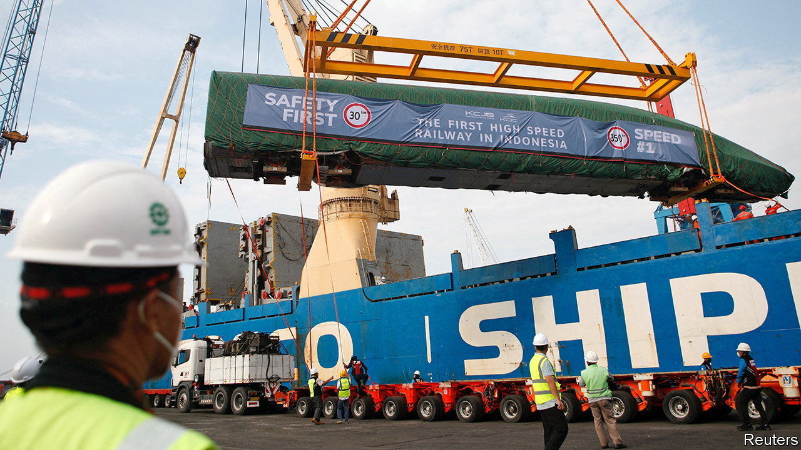
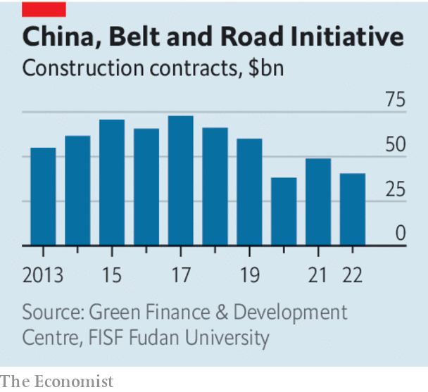

###### Belt and Road at ten

# China’s Belt and Road Initiative will keep testing the West 

##### The projects are smaller, the challenge is growing 

 

> Sep 7th 2023 

TEN YEARS ago this week China’s leader, Xi Jinping, began laying the tarmac for what would become his signature foreign policy. He began with vague suggestions of reviving the Silk Road, an ancient network of trade routes linking China with Central Asia, the Middle East, Africa and Europe. When the plan was given an official name—“One Belt, One Road”—it suggested that China was putting itself back at the centre of the world. Later it would be softened, for the benefit of foreign audiences, to the “Belt and Road Initiative”, or BRI. Mr Xi modestly hailed it as the “project of the century”.

In many ways the BRI has lived up to the hype. More than 150 countries, accounting for almost 75% of the world’s population and more than half of its GDP, have signed on to the scheme. China has doled out hundreds of billions of dollars in loans and grants for railways, roads and other infrastructure that might otherwise have gone unfunded. Its projects have spanned the globe, from Brazil to Kenya to Laos. Over the past decade China has become the largest creditor and a crucial source of investment in many developing countries. Much of this has been good: many countries badly need better roads.

 


But time has also exposed the BRI’s flaws and China’s self-interest. A number of recipient countries have struggled with debt repayments. As we report this week, China is now adjusting the project, seeking better returns and changing an economic plan into a normative one (). Even as it pours less concrete, it is posing a greater challenge to the West.

The BRI’s troubles are no secret. For years Chinese banks used dodgy criteria to lend to dirty regimes. Unsurprisingly, many of the infrastructure projects the banks financed have not succeeded. Some have become white elephants; others have been abandoned. Burdened with debts (not all from BRI projects), several countries have teetered on the brink of default. China has made things worse, by shunning other lenders and multilateral institutions, instead conducting debt negotiations bilaterally, secretly and with apparent stubbornness.

In some ways China seems to have learned a lesson. Its banks have changed their practices. Its lending has become more targeted—not least because China’s own struggling economy has sapped public enthusiasm for the BRI (). Mr Xi has urged Chinese investors to focus on “small but beautiful” projects, with higher standards and better returns. There is increasing talk of a “digital silk road”, with a focus on industries like telecommunications and cloud computing.

Yet problems remain. China shows few signs of becoming more transparent. Nor has it become any less hard-nosed. Although it worked with other government creditors to restructure Zambian debt, largely owed to China, it did not agree to a haircut. 

China is also harnessing the BRI as a vehicle for its plans to remake the rules-based order. The Communist Party has always sought to use the scheme to enhance its own image and boost its weight in the world. Increasingly, however, it is also being used to rally the global south around China’s democracy-free model of development. Recipients of its largesse face no Western-style fussing about human rights or corruption. Ports and power stations appear, clearly labelled as Chinese-backed projects. What, locals wonder, do preachy Westerners offer that compares? 

Belt up

The West needs to push back by presenting a better alternative to the BRI. At a meeting of the G20 on September 9th and 10th President Joe Biden is expected to call for beefing up the role of the World Bank and the IMF in helping poorer countries. Last year the rich democracies of the G7 unveiled a $600bn plan to boost investment in infrastructure in low- and middle-income countries. Now they need to honour their commitment. Earlier such promises mostly went nowhere.

There are reasons to be gloomy now, too. Westerners are dealing with their own economic struggles. But they are wrong to think of this as charity. Rather, it is an investment in the rules-based order—or, if it sells better, part of a campaign to counter China. As a decade ago, poor countries face an enormous shortfall in funding for needed construction. If China and its friends are the only ones making an offer, they will shape the future. ■

