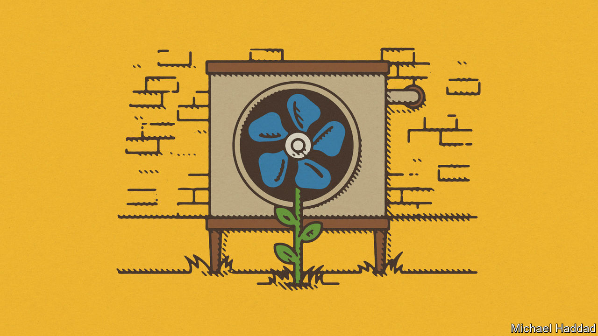

###### In hot water

# Heat pumps show how hard decarbonisation will be 

##### The row over them portends more backlashes against greenery 

 

> Sep 6th 2023 

They hang from the walls of utility rooms, nestle inside kitchen cupboards and hunker down in cellars. Gas and oil boilers and furnaces have been making homes more comfortable for decades. Their adoption during the 20th century brought people central heating and hot baths on demand, and allowed them to stop shovelling coal. But if the goal of decarbonisation is to be met, these boilers must go. 

Twelve European countries plan to phase fossil fuels out of the heating of buildings, and air-source heat pumps have emerged as the best alternative. These extract ambient heat from the outside air, even when it is below freezing, and concentrate it to warm inside spaces. Heat pumps are far more efficient than boilers, in terms of the amount of energy used per unit of heat generated. Lately, however, they have become a symbol of the obstacles that await as countries try to decarbonise. Until recently, green policies had seldom required private citizens to roll up their sleeves and make big, disruptive changes to their lives. Now they are starting to, and many people do not like it.

The annoying thing about heat pumps is that you cannot simply swap a gas boiler for one—at least not yet. Heat pumps are larger than gas boilers, require outside space and, for the 60% of European properties that are old and leaky, their installation must come with extra insulation. 

In Britain, knowing whom to trust on the best green heating design for your home is hard enough to discourage all but the most determined and wealthy eco-warriors. Owners of older houses face difficult choices, such as whether to lift up their floorboards and line their inside walls with thick insulation, or wrap their homes in a much thicker layer of external insulation, which may not be allowed by local planning rules. All this can quickly become costly, disruptive—and politically toxic. A plan in Germany to ban gas- and oil-boiler installations as early as next year, for instance, was abandoned after a public outcry.

What to do? Heat pumps that are an easy swap for boilers are likely to . But even then households cannot be entirely spared from disruption. The least governments can do is make adoption as easy as possible. Although grants covering part of the cost are available in some countries, their administration is often sluggish and should be speeded up. A target cannot be enforced if there are not enough skilled workers to retrofit homes; more will need to be trained. The clash between planning regulations and green rules, which makes householders feel helpless, must somehow be resolved.

Germany’s watered-down rules, which are due to be passed in parliament later this week, wisely give households more time, and also ask local authorities to be involved in their administration. They will give large and small municipalities until 2026 or 2028, respectively, to draw up transition plans, which can allow for greener heating that does not involve single-home heat pumps. Municipalities know their local housing stock better than central governments do, and they make the planning decisions that often collide with the demands of retrofitting. They must start favouring the planet more and nimbys less.

This episode contains a lesson for governments. Decarbonisation on the scale required to avert planetary calamity will be painful. Voters will often object, and may sometimes sack green-friendly governments. So it is crucial that policies are crafted to reduce emissions as efficiently as possible, with incentives generally designed to persuade rather than coerce. Even with the most far-sighted policies, however, there will be more backlashes. Governments must prepare. ■

