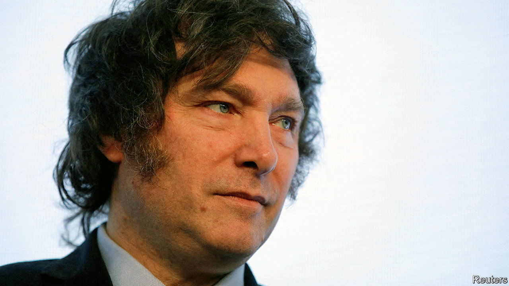

###### The man who may be president

# Javier Milei would be a danger for democracy in Argentina 

##### Despite his neoliberal credentials, the presidential candidate has an authoritarian streak 

 

> Sep 7th 2023 

Argentina needs saving. Annual inflation is 113%. The peso’s black-market value against the dollar has fallen by half this year. After decades of economic mismanagement, mostly under Peronist administrations, Argentines are fed up with their venal and incompetent politicians. Their dismay has helped propel Javier Milei, a self-described libertarian and “anarcho-capitalist” who entered Congress only in 2021, to become the front-runner for the presidential election in October. Even by the standards of Argentine politics, he can sound eccentric: he is said to have hired a medium to consult Conan, his dead mastiff.

Nevertheless, Mr Milei talks a good game. He is steeped in neoliberal economics, as he displays in a  with . He wants to privatise all the sclerotic state companies, dollarise the economy and reduce the country’s deficit to zero in his first year. His political and economic models, he says, are Australia, Israel, Ireland and New Zealand. For years talk of free-market capitalism has been a guaranteed vote-loser in bloated, statist Argentina. Past attempts to liberalise have all faltered. Yet if Mr Milei wins the election next month the country could, in theory, become again a laboratory for exciting, dynamism-promoting ideas. 

This paper would be delighted if Mr Milei were to usher in a new age of liberalism in Argentina. However, that seems unlikely. His policies are poorly thought through. Far from building a consensus, he would struggle to govern. And if frustrated, some Argentines worry, he might conceivably turn authoritarian. 

His proposal to scrap the national currency for the greenback is superficially alluring. , including Ecuador and El Salvador, and Argentina’s economy certainly needs bold reform. Dollarisation would immediately bring down inflation and end exchange-rate swings that wreak havoc on trade. But under such a system, Argentine banks and households would need a float of dollars to get up and running, which Mr Milei has no way of providing. Currently, Argentina cannot even service its debts to the imf, its biggest creditor (it is using yuan borrowed from China to do so).


In the medium term

Moreover, though dollarisation would stop the state from printing money, it would not automatically restrain Argentina’s profligate fiscal policy. Politicians would still try to borrow too much, and there would be no central bank to inflate the debt away. Fiscal consolidation would require political will that Argentina has seldom shown in the past. To make matters worse, Argentina is on the brink of default, which dollarisation would make even more painful, since there would be no lender of last resort if Argentina’s central bank disappeared with the peso. 

The next president will surely have to go cap in hand to the IMF, and this is the kind of delicate, diplomatic task for which Mr Milei plainly lacks the right temperament. His closest adviser appears to be his sister. He says incendiary things about his opponents. He suggested that a former presidential aide should be beheaded. He is a fan of Jair Bolsonaro, a populist ex-president of Brazil who copied some of Donald Trump’s anti-democratic tactics. He seems to believe conspiracy theories about election-rigging in Brazil and, more worryingly, at home. Despite coming first in Argentina’s primaries, he claims he was “robbed” of 5% of the vote. 

Mr Milei’s view of history is troubling, too. His running-mate, a former lawyer for soldiers accused of atrocities during Argentina’s military dictatorship of 1976-83, plays up the crimes of left-wing guerrillas who fought the junta, rather than the bloodier acts of the junta itself. Mr Milei says “both sides committed crimes”, a line that civil libertarians do not find reassuring. Intemperate, rash and outlandish: little about Mr Milei suggests he is the saviour Argentina needs. ■

