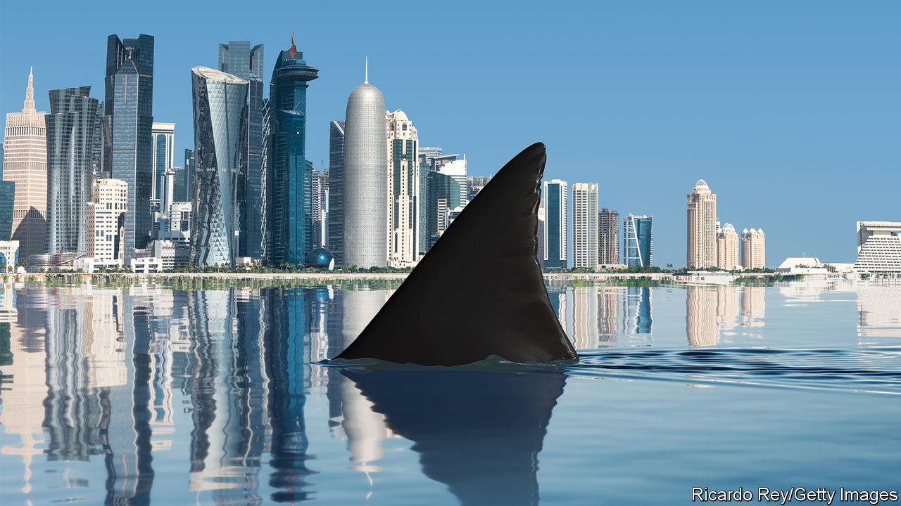

###### Cash v chaos

# The new Middle East has more money and less mayhem. For now 

##### Economies are booming and wars are fading. But climate change is looming 

 

> Sep 7th 2023 

If you thought the Middle East was stagnant, think again. The Gulf economies are among the richest and most vibrant on the planet, helped by a Brent crude oil price that rose back to over $90 per barrel this week. A $3.5trn fossil-fuel bonanza is being spent on everything from home-grown artificial intelligence models and shiny new cities in the desert, to filling the coffers of giant sovereign-wealth funds that roam the world’s capital markets looking for deals. 

As the cash flows in, the chaos shows signs of receding, thanks to the biggest burst of diplomacy for decades. Saudi Arabia and Iran have negotiated detente in a rivalry that has lasted since the Iranian revolution in 1979. Civil wars in Syria and Yemen are killing fewer people, as their sponsors seek de-escalation. Following the Abraham accords between Israel and some Arab governments, Saudi Arabia is considering recognising the Jewish state, 75 years after its creation. The region’s global clout is rising—four countries are about to join the brics club of non-aligned powers that want a less Western-dominated world. 

As  explains, these shifts begin a new chapter in the Middle East marked by fresh opportunities and new dangers. The region’s leaders are testing ideas that have caught on in much of the world, including embracing autocratic pragmatism as a substitute for democracy, and multipolar diplomacy instead of the post-1945 American-led order. The Middle East is also a place where threats that will menace the world in the 2030s may play out early, including nuclear proliferation, extreme weather and even greater inequality, as weak countries fall further behind. 

Many occupants of the White House have left office wishing they could forget all about the Middle East. But whether you run a superpower or a small business, it matters as much as ever. Although it has only 6% of the world’s people, it has a chokehold on the global economy. As the lowest-cost oil producer, its share of crude exports is 46% and rising. Its share of exports of liquefied natural gas, in great demand since Russia’s pipelines to Europe shut down, is 30% and going up, too. Thanks to its location, 30% of all container trade and 16% of air cargo passes through the region. With $3trn of assets, its sovereign-wealth funds are among the world’s largest. Its wars and disorder often spill across borders; its refugees affect politics as far away as Europe.

The past two decades have been miserable in the Middle East. Democratic projects ended in failure and bloodshed, in Iraq after the American-led invasion of 2003 and in several countries after the Arab spring in 2011. Islamic State sought to kill its way to creating a caliphate, while in Syria Bashar al-Assad doused his own people in chlorine and nerve agents.

Yet now, as the fighting ebbs, three big changes are visible. First, the region is having to take more responsibility for its own security, as America’s appetite to intervene militarily has evaporated. Alongside this, trade patterns have become multipolar: the imf reckons 26% of Middle Eastern goods exports go to China and India, almost double the level in 2000 and roughly twice the share headed for America and Europe. Recently, this geopolitical realignment has led to a desire to de-escalate conflicts. 

Second, the energy transition creates an urgent need to escape the familiar pattern of oil booms and busts. Instead there is a powerful incentive for the Gulf to lift fossil-fuel production in the next decade before demand dwindles permanently, and spend the proceeds on diversifying local economies. 

The final shift is a weariness in public opinion. Political experiments, whether democratic or Islamist, are tarnished. Instead, people across the Middle East yearn for economic opportunity. Forget Canada or Sweden: polls show the country young Arabs admire most is the uae, with its stability and thriving economy under iron-fisted dynastic rule. At the same time, less Western involvement in security and trade also means less pressure for human rights or democracy.

Some of the region’s changes invite ridicule—think of a vanity project like neom, a gaudy new city being built for an estimated $500bn by Muhammad bin Salman, Saudi Arabia’s de facto ruler. But other changes are durable and profound. More women are working in the Gulf. Israeli tourists are thronging to Dubai. Across the region, the non-oil economy is growing at a healthy annual rate of 4% and cross-border multinational investment is rising. It is possible to imagine how a virtuous cycle of stability and peace might lead to more investment and trade that raises living standards and broadens prosperity, reversing a long-lasting spiral of failure in a part of the world with some 500m people.

Yet to achieve that, the Middle East will have to overcome some big problems. Many of these are familiar. The region’s more enlightened autocrats argue that they face a kind of “performance accountability” to improve the lot of their populations. But regimes with absolute rule tend towards decay. Other dangers are new—or, rather, looming more menacingly than ever. Now that Iran  of becoming a nuclear-armed state, proliferation is a grave worry. Climate change means that one of the world’s hottest, driest places faces even more extreme weather. Only some countries can afford the investments, such as redesigned cities and desalination projects, that they need to remain habitable.

80:20 rule 

Most starkly, the new Middle East is more lopsided than in recent memory. The success stories, the Gulf and Israel, account for only 14% of the population but 60% of gdp, 73% of goods exports and 75% of inward multinational investment. From Israel and the West Bank to Saudi Arabia and Yemen, modern economies border places trapped in despair. Lebanon is mired in financial crisis; Egypt could be heading the same way. The new Middle East’s winners embody a transactional mindset that may yet make them richer. Its losers are a reminder that in a world with fewer rules and principles, no one is coming to the rescue. As you fill up your car or wait for your air-freighted parcel, remember they depend on a region that is an economic and political laboratory—and hope the experiment does not blow up.■


